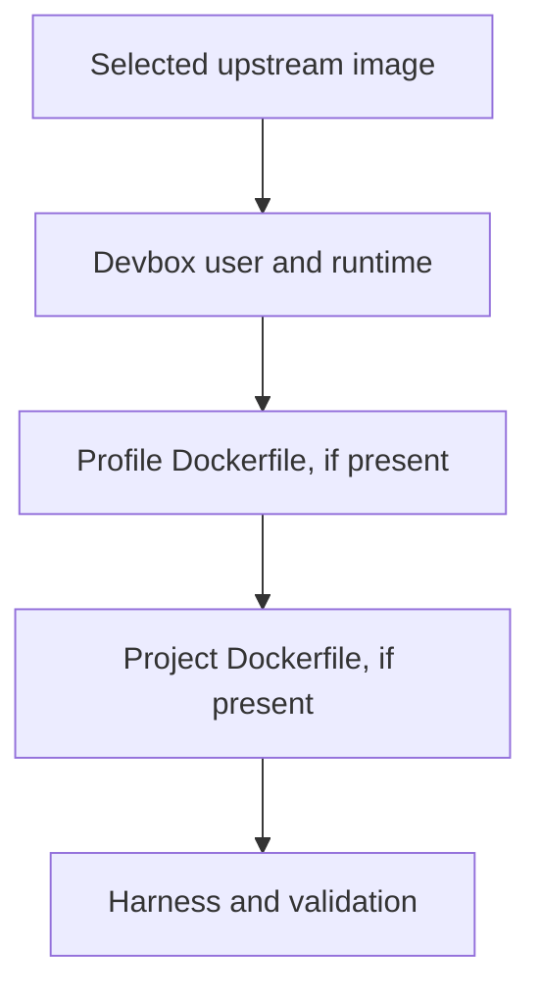

# Proposal: simpler profile/project customization

Status: historical milestone. [Folder-local sessions and explicit configs](generic-config-alternative.md) supersedes its profile/project frontend, inheritance cutoff, and schema. Generic source contents, ordered image/hook composition, and the Devbox-owned build-user contract remain. Current validation and unpassed live-Docker gates are tracked in `progress.md`.

## Goal

Keep the existing profile/project model and environment selection. Simplify image customization and make profile/project artifacts compose without duplication.

- Profiles supply reusable defaults across projects.
- Project configuration supplies customization for one codebase from its `.devbox/` directory.
- Both use the same generic config schema and composition code, with an optional `inherit` control. Environment naming belongs to profile/project selection, not config contents.
- Their Dockerfiles and lifecycle scripts chain in profile-then-project order.
- Devbox prepares the development user and runtime before custom Dockerfiles run.
- Tool installation stays cached at image-build time.
- Harness configuration remains in its native files.

Keep the familiar profile/project interface over a generic config engine. The frontend locates directories and determines environment identity. The engine composes the selected sources and applies inheritance without interpreting their roles. Configs have no `name` field; a future generic frontend could supply environment identity separately.

There is no additional public custom-config system, project-directory override, or list of extra sources in this proposal. No separate `--name` flag, source-list editor, or new targeting syntax is needed.

## Familiar selection stays available

Normal workflows remain:

```sh
devbox-neo create .
devbox-neo create . --profile work
devbox-neo open . --profile work
devbox-neo recreate . --profile work
```

Keep profile/project source discovery and convenience flags:

- `--profile` selects the first source; otherwise the global default profile supplies it.
- The workspace's `.devbox/` directory supplies the next source.
- `--ignore-project` or global project exclusion removes the project source before composition.
- Apply the generic `inherit` rule to the ordered sources before merging settings or artifacts.
- At least one config source must participate.

`inherit` replaces `inherit_profile`; it is not another role-specific flag. Setting it to `false` excludes preceding sources regardless of whether they were selected automatically or explicitly. This replaces the current explicit-profile conflict with the same cutoff rule used for any preceding source.

The effective order remains:

```text
Built-in/global baseline
→ participating profile
→ participating project
```

Multiple environments in the same folder and existing folder/profile/exact-session targeting remain available. The frontend derives the familiar `.profile-NAME`, `.profile-NAME.project`, and `.project` suffixes from the retained profile/project selection; config files do not supply names. Folder lookup selects the corresponding identity without scanning other saved environments.

Saved sessions retain their selected profile/project sources and environment identity. Exact-target resolution and recreation use the recorded source selection independently of changed defaults. Source contents remain editable; this does not introduce frozen config snapshots or automatic renaming of existing environments.

## Familiar configuration directories

Profiles live under `<home>/profiles/<name>/`; project configuration lives under `<workspace>/.devbox/`.

Both use the familiar artifact layout, with the every-open hook renamed for its actual event:

```text
.devbox/
  config.json
  Dockerfile
  Dockerfile.dockerignore
  setup.sh
  before-open.sh
  pi/
    settings.json
    extensions/
  opencode/
    opencode.json
  tools/
    ...inputs used by Dockerfile COPY...
```

Each source uses `config.json` for sparse settings and optional inheritance control. Source creation seeds only the schema version; users add the settings and artifacts they need. Existing profile/project creation, initialization, and configuration menus remain the frontend. Both roles use ordinary config files with the same schema.

Arbitrary files are not automatically mounted or executed. Files under `tools/`, for example, become image contents only when the Dockerfile copies them.

## Generic inheritance

`inherit` is config participation metadata, not an environment name or a runtime container setting.

`inherit` defaults to `true`. When a source sets it to `false`, discard all preceding config sources and retain that source and any later ones:

```json
{
  "inherit": false
}
```

The discarded sources contribute no settings, Dockerfiles, scripts, or harness files. The frontend derives identity from the remaining profile/project selection. Built-in/global baseline settings remain underneath; they are not directory sources discarded by this rule.

For a generic engine receiving the following ordered inputs:

```text
First config
Second config  inherit: false
Third config

Retained sources: second → third
```

This illustrates the engine's rule; it does not add a public extra-config CLI to this proposal. With several cutoffs, the last `inherit: false` determines the retained suffix of the source list.

Resolve participation before expanding or validating excluded settings/artifacts, determining the frontend's environment identity, or executing builds/scripts. A discarded profile must not block resolution because its settings or artifacts are missing or invalid. There is no special explicit-profile exception: the same cutoff applies however earlier sources were selected.

This replaces `inherit_profile` rather than introducing a second spelling or compatibility reader. The same participation rule applies regardless of how the directory was selected. Naming remains outside the generic composition engine.

## Composition rules

After applying `inherit`, preserve existing runtime-setting and harness-file merge semantics. Change Dockerfiles and lifecycle scripts from singleton winners to ordered contributions.

| Component | Rule |
|---|---|
| `inherit` metadata | `false` discards all preceding config sources before composition; default `true` |
| Runtime settings in `config.json` | Existing sparse settings merge across retained sources in order |
| `base_image` setting | Last explicit value wins; otherwise use Devbox's default base |
| `Dockerfile` | Build the profile's Dockerfile, then the project's, extending the preceding image through `DEVBOX_BASE` |
| Docker build context | Each Dockerfile uses its own containing directory |
| Docker ignore rules | Each context uses its own `Dockerfile.dockerignore`, otherwise its `.dockerignore` |
| `setup.sh` | Run the profile's script, then the project's, during container creation/recreation |
| `before-open.sh` | Run the profile's script, then the project's, before the harness launches through `open` |
| Selected harness's configuration tree | Overlay harness defaults, then profile files, then project files by relative path |

Excluded sources contribute nothing. Within the retained sources, an absent artifact adds no step and does not erase an earlier contribution.

Settings are not universally “last value wins”: current scalars replace, most lists append, shell argv replaces as a unit, and configured harness arguments contribute only when their layer names the selected harness. Later environment assignments for the same variable win. This proposal does not redesign those rules or introduce list-removal syntax.

### Example

A profile installs Go through its Dockerfile and supplies Pi extensions. A project Dockerfile installs additional project tools. Both profile and project have setup scripts, and the project supplies ports and a Pi settings file.

The project image inherits Go. Both setup scripts run, profile first. Harness files overlay normally. The project does not need to copy the profile's Dockerfile, setup script, or extensions.

## Prepared base and chained Dockerfiles

### Select the upstream base in configuration

Proposed setting:

```json
{
  "base_image": "ubuntu:24.04",
  "harness": "pi"
}
```

Resolve `base_image` once from the merged settings. The project can override the profile's choice. Without an explicit value, use Devbox's default Debian base. The resolved base is the foundation for the whole build; a project Dockerfile does not reset it midway through the chain.

### Devbox prepares the user before customization

The proposed build order is:

1. Select the upstream image.
2. Devbox prepares its runtime, correctly mapped development user, home, sudo access, and default build environment.
3. Build the profile Dockerfile, if present, against that prepared image.
4. Build the project Dockerfile, if present, against the preceding result.
5. Install the selected harness and validate the final runtime contract.



Every custom Dockerfile uses the same contract:

```dockerfile
ARG DEVBOX_BASE
FROM ${DEVBOX_BASE}

# Devbox has already prepared devuser and HOME.
RUN sudo apt-get update \
    && sudo apt-get install -y ripgrep

ARG DEVBOX_UID
ARG DEVBOX_GID
ARG DEVBOX_USER_HOME
COPY --chown=${DEVBOX_UID}:${DEVBOX_GID} tools/ ${DEVBOX_USER_HOME}/tools/
ENV PATH="${DEVBOX_USER_HOME}/tools/bin:${PATH}"
```

For the first contributing Dockerfile, `DEVBOX_BASE` identifies the prepared Devbox image. For the next, it identifies the preceding build's resulting image. If neither layer supplies a Dockerfile, skip user customization.

Devbox owns user creation, UID/GID mapping, runtime scaffolding, and harness integration. Users own ordinary cached image customization. They should not need to create `devuser` or reproduce Devbox's permissions setup.

Each Dockerfile's final image must derive from its supplied `DEVBOX_BASE`. Do not silently rewrite arbitrary `FROM` instructions. Upstream image selection belongs in `base_image`.

A participating project Dockerfile adds to the profile's image customization instead of replacing it. A project config with `inherit: false` excludes the preceding profile entirely, including its Dockerfile. Later Dockerfiles can modify the inherited filesystem, but are not a declarative undo of earlier installation steps. A failed build stops the chain.

### Each Dockerfile keeps its own inputs

The profile's Dockerfile reads `COPY` inputs from the profile directory. The project's Dockerfile reads them from the selected project configuration directory (`.devbox/` or its override). Each uses its own ignore rules.

For example, a project Dockerfile inherits Go installed by the profile, but `COPY tools/ /opt/tools/` reads the project's `tools/`, not the profile's.

Do not concatenate Dockerfiles or merge their build contexts. Capture each Dockerfile, context, and ignore file as an ordered build input.

### Build arguments and inherited defaults

| Argument | Meaning |
|---|---|
| `DEVBOX_BASE` | Prepared image for the first Dockerfile; preceding build's resulting image for the next |
| `DEVBOX_USER` | Development username, currently `devuser` |
| `DEVBOX_USER_HOME` | Development user's in-container home |
| `DEVBOX_WORKSPACE` | In-container workspace path; the host project is not mounted during image builds |
| `DEVBOX_UID` | Numeric development-user ID |
| `DEVBOX_GID` | Numeric development-group ID |

Devbox supplies the default build user, HOME and USER environment variables, useful PATH, working directory, and sudo access. Most Dockerfiles should need only `DEVBOX_BASE`; explicit path/ownership arguments are conveniences, not required scaffolding. Numeric UID/GID arguments avoid assuming a group name matches the username.

Do not overload `DEVBOX_HOME`, which identifies the host-side configuration/state directory. Use Docker's built-in platform arguments rather than adding architecture duplicates. Credentials, arbitrary host paths, session IDs, and profile names do not belong in the build-argument contract.

The rewrite currently supplies `HOST_UID` and `HOST_GID`; these proposed argument names are a deliberate change, not existing behavior. No compatibility aliases are specified.

### Caching and runtime requirements

Tool installation belongs in the image build, not in a large installer rerun for every container.

- Identical effective image inputs should reuse the image or applicable Docker build cache across environments.
- Changes to an earlier resulting image invalidate dependent downstream cache.
- A change limited to the project Dockerfile does not require rebuilding unchanged upstream images.
- Ports, mounts, or launch-argument changes must not independently invalidate tool installation. If a Dockerfile copies the edited config file as a build input, normal Docker cache dependencies still apply.
- Image fingerprints must include the upstream image, user mapping, platform, ordered Dockerfiles and their contexts/ignore rules, Devbox runtime, and harness installation inputs.

Caching does not make unpinned package repositories or network installers reproducible. No new package-management language or `install.sh` wrapper is proposed.

Initially target Debian/Ubuntu-compatible bases, not arbitrary distributions. Supported bases and preexisting user/UID conflicts need validation and testing. An Ubuntu image reference alone is not proof of compatibility.

Preserve custom PATH additions through finalization while ensuring required runtime tools and the harness remain available. Image-installed tools must not be placed under paths hidden by session/auth/cache mounts. Creating the correct user does not by itself prevent tools from being obscured by mounts.

## Lifecycle scripts

Keep two events:

- `setup.sh` runs during creation of each new container, including recreation, with the workspace mounted. Use it for workspace-dependent preparation.
- `before-open.sh` runs before each harness launch through `open`, including when the container is already running.

Both run inside the container as the development user, with the workspace as the working directory and sudo available. Setup is per container, not once forever per saved session.

For each event, execute the participating profile script followed by the participating project script. Missing scripts add no step. A project script does not replace the profile script.

Stop the chain on failure and fail the operation rather than launching the harness or claiming successful setup. Completed effects, particularly writes to the mounted workspace, are not automatically reversible. Scripts run as separate processes and do not share transient shell variables or working-directory changes.

This deliberately changes today's singleton-script selection and renames `entrypoint.sh` to `before-open.sh`. Record ordered script inputs for fingerprints and recovery so setup recovery verifies the complete chain, not only one script.

## Applying and inspecting configuration

Continue editing profile/project sources through their existing menus or files. Project inspection and editing use the workspace's `.devbox/` directory.

- Source edits change desired configuration.
- `status` explains differences from the applied environment.
- Recreation applies image/container changes while keeping session identity and saved state.
- Existing stopped-start synchronization applies compatible harness configuration changes.
- Configuration-source failures remain errors when those sources are required; they do not cause silent fallback.

Keep one saved source-selection authority, populated by the profile/project frontend. Record environment identity and source references separately; the generic merger does not derive either from config name fields. Existing applied snapshots describe what was used successfully; do not introduce a second source registry or configuration snapshot system.

Inspection should show the selected sources, any sources excluded by `inherit`, setting provenance, each Dockerfile with its own build context, and the ordered scripts for each event. Keep the existing configuration inspection frontend rather than introducing a new source-management command.

Copy/move operations retain their profile/project slot-selection semantics. Project sources resolve under the destination workspace's `.devbox/`; transfers do not copy project configuration.

## Implementation contracts and acceptance

- Folder lookup uses profile/project participation to select one session; unrelated records do not affect lookup. `--ignore-project` selects the profile-only path without inspecting project configuration.
- Recreation rereads the saved record under the operation lock and preserves recorded participation.
- Prepared images must identify as Debian or Ubuntu and provide the supported package environment. An existing `devuser` must have the requested UID/GID and home; a different account already owning the requested UID fails clearly, without being renamed or deleted.
- Source boundaries restore USER, HOME, shell, and working directory. Preparation retains upstream PATH entries; finalization preserves user additions and prepends harness paths before validating the binary and managed mount parents.
- Session schema 4 stores ordered source/build/hook inputs. Recovery verifies all recorded setup inputs and uses exact recorded env-source references. No runtime migration, aliases, or old-format readers were added.

Unit/fake-Docker checks do not establish live image compatibility or cache performance. Real Debian/Ubuntu builds, user-tool installation, and live recovery remain acceptance gates until run with Docker.

## Implementation fit

Reuse existing owners:

- `internal/artifact/selection.go`: keep the profile/project discovery frontend; apply generic `inherit` metadata to determine retained sources.
- `internal/config/`: use one config-source schema with generic `inherit`, no config-level name, and no role-dependent parsing. Runtime-setting merge rules remain unchanged.
- `internal/artifact/resolve.go`: merge settings from retained sources, collect ordered Dockerfiles and scripts, and retain harness-file merging without role-specific composition branches.
- `internal/artifact/context.go`: capture each contributing Dockerfile's separate context.
- `internal/artifact/source.go`: retain complete profile source copying, including build inputs.
- `internal/environment/build.go` and `spec.go`: prepare the user/runtime first, build the Dockerfile chain, then install/validate the harness. Extend input snapshots to describe the ordered build.
- Session records, identity validation, and lifecycle execution: record sources separately from the frontend-generated environment identity, and track/execute ordered setup/before-open scripts. Profile/project naming remains in the selection frontend, not in the source schema or artifact merger.

Update profile/project initialization templates, schema/help, seeded guidance, docs, and tests together when implementing. Keep configs unnamed, replace `inherit_profile` with generic `inherit`, and update Dockerfile/hook templates. Source creation remains sparse; the templates must not contradict the new contract.

## Recommendation

**Keep profiles for reusable defaults and workspace `.devbox/` directories for project customization. The frontend owns environment naming. Underneath, unnamed generic configs apply `inherit` cutoffs, merge settings, and chain Dockerfiles/scripts. Devbox owns the prepared user/runtime. Preserve familiar targeting without putting naming rules in the config schema or composition engine.**

The implemented scope is this bounded profile/project design. `generic-config-alternative.md` remains a separate, unimplemented alternative.
