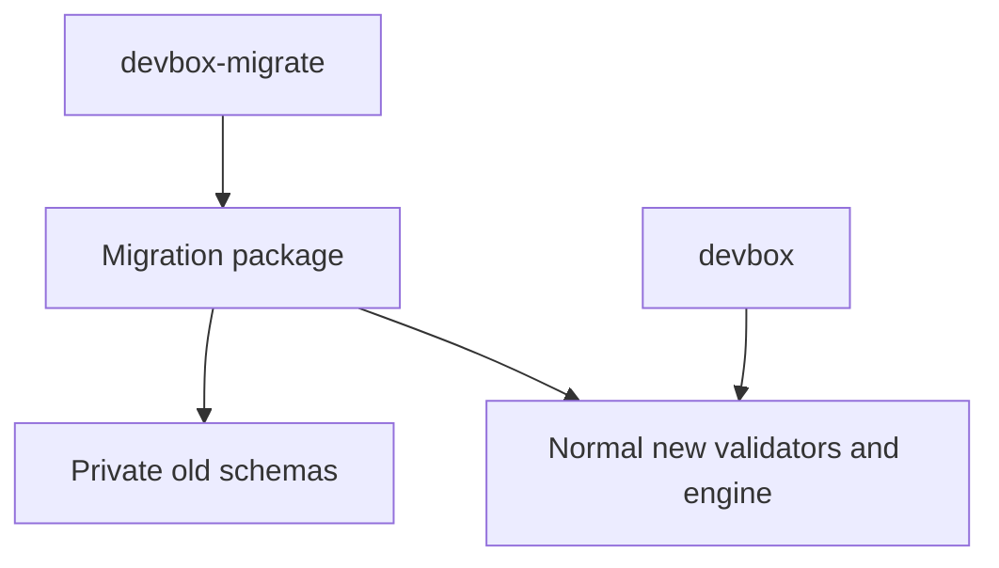
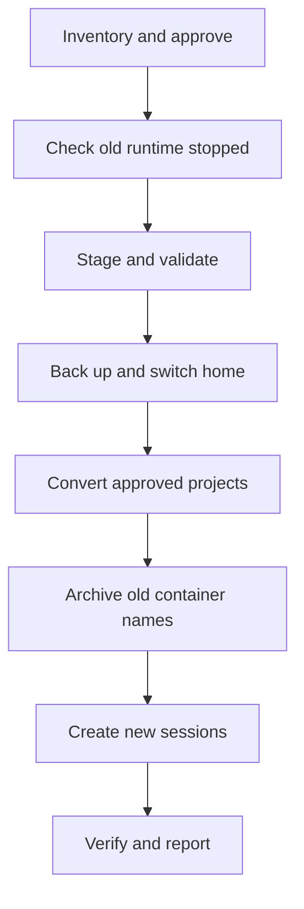

# One-Time Devbox Migration Plan

## Status and Goal

This plan defines a separate, removable migration utility for moving the current Go Devbox home into the rewrite described in [rewrite-plan.md](rewrite-plan.md). It is a plan, not an implemented command.

Preserve user-owned configuration, authentication, session identity, and portable harness state. Keep the original home at `~/.devbox.old`. Build fresh rewrite containers instead of adopting old containers or teaching the rewrite to read old files.

The main rewrite retains strict current-format loaders. The sole old-format reader is the explicitly invoked migration utility.

## Scope

### Include

- a read-only inventory and dry run;
- current supported Go-release global/profile config conversion;
- optional, explicitly approved conversion of project config outside the home;
- managed auth and approved external auth-source copying;
- portable session state, stable IDs, workspace/slot identity, and activity;
- compatible cache copying;
- staged conversion, original-home backup, resumable cutover, and per-session recreation;
- a report of imported, changed, excluded, and blocked items.

### Exclude

- migration during normal Devbox startup;
- legacy fallback readers, old labels accepted by the new runtime, or old schema variants in new models;
- a general migration framework or support for every historical Devbox version;
- automatic recovery of corrupt metadata or unfinished relocation;
- automatic conversion of unsupported harnesses into new built-ins;
- copying workspace contents or promising to preserve arbitrary container-layer installations;
- automatic deletion of backups, old images, proxy resources, or user networks;
- a background daemon or online migration while either CLI is in use.

Support the source schemas written by the current Go implementation first. Pin their supported versions in migrator fixtures before implementation. Older versions must be brought to that supported source version using the old release; do not transitively embed its entire migration history.

## Evidence and Constraints

The current implementation separates facts that the rewrite combines:

- `internal/session/record.go`: session ID, alias, activity, history, and pending relocation;
- `internal/service/metadata.go`: workspace, profile, harness, image, and concrete creation settings;
- `internal/service/creation_settings.go`: creation-time mounts, env, ports, and Docker arguments;
- `internal/harness/harness.go`: old harness state/config/auth/cache mappings;
- `internal/service/open_resolution.go` and `open_container.go`: generated config projection and structured merging;
- `internal/service/session_transfer.go`: portable state copying and exclusions;
- `docs/src/reference/state-and-sessions.md`: old home layout.

Important consequences:

1. Renaming the home does not convert Docker bind mounts or ownership labels.
2. An old session directory is not already a valid new `SessionRecord`.
3. Old metadata can contain secret-bearing values. Never copy it wholesale into new records or print it in reports.
4. Existing generated symlinks cannot safely be copied without checking their intended target.
5. Profile precedence, networking, and supported harnesses change in the rewrite. Successful parsing does not prove equivalent behavior.
6. Project `.devbox/` configuration is outside the home and needs separate consent and backup.

## Isolation and Removal Boundary

Proposed layout:

```text
rewrite/
  cmd/devbox-migrate/
    main.go
  internal/migration/
    migrations.go
    migrations_test.go
    testdata/
  docs/dev/
    migration-plan.md
```

`main.go` owns argument parsing and rendering only. Old structs, decoding, conversion, old-resource verification, and the migration state machine live in dedicated `migrations.go` files inside `internal/migration/`. Split those files within this package only if needed for readability; do not distribute compatibility across normal packages.

Dependency rule:



- The migration package may depend on new config, harness, store, and application APIs.
- No normal runtime package imports the migration package or reads its journal.
- No migration flags, optional old fields, or legacy modes enter `EnvironmentSpec`, `SessionRecord`, or config loaders.
- Normal creation may accept ordinary in-memory identity and prepared-state inputs also useful to clone/relocate. It must not accept an old record or an `isMigration` switch.
- Build the utility through a separate target. The normal binary must build and pass its tests with the migration package and command removed.

Later removal means deleting this command/package, its fixtures, build/release wiring, and migration-only docs. It must not require rewriting core logic.

## Command Contract

Proposed minimum interface:

```text
devbox-migrate --dry-run
devbox-migrate --apply
devbox-migrate --apply --convert-project-configs
devbox-migrate --home /path/to/devbox --dry-run
```

- `--dry-run` makes no filesystem or Docker changes, including no source initialization or schema repair.
- `--apply` performs the approved inventory and cutover. It rechecks facts rather than trusting a previous dry run.
- `--convert-project-configs` authorizes conversion only for the exact project paths listed for confirmation. It is not permission to scan and edit unrelated repositories.
- A repeated `--apply` resumes the existing journal after validating the same source, destination, installation identities, and approved scope. It never starts a second import over a partial one.
- Existing backup/work paths not belonging to that recorded run are blockers, not overwrite targets.
- Non-interactive use requires explicit consent for reported semantic changes, exclusions, project edits, and Docker name changes. Freeze the small set of selection/confirmation flags with the CLI tests; do not add a generic transformation scripting interface.

Dry-run output groups facts into:

- ready to copy or convert;
- behavior changes requiring acceptance;
- items proposed to remain only in backup;
- blockers requiring correction before apply.

Names, paths, field names, and counts are enough. Do not print credentials, expanded env values, full old metadata, or secret-bearing Docker arguments.

## Filesystem Layout During Migration

For the default home:

```text
~/.devbox/                     # old home until cutover, new home afterward
~/.devbox.old/                 # original home after cutover
~/.devbox.migration/
  lock
  journal.json
  report.json
  new-home/                    # staged new-format home before cutover
  sessions/                    # prepared state for sessions not yet recreated
  project-backups/             # original project config bytes and path mapping
  project-staging/             # converted project config before replacement
```

Custom `--home` uses sibling paths with the same suffixes. The source, backup, and staging paths must be distinct, non-overlapping where required, and on a filesystem supporting the intended same-filesystem renames. Reject unsafe path shapes before mutation.

The work directory is `0700`; journal/report and secret-bearing backups are `0600`. Preserve executable modes on copied scripts and apply the new runtime's ownership/permission rules to new managed paths. Do not make source credentials more broadly readable while copying.

Do not hard-link new mutable files to the backup. New harness writes must not alter the old copy. Budget disk space for duplicate portable state, optional caches, and new images before cutover.

## Data Conversion Rules

### Global configuration and profiles

- Convert old `global.json` into new `config.json`, preserving supported defaults and global env entries.
- Preserve sparse layer values; do not materialize global defaults into every profile.
- Remove proxy fields and report their removal. Do not recreate an equivalent network-security claim.
- Convert `host_network` to `network: host` when true and normal default networking otherwise, respecting sparse inheritance.
- Non-empty `extra_networks` has no equivalent durable list in the rewrite. Do not silently select one as the primary network or drop the list. Require an explicit configuration decision before importing affected environments.
- Preserve supported Dockerfiles, hooks, harness config, and the build-context files those Dockerfiles require. Do not assume that copying only the named Dockerfile preserves `COPY`/`ADD` inputs.
- `Dockerfile.full` has no rewrite equivalent. Block affected imports until the user supplies a supported layered `Dockerfile` or explicitly excludes the affected configuration. Never silently rename it or discard its runtime responsibilities; the original remains in the backup.
- Validate raw Docker args against the new runtime's invariant restrictions.
- Report explicit-profile behavior changes: old profile slots could inherit project artifacts; new explicit profiles exclude them. Do not add a per-session legacy-precedence mode.
- A direct import of existing project configuration preserves ordinary profile inheritance. `inherit_profile: false` is added by the new `project create --from-profile` workflow, not indiscriminately to migrated projects.
- Converted config may preserve existing literal values, including user-owned auth/env configuration where supported. New session records still follow the rewrite's no-secret persistence rules.

Unsupported fields, malformed participating configs, missing selected profiles, and ambiguous mappings block affected imports. An explicit exclusion must cover dependent sessions/default selections as well; do not publish a home that points at intentionally omitted configuration.

### Project configuration

Discover candidate project paths from validated session metadata, not a recursive scan of the user's filesystem.

Without project-conversion consent, leave repository files untouched. If the target resolver cannot use them, explain the required changes and block those sessions until the user edits them or approves conversion.

With consent:

1. Record the exact project config path, original digest, and proposed converted content.
2. Save its original bytes in the migration work directory, not a potentially committed repository backup file.
3. Recheck that the file still matches the approved source before replacement.
4. Replace only the approved config atomically; leave Dockerfiles, hooks, workspace files, and unrelated changes alone.
5. Journal each replacement so retry does not overwrite a later user edit.

Multiple project edits are not one atomic filesystem transaction. The journal must identify applied and unapplied files. Never describe the home backup alone as a backup of project configuration.

### Session identity and records

Combine validated old `session.json` and `metadata.json` facts in memory:

- preserve the valid session ID;
- preserve canonical workspace/slot identity and activity timestamps;
- resolve the effective new harness and configuration;
- copy portable state to its declared new store destinations;
- obtain applied image IDs, fingerprints, setup completion, and creation settings only from successful normal new-runtime creation.

Do not fabricate applied fingerprints, treat an old image ID as a new installation-owned image, or write an incomplete new record and expect normal startup to finish conversion. Pending imports stay in the migration work directory and journal, not as special session variants visible to the normal runtime.

Aliases and permanent clone/relocate lineage are not imported into the new schema. Preserve the old records in backup and report those omissions. Pending relocation must be completed or repaired with the old CLI before migration; the migrator does not become another relocation recovery engine.

### Harness state, auth, and caches

Initial built-in mapping targets are Pi and OpenCode. Prove exact destinations against their finalized new definitions before freezing conversion:

- old Pi session state maps to its new environment-scoped agent-home store;
- old OpenCode state maps to its new declared state store; its separate config home must also be inventoried, not assumed to be part of that state directory;
- managed auth maps to the new managed host auth layout, not into portable session history;
- compatible Pi npm caches map by declared cache name and destination, not arbitrary directory similarity.

For other harnesses, a valid user definition alone is not sufficient evidence of a safe old-to-new state mapping. Require both a validated definition and an explicit, tested mapping to its stores. Otherwise block import or require an explicit decision to leave that data only in `.devbox.old`. Do not silently switch the harness.

Auth sources outside the old home are not backed up by the home rename. Report them and request consent before copying them into new managed auth. Never move or modify the external original. Unsupported sources block the dependent import rather than producing an empty placeholder credential file.

Copy portable harness state while every relevant container is stopped. Preserve conversation databases and their companion files together; do not extract a guessed subset of history files. Exclude old Devbox leases, locks, proxy CA material, and generated bookkeeping.

If mapped live harness config exists only inside an old container, include that exact config location in the inventory and extract it from the verified stopped container into prepared staging. This is a known harness mapping, not a copy of the entire writable layer. If the container is gone, report unavailable container-only config rather than pretending host defaults reproduce user changes.

Handle symlinks deliberately:

- preserve links only when their meaning remains valid within the copied tree;
- materialize recognized Devbox-generated config links from verified source content when needed;
- route recognized auth links through the auth mapping rather than duplicating credentials into session state;
- block unresolved links or links escaping approved roots; do not recursively follow arbitrary targets.

Do not invent a managed manifest claiming Devbox last wrote imported files. The normal synchronizer treats source-managed ordinary paths as authoritative and preserves only undeclared keys in shared JSON. Report imported edits that would be replaced and retain the original backup; users must place durable managed edits in profile/project sources before cutover. Resolve malformed shared-JSON conflicts explicitly before declaring the session usable.

Caches are optional and may be rebuilt. Report omitted incompatible caches; never treat session history or auth as disposable cache. Unrecognized old home data remains in the backup and is listed rather than silently discarded.

## Offline Cutover



### 1. Inventory and approve

Read supported old schemas without invoking old startup migration helpers. Inspect Docker and verify installation/session ownership before including resources. Reject unrelated deterministic-name collisions, unsupported source versions, corrupt identity, unresolved transfers, and incomplete source mappings.

List all required project edits, external auth copies, configuration behavior changes, backup-only exclusions, and old-container name changes. Apply only the accepted scope.

### 2. Establish the offline boundary

Require all old managed main/proxy containers involved in the home to be stopped and no live attached commands or active transfers. Tell the user to stop them with the old CLI before applying; do not unexpectedly terminate work inside the migration command.

Acquire the migration lock and relevant old operation/record locks in deterministic order. Recheck state while locked.

Those locks coordinate existing operations; they cannot prevent a newly launched old CLI from creating new lock paths after the home is renamed. The explicit maintenance rule is therefore essential: neither CLI nor direct Docker writers may run until cutover completes or the user performs rollback. The new runtime does not gain a migration-journal reader just to enforce this temporary rule.

### 3. Stage and validate

Create a fresh staged home with a new installation ID. Copy/convert approved config, auth, compatible caches, and prepared session data without changing source files. Prepared session data remains outside the new home's published session inventory until normal creation succeeds.

Validate new schemas, paths, mappings, and permissions; verify copied durable data against the source. Run new resolution against staged inputs while planning final home paths. Temporary staging paths must not become persisted mounts, source paths, or fingerprints.

No source-home rename occurs until staged data and required project conversions pass validation. Recheck source/config digests before committing the cutover.

### 4. Switch home and approved project config

Write the next journal intent, rename the original home to `.devbox.old`, then rename the staged new home to `.devbox`. Record completion after each action.

These are two renames, not a globally atomic swap. Retry inspects the actual paths and recorded identities to distinguish an action that did not run from one that completed before the journal write.

Apply approved project-config replacements using their separate backups and digest checks. Keep both CLIs offline while any approved replacement is incomplete.

### 5. Resolve old Docker names without adoption

Use fresh containers with the new installation ID. Do not relabel old containers or make the normal engine accept old ownership.

Recommended collision policy: archive each verified stopped old main container by renaming it to an approved, collision-free `.old` name. Record original and archived names plus immutable Docker IDs. This preserves its writable layer for manual recovery without claiming it migrated. Refuse an occupied archive name; never overwrite or delete another container.

Only exact verified containers are eligible. Old proxy sidecars, networks, and images remain stopped/unused; no automatic cleanup is required for successful migration. Never create or delete user networks.

Archived containers must not be started against the new home. Their recorded bind source strings may now resolve to new data. Their retained writable layers are a manual recovery aid, not a ready-to-run rollback environment.

### 6. Create new sessions through the normal engine

For each approved session:

1. Resolve converted configuration using the new rules and final paths.
2. Supply its preserved identity and prepared portable state through the normal typed destination-creation path used for durable session creation/transfer.
3. Build the new image and create the container with new ownership labels.
4. Apply normal stopped-only managed config synchronization and required creation/setup checks.
5. Commit the valid new session record only after normal creation succeeds.
6. Leave the new container stopped and record the completed migration item.

Do not launch a harness or create attached-command leases during import. Setup hooks are executable user code and may have external effects; identify their execution in the apply confirmation. A filesystem backup does not undo arbitrary hook side effects.

The migration package does not construct a parallel Docker creation implementation. If the normal engine cannot yet create a session from prepared portable state and a supplied valid identity without legacy flags, that is an implementation prerequisite shared with session transfer, not justification for migration branches in core code.

### 7. Verify completion

Verify each imported ID, workspace/slot, harness store, new container ownership, valid record, and expected final stopped state. Verify that new runtime state contains neither migration markers nor obsolete formats and that copied auth/config does not retain unsafe old-home links.

Report exact imported sessions, backup-only items, behavior changes, archived Docker names, and next `devbox open <target>` commands. Leave `.devbox.old` and the migration report/project backups intact. Old-resource cleanup is a later explicit user action, not part of migration success.

## Failure and Retry Rules

Use one migration journal and one bounded state machine, not a generic transaction callback framework.

The journal records the run ID, supported source version, canonical paths, old/new installation IDs, accepted item identifiers, source digests, completed home/project/name transitions, and per-session outcomes. It must not contain auth contents, resolved secrets, full env arrays, or raw unredacted errors.

| Failure point | Required behavior |
|---|---|
| Inventory or staging | Old home/project files/containers remain unchanged; report blockers |
| After old-home rename, before new-home install | Resume from known paths and identities; do not create another backup or initialize an empty home |
| During project conversion | Resume only unchanged approved files; preserve and report any later user edit |
| During container archival | Inspect the recorded Docker ID and names; accept an already completed rename, reject identity mismatch |
| During session creation | Keep prepared source state, let normal creation clean its own incomplete resources, and retry only that item |
| After successful creation, before journal update | Verify the normal session record and ownership to recognize completion; do not create a duplicate session |
| After some sessions succeed | Preserve successful new sessions and all old backups; resume remaining items without resetting successful state |

Never silently roll back the entire home after new sessions may have written data. Do not promise automatic rollback of Docker operations or setup scripts.

Document a manual rollback procedure: stop both installations, preserve the new home separately, restore only project files still matching the migration-written versions, reverse verified archived container names, restore the original home pathname, and only then use the old CLI. Keep newer state available for recovery; do not overwrite it with the backup.

## Implementation Sequence

1. **Source fixtures and inventory:** pin supported source schemas, create sanitized fixtures, implement read-only classification and redacted reporting.
2. **Pure conversion:** convert config and session facts; prove mapping against the finalized Pi/OpenCode definitions and new validators.
3. **Copy and backup:** implement containment checks, permissions, symlink/auth handling, project backups, and source verification.
4. **Cutover state machine:** implement journaling, home renames, approved project edits, and verified old-name archival with fault injection.
5. **Normal-engine integration:** recreate sessions from prepared state, preserve identity, and record resumable outcomes without core migration branches.
6. **Acceptance and removal test:** test real source fixtures through normal rewrite operations, demonstrate backup retention, and verify that deleting migration code leaves the normal binary buildable and functional.

Start inventory/converter fixtures in parallel with rewrite development if useful. Do not freeze destination layouts or claim end-to-end migration support before the normal runtime, both harness mappings, and prepared-state creation path are proven. Complete migration acceptance before directing existing users to cut over with this tool.

## Tests

### Pure and filesystem tests

- supported-version decoding; unsupported/corrupt source rejection without repair;
- global/layer conversion with sparse values, proxy removal, explicit network decisions, and changed profile precedence;
- project consent, external auth consent, and no edits outside approved paths;
- stable session IDs/activity and deliberate omission of aliases/lineage;
- Pi/OpenCode state/auth/cache mapping and unsupported-harness blockers;
- regular files, executable modes, restrictive credentials, generated links, valid internal links, escaping links, and special-file rejection;
- preservation of modified harness config without false managed ownership;
- no secrets in journal, diagnostics, manifests, or new session records;
- disk/copy/write/rename failures and interruption before/after every committed transition;
- preexisting `.old` or unrelated work directories never overwritten;
- repeated apply recognizes completed work without duplicate sessions or overwritten edits;
- source backups are not mutated through hard links, copied symlinks, or new-runtime writes;
- dry run performs no source, destination, project, or Docker mutation.

### Docker integration tests

- refuse live containers/leases and ownership mismatches;
- archive verified old names without relabeling/adoption/deletion;
- migration uses a new installation ID and fresh normal-engine-created containers;
- Pi/OpenCode conversations and auth remain usable after first normal open;
- state is not copied while a source container can write it;
- missing images, failed builds, failed setup, failed record commits, and interrupted success bookkeeping remain resumable;
- preserved source records/state and archived writable layers remain available after partial failure;
- old proxy/user network resources are not deleted;
- imported sessions work with normal list/show/open/recreate/delete and contain no migration-specific runtime mode.

## Completion and Removal

Migration is complete when every accepted item is either imported and verified or explicitly retained only in backup, the home/project cutover is consistent, and the report explains all behavior changes. An unexpected omission or failed session is not reported as success.

After users have validated their new sessions, backup/resource deletion remains their explicit choice. Removing the migrator later removes old-format support completely without invalidating any imported session. Future normal schema evolution is a separate design question; this utility is only the old-Go-to-rewrite cutover tool.
