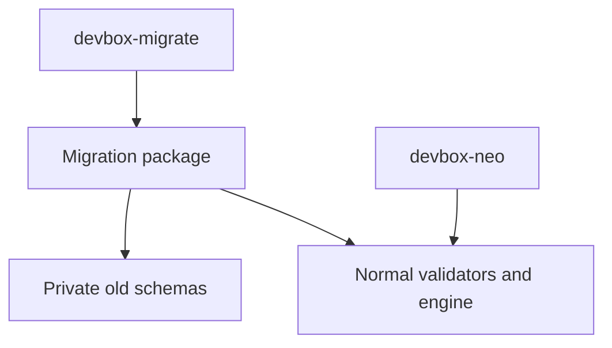
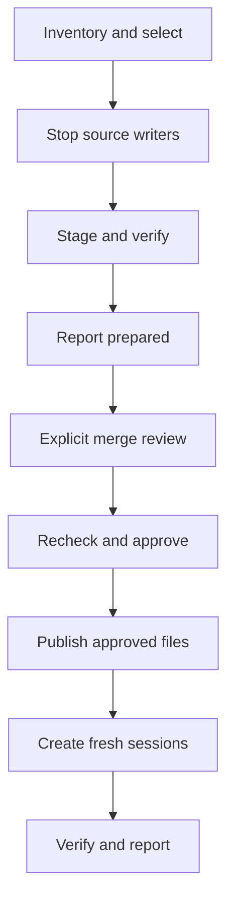

# One-Time Devbox Migration Plan

## Status and Goal

This plan defines the separate, removable utility for importing the current Go Devbox home's data into the rewrite described in [rewrite-plan.md](rewrite-plan.md). **Inventory, staging, explicit merge, and resumable normal-engine creation are implemented as a development candidate. Real-Docker, provider continuation/auth, and power-loss acceptance remain unpassed.** See [Current implementation](#current-implementation) for the executable contract. The flow examples below illustrate the interaction rather than prescribing exact screen text.

The user-facing promise is:

> Bring your profiles, configuration, credentials, and saved conversations into Neo. Rebuild the environments around them. Keep the originals available.

The migration has two explicitly authorized phases: **prepare an import**, then **merge it into Neo**. By default, copy and convert `~/.devbox` into `~/.devbox-neo.migration`, then merge approved items into `~/.devbox-neo`. The destination may already contain valuable environments. Never rename or replace the source home, overwrite an existing Neo session, or treat staging approval as merge approval.

Build fresh containers instead of adopting old containers. The normal rewrite retains strict current-format loaders; only the explicitly invoked migration utility reads old formats. A saved `report.txt` explains imported, changed, skipped, failed, and pending items, including old aliases and lineage that have no runtime equivalent.

## Current Implementation

Build the standalone tool with `make build-migrate`; normal `make build` still builds only Neo. The merge implementation follows the separately delivered staging checkpoint. Nothing runs automatically on Neo startup.

Run `bin/devbox-migrate` in a terminal for a compact menu showing source/destination paths:

- `[1]` **Preview migration (read-only)** — run the same metadata-only preview as `--dry-run`; no staging, locks, or Docker inspection.
- `[2]` **Prepare staged copy** — copy and convert into a separate folder without changing either installation's data or project files.
- `[3]` **Review and import** — review conflicts and approve changes before importing data and building new containers.
- `[4]` **Resume** — continue already approved copying or importing; this may make changes immediately, but never resets completed imports.
- `[0]` **Exit**.

Menus follow the rewrite's indented `[number]` choices and `Choose a number >` prompt. `[0]` goes back, cancels, or exits as labeled (`q` does the same); copy/import approval prompts remain separate.

Unavailable actions stay visible with a short inline reason, such as `(not staged)` or `(nothing pending)`. Explanations, staging paths, warnings, and approvals belong inside the selected action, not on the landing screen. Preview remains available in every staging state, including unreadable work directories, and neither modifies nor resumes an existing run. An absent work directory enables copying, a prepared journal enables import review, and an incomplete staging/merge journal enables continuation. Completed or unreadable work state does not authorize a new run or overwrite. Selecting copy/import opens its existing review and confirmation flow; after copying finishes, invoke the tool again to review the import separately. `--source` and `--destination` also work with this menu. Without terminal input, the bare command prints help; `--help` always shows the full flag reference.

Explicit phase flags remain available:

```text
bin/devbox-migrate --dry-run
bin/devbox-migrate --stage
bin/devbox-migrate --merge
bin/devbox-migrate --resume
bin/devbox-migrate --merge --review-pending
```

- `--dry-run` performs lightweight metadata discovery only: no recursive payload walks, credential/history/cache reads, Docker commands, filesystem changes, initialization, locks, or saved report. It reads configuration and session records and identifies copy candidates. Byte totals and deep-tree validation remain unknown until the selected-data snapshot.
- Inventory output defaults to grouped, compact rows with status counts. Session/profile blocks are separated by blank lines. Terminal headings are bold and status labels colored; redirected output and saved reports stay plain, and `NO_COLOR` or `TERM=dumb` disables styling. Every error, warning, exclusion reason, and conversion remains visible; repeated review/conversion notes keep the same number across all items. Their full text appears under each affected item in ascending number order and in a shared summary below; no lookup is needed. The metadata-only disclaimer appears once, not under every owner. `--verbose` shows full inventory paths, IDs, target names, timestamps, aliases, and lineage without changing discovery or approval behavior. Saved `report.txt` files always use the full format.
- `--stage` presents numbered inventory, selection, exclusion, rescan, and confirmation choices. Selection rows show include/skip separately from their metadata status, with the same terminal colors as the preview; skipping an item does not hide its metadata errors or warnings. The selection menu includes **Exclude all items**, which skips every inventory item and disables caches. Individual items can then be reselected; dependency exclusions still apply. It copies converted host-backed data into `<destination>.migration/staged-home/`, writes `journal.json` and `report.txt`, and never writes the destination or project files. Project proposals are stored under `staged-home/projects/<workspace-hash>/`; staging does not back up or replace live project files.
- Non-interactive staging requires `--confirm-stage`. Use repeatable `--skip <inventory-key>` for explicit exclusions and `--approve-external-auth auth:pi` / `auth:opencode` for external credential copying. Unsupported items are errors unless explicitly skipped. Skipping an owner also skips dependents, including global config if its default profile was excluded. The interactive supported-items choice shows the complete exclusion list before confirmation. Known retained Claude/Codex/Copilot stores inside a Pi/OpenCode session are not copied and produce nonblocking warnings naming their source paths. Warnings appear in dry-run, before staging confirmation, in merge review, and in the saved report; originals remain untouched. A recorded unsupported harness, unknown entry, unsafe alias, or ambiguous layout still blocks.
- `--caches` includes mapped optional caches; otherwise their payloads are not walked, read, or hashed, including during staging/resume. The same applies to explicitly skipped payloads. Scripts use these selection flags only with `--stage`; resume retains the recorded scope.
- Source formats follow the [compatibility table](#supported-source-formats): global v1/v2, sparse and legacy layers, session v1 or an absent record, metadata v3/v4 with creation settings, and pre-label/current ownership. Unsupported formats are not repaired. Diagnostics identify the file and each failed version check, distinguishing missing/null versions and creation settings. JSON failures show field names, expected/actual types, or syntax offsets without config values. Workspace errors distinguish missing paths/targets, permissions, non-directories, link loops, and canonical-path differences. Failed generated-config links show their target and attempted host mapping; unsupported session layouts report entry kinds and harness-root link targets.
- `[Metadata OK]` means metadata checks passed, not that payload files/links have been scanned or importing has been validated. In a preview, `Planned staging path` names a future output location; no staging directory or locks are created. Source Docker checks, selected-data validation, and final configuration/conflict review are separate gates. A successful metadata preview does not authorize omissions or prove the selected files can be copied.
- Selected Pi and OpenCode host-backed stores are fully snapshotted during staging, including complete database companion files. Generated `/devbox/harness-config` links are materialized from verified host staging; safe internal links retain their relative meaning. A mirrored link whose target is absent from an existing stage is recorded as a stale-projection omission requiring merge acceptance. Missing stages, ambiguous/unsafe mappings, and special files still block. User directory names have no built-in semantics. During merge review, the capture menu or `--capture-config` reads OpenCode's separate config home from its verified stopped container into private work state. Unavailable config requires an explicit `--omit-container-config <session-key>` decision or skipping the session. Captures are checked again before use.
- Source identity, timestamps, aliases, lineage, and the distinction between a project slot and its inherited source profile appear in the full report (`--verbose` or saved `report.txt`). Staging creates no Neo records. Merge preserves existing identity and available activity through normal creation, which commits a complete current-format record. An absent source session record gets a stable proposed import ID and the old metadata creation timestamp (or the old CLI's session-directory timestamp fallback), without writing source records. When source activity is absent, the import approval time is recorded as creation activity rather than inventing historical activity.
- Staging requires read-only Docker ownership/idle checks. All source-installation containers must be stopped because shared auth/cache writers may belong to skipped or unrecorded sessions. This includes metadata-backed pre-label containers, even when their sessions are excluded; `active/`, `.active/`, and `.internal/leases/attached/` leases are all checked. Present ownership labels must match, never fall back to legacy metadata. A missing source installation ID is permitted only for pre-label sessions and is never initialized by the importer. Source session operation/record locks coordinate copying; source data is not converted or repaired in place. Keep the old CLI and other source writers idle during copying.
- Approval selects owners, not a frozen payload from the initial preview. With source operation/record locks held and writers stopped, staging rechecks reviewed metadata, then snapshots only selected payloads before copying. Data created between preview and this snapshot is included. File content, executable modes, presence, directory membership, and links are checked during copying and final verification. Deep-tree errors block copying rather than silently excluding data. Progress names the active phase/item and periodically reports file/byte counters, including during large reads. Interrupted staging reconstructs and compares the same selected snapshot; changed included inputs require review rather than overwriting staged edits. Changes inside excluded payloads are not part of that snapshot. Unrelated work directories are refused, including by resume. To start a fresh snapshot after source changes, stop the importer, retain the existing work directory at a separate non-conflicting path, and run `--stage` again; the utility never discards or resets a prior run automatically. A merely prepared run cannot advance into merge through resume.
- `--merge` reviews the current destination, profile conflicts, credential reuse/replacement, exact project edits, and per-session behavior changes. It validates proposed configuration in private previews through the normal resolver, then verifies the same fingerprints at final paths before creating containers. Existing destinations must have a valid Neo installation identity; unidentified directories are refused rather than initialized over.
- Scripts require `--confirm-merge` plus explicit `--accept-change <review-key>` decisions. Owner choices use `--rename-profile old=new`, `--reuse-profile <profile-key>`, `--approve-project <project-key>`, `--global keep|import`, and `--replace-auth <auth-key>`. `--skip` accepts the same exact inventory keys as staging. Global settings and existing credentials are retained by default. `conversion:<inventory-key>` reviews cover removed settings and stale generated-link omissions; captured OpenCode omissions use `capture-conversion:<session-key>`. Equivalent structural translations do not need an extra behavior-change approval.
- Merge records publication intent, backs up approved replacements, and uses no-replace directory publication for additions. Prepared session directories are bound to their Linux device/inode before publication. Retry recognizes valid committed records and never recopies their state. Newly built environments are left stopped; old containers are never adopted or renamed.
- `--resume` continues the already approved phase. After shared-file publication finishes, `--merge --review-pending` can explicitly reapprove changed current configuration for unfinished environments, such as a corrected setup script. It cannot change import scope, repeat shared publication, or reset completed sessions. Project trees then follow the normal desired-input fingerprints, while staged portable data and source-home inputs stay immutable.
- Raw `docker_args` containing `--env=...` block session import: move those values to source `extra_env` before staging (converted destination field: `env`) or destination `env` before importing. The ordinary engine currently serializes raw Docker arguments; the importer will not pass credential-bearing env arguments into its creation record. No automatic precedence-changing conversion is attempted.
- Destination user harness definitions must retain the tested builtin binary/env/store/auth/config/merge mapping. Different installation or launch settings require review. Unmapped archive links, hard links, special files, and malformed shared JSON block affected imports rather than silently dropping data.
- Reports distinguish prepared state, incomplete merges, imported sessions, pending sessions, exclusions, retained originals, backup paths, and exact next commands. Keep the original home and work directory; there is no automatic cleanup or full-home rollback.

The safety tests use sanitized fixtures, temporary homes, and fake Docker inspection. Real Docker, provider auth/continuation, and power-loss acceptance have not run. No test or smoke command may target the user's actual installations or resources.

## Scope

### Include

- read-only inventory and dry run, including saved sessions whose containers are missing;
- supported harness-aware Go global/profile config conversion, including established legacy forms;
- selection of profiles and sessions with their required dependencies;
- item-level errors, manual review/rescan, and explicit skipping;
- staged conversion without destination, project, or Docker mutation;
- explicit, reviewed merge into either a fresh or an existing Neo home;
- separately approved conversion of exact project config files outside the home;
- managed auth and approved external auth-source copying;
- portable Pi/OpenCode state, stable session IDs, workspace/slot identity, and available activity;
- optional compatible caches, excluded by default;
- resumable per-session creation through the normal engine;
- a persistent human-readable report throughout staging and merge.

### Exclude

- migration during normal Devbox startup;
- legacy fallback readers, old labels accepted by the new runtime, or old schema variants in new models;
- a general migration framework or support for every historical Devbox version;
- automatic recovery of corrupt metadata or unfinished relocation;
- Claude, Codex, Copilot, or other harness migration, even if a custom definition exists;
- automatic harness switching or conversion of one harness's conversations into another's;
- automatic overwrite/deep merge of existing Neo profiles or session histories;
- restoring aliases or permanent transfer lineage as Neo runtime features;
- copying workspace contents or promising to preserve arbitrary container-layer installations;
- automatic deletion or archival renaming of old homes, containers, images, proxy resources, or user networks;
- dual project-config directories or compatibility modes for running both versions;
- a background daemon or copying mutable source state while writers remain active.

Support the harness-aware Go persistence contract and its established config/identity upgrade paths. Do not attempt to accept everything the old permissive metadata decoder could deserialize, or reconstruct missing creation settings. Older formats outside the table require old-CLI repair/recreation or explicit exclusion; the migrator does not embed the entire release history.

### Supported source formats

| Source | Accepted input and conversion |
|---|---|
| Global config | v1 per-harness auth objects and v2 `harnesses` map. Omitted/null versions follow the old format discriminator. An absent file uses old built-in global defaults. Explicit invalid/future versions and mixed schemas fail. |
| Profile/project layers | v1, including omitted/null version and missing files. Preserve sparse inheritance and env expressions. Convert flat or nested proxy fields; reject mixtures. Recognize boolean `auto_rebuild` and require approval to remove it. Unknown fields still fail. |
| Container metadata | v3/v4 with complete recorded `creation_settings` and matching workspace/profile/harness identity. Both versions use the same settings schema; v4 added a managed Docker host alias, which fresh Neo containers supply independently. Earlier/future versions and missing settings block. |
| Ownership | v1 labels, or pre-label metadata with missing/null/zero ownership version. Foreign/partial labels fail. Legacy metadata must match the reviewed bytes and exact container identity; names alone never authorize capture. A source installation ID is required for labeled sessions. |
| Session identity | v1 preserves IDs/activity. For absent records only, propose a stable ID scoped to the source installation (source path when no installation ID exists) and container name. Corrupt records are not treated as absent. Pending relocation blocks. |
| Portable stores | Flat `pi/` and `opencode/`, or canonical `harnesses/<harness>/`, including complete conversation/database companions and arbitrary user content. Exact flat-path aliases to real canonical directories are accepted and copied once. Other known old harness stores (Claude/Codex/Copilot) remain in the source with explicit nonblocking warnings, not imported or scanned for payload contents. Two real stores, foreign/missing-target aliases, special files, and escaping links block rather than being guessed. |
| Generated projection | Resolve `/devbox/harness-config` through `.staged-harness/<harness>/` or `.internal/harness-config/staged/<harness>/`, accepting only exact aliases between them. Select each moved directory independently, so partially moved layouts work without preferring one of two real copies. Copy present content; only mirrored missing entries in an existing verified stage qualify for reviewed omission. Do not reconstruct targets from current profiles or assign meaning to filenames. |
| Runtime bookkeeping | Check `.active/`, `active/`, and `.internal/leases/attached/` leases, even for excluded sessions; do not import them. Recognize `.internal/harness-config/{fallback,staged}` and `.internal/proxy-ca`; unknown control entries block rather than being discarded. Containers, images, proxy machinery, and generated runtime state are rebuilt. Optional existing cache copying remains opt-in, not a compatibility requirement. |

Removed settings and qualifying stale links appear in the saved report and must be accepted before their owner is merged. If that owner is reused, kept, or excluded rather than published/imported, its proposed conversions are not applied.

The evidence boundary is `internal/config/migrations.go`, `internal/config/config.go`, `internal/session/migrations.go`, and metadata-backed ownership checks in the old CLI. Relevant old-repository history: `2be57b6` changed metadata v3 to v4 for the host alias; `24f750b` removed `auto_rebuild` from layer v1. Saved Git snapshot `2da9d27`, particularly `internal/service/session_layout_migrations.go` and `internal/state/paths.go`, defines the nested layout, moved bookkeeping, and retained bind-source aliases. The fixture tests pin these formats without calling old loaders or modifying source files.

## Evidence and Constraints

The source implementation separates facts that the rewrite combines. These paths are relative to the parent, old-Go repository:

- `internal/session/record.go`: session ID, alias, activity, history, and pending relocation;
- `internal/service/metadata.go`: workspace, profile, harness, image, and concrete creation settings;
- `internal/service/creation_settings.go`: creation-time mounts, env, ports, and Docker arguments;
- `internal/harness/harness.go`: old harness state/config/auth/cache mappings;
- `internal/service/open_resolution.go` and `open_container.go`: generated config projection and structured merging;
- `internal/service/session_transfer.go`: portable state copying and exclusions;
- `docs/src/reference/state-and-sessions.md`: old home layout.

The rewrite's current destination contracts live in `internal/config/config.go`, `internal/environment/spec.go`, `internal/store/store.go`, and the Pi/OpenCode definitions under `internal/harness/builtin/`. `internal/app/engine.go` exposes `CreatePrepared` with a current `environment.Spec`, an already-held session operation lock, and `CreationIdentity`. Both transfers and the importer use this normal creation path. The importer owns its external journal and prepared-directory recovery; the runtime never reads migration state.

Important consequences:

1. Copying directories does not convert Docker bind mounts, ownership labels, or saved records.
2. A Devbox session record and its harness conversations are different data; preserve both.
3. Old metadata can contain secrets. Never copy it wholesale into new records or print it in reports.
4. Generated symlinks must be mapped deliberately, not copied as links back into the old home.
5. Profile precedence, networking, name validation, and supported harnesses change. Parsing does not prove equivalent behavior.
6. Both versions use `<workspace>/.devbox/`. Separate homes do not isolate project configuration, workspace files, extra bind mounts, or shared Docker volumes.
7. Containers created against staging paths would retain those paths. Create containers only after final destination decisions and publication.
8. The destination installation ID must be retained when merging into an existing Neo installation. A fresh destination gets its own new ID, never the source installation's ID.

## Isolation and Removal Boundary

Proposed layout:

```text
rewrite/
  cmd/devbox-migrate/
    main.go
  internal/migration/
    migrations.go
    migrations_test.go
    testdata/
  docs/dev/
    migration-plan.md
```

`main.go` owns argument parsing and rendering only. Old structs, decoding, conversion, old-resource verification, and the migration state machine live in dedicated `migrations.go` files inside `internal/migration/`. Split those files within this package only if needed; do not distribute compatibility across normal packages.



- The migration package may depend on new config, harness, store, and application APIs.
- No normal runtime package imports the migration package or reads its journal.
- No migration flags, optional old fields, or legacy modes enter desired specifications, session records, or config loaders.
- Normal creation may accept ordinary in-memory identity and prepared-state inputs also useful to clone/relocate. It must not accept an old record or an `isMigration` switch.
- Build the utility through a separate target. The normal binary must build and pass its tests with the migration command/package removed.

Removal means deleting this command/package, fixtures, build/release wiring, and migration-only docs, without rewriting core logic.

## Command Contract

Proposed interface:

```text
devbox-migrate --dry-run
devbox-migrate --stage
devbox-migrate --merge
devbox-migrate --resume
devbox-migrate --source /path/to/old --destination /path/to/neo --dry-run
```

Default source is `~/.devbox`, destination is `~/.devbox-neo`, and work directory is the destination's sibling with suffix `.migration`. Use separate `--source` and `--destination`, not an ambiguous `--home`. Do not let an inherited `DEVBOX_HOME` silently select either endpoint. With no operation, show help and make no changes.

- The four operation flags are mutually exclusive.
- `--dry-run` discovers metadata and previews owners without walking/hashing payload trees or changing the filesystem or Docker, including no initialization, schema repair, locks created on disk, or saved report. It prints the report to the terminal only; sizes and deeper payload validation are deferred until staging selection.
- `--stage` selects scope, obtains copying/exclusion consent, and prepares verified converted data and `report.txt`. It does not authorize destination changes, project edits, image builds, or container creation.
- `--merge` loads a completed staged run, inventories the current destination, resolves conflicts, and requires approval of the exact merge plan before mutation. It is explicit even when the destination does not exist.
- `--resume` continues an interrupted, previously authorized phase after checking the journal and actual state. It never advances a merely staged run into merge without merge approval. Changed approved inputs require renewed review.
- A recognized existing work directory points the user to review/resume its run. An unrelated, corrupt, or identity-mismatched directory is a blocker, never an overwrite target.
- Non-interactive use must supply explicit scope and approvals for consequential changes, exclusions, and project edits. Unresolved decisions fail rather than prompt or silently accept defaults. Freeze the small set of approval flags with CLI tests; no generic transformation scripting interface or blanket unsafe approval.

Names, paths, field names, and counts are enough for diagnostics. Do not print credentials, expanded env secrets, full old metadata, or secret-bearing Docker arguments.

## Interactive UX

Use a short numbered flow with actionable issues and a final approval per phase. No file-by-file confirmation spam, surprise container stops, automatic harness launch, or cleanup prompt at the end. The user must always know what is prepared, what will change, what was excluded, and how to continue after failure.

Examples below are illustrative output, not actual inventory.

### 1. Inspect and choose scope

`devbox-migrate --stage` starts with:

```text
Migrate Devbox -> Neo

Source       ~/.devbox
Staging      ~/.devbox-neo.migration
Destination  ~/.devbox-neo  [already exists]

This step prepares an import.
It will not modify your existing Neo installation or project files.
Your original Devbox data will remain in place.

Scanning...
```

Group inventory by meaningful profile/workspace/harness names and show last activity when selecting sessions, not just opaque IDs or Docker names:

```text
Profiles
  Ready   work          pi          5 sessions
  Ready   personal      opencode    2 sessions
  Error   experiments   codex       3 sessions

Projects needing review
  Error   ~/projects/api    selects claude
  Review  ~/projects/web    project config requires conversion

1. Review issues
2. Choose what to import
3. Prepare all supported items
4. Cancel
```

Selecting a session includes its required profile and auth dependencies. Unsupported or corrupt unrelated items do not prevent preparing healthy items. "Prepare all supported items" still requires reviewing and accepting the exact exclusion list; it does not silently skip data.

An unsupported-harness issue names the owner and dependent sessions:

```text
Profile: experiments
Harness: codex

Only Pi and OpenCode migration is supported.
This blocks the profile and its 3 dependent sessions.
Changing the harness setting does not convert its existing history.

1. Skip this profile and its dependent sessions
2. Rescan after manual fixes
3. Back
```

Apply the same error/review/skip flow to discovered projects selecting unsupported harnesses. A source session's recorded unsupported state remains unsupported even after its config is edited to select Pi or OpenCode.

### 2. Establish a safe copy and confirm staging

Inspection may run while source environments are active; state copying may not. List relevant running containers or active commands with exact old-CLI stop guidance, then offer **Recheck**, **Back**, or **Cancel**. Do not stop them on the user's behalf.

Show the final selected scope, dependent exclusions, portable-data size, cache choice, and external-auth copies before asking `Prepare? [y/N]`. Caches are excluded by default. State clearly that this phase changes neither the destination nor project files.

Progress reports durable steps: converted configuration, copied auth, copied session state, verified data, and saved report. On completion:

```text
Import prepared. Nothing has been merged.

Next:
  devbox-migrate --merge

Report:
  ~/.devbox-neo.migration/report.txt
```

### 3. Review the merge

`devbox-migrate --merge` rechecks the actual destination and presents additions separately from decisions:

```text
Merge into existing Neo installation

Existing Neo sessions will not be overwritten.

Ready
  1 new profile
  5 new session slots

Needs decisions
  Profile "work" already exists
  2 session slots already exist
  Pi authentication already exists
  1 project config needs editing

1. Resolve conflicts
2. Review behavior changes
3. Review full plan
4. Cancel
```

Conflict screens:

- **Profile exists:** compare configurations; rename the imported profile; reuse the existing profile after review; skip the imported profile and dependent sessions; back. Reuse triggers resolution against the existing profile. Renaming shows resulting slot/name changes and rechecks collisions.
- **Session slot exists:** explain that its conversations will not be replaced; offer skip or back. Do not offer directory/history merging or automatic replacement.
- **Auth exists:** show paths and dependent environments, never contents. Keep existing auth by default and flag which imports will use it. Replacement requires separate approval and a backup, including review of effects on existing sessions.
- **Project edit:** show a safely redacted conversion diff and backup location; offer approve, skip dependent sessions, or back. Warn that the old CLI may need the original file restored afterward.
- **Behavior change:** describe the concrete effect and affected items. Critical changes, especially loss of proxy protection, need explicit acceptance; unresolved decisions block apply.

### 4. Approve and execute

After decisions, show one final summary:

```text
Apply merge

Add             2 profiles · 5 sessions
Reuse           existing Pi authentication
Edit            1 project config
Skip            5 source sessions
Replace         no existing Neo sessions

Important
  Proxy protection will not carry over.
  Fresh containers will be built.
  Setup hooks will run and may affect shared workspace files.

Keep both CLIs idle while the merge runs.

1. Apply this plan
2. Review details
3. Cancel
```

Offer apply only when required approvals and blockers are resolved. During execution show per-step and per-session results, including final stopped state. Failures name the cause and next action without dumping secret-bearing subprocess output into the report.

```text
Merge incomplete

Completed sessions remain intact.
Pending imports and original data are retained.

Fix the reported build issue, then:
  devbox-migrate --resume

Report:
  ~/.devbox-neo.migration/report.txt
```

Resume never recopies over completed sessions, even if the user has since used them. Any pending operation whose approved inputs changed returns to review.

### 5. Finish

```text
Migration completed with exclusions

Imported  5 sessions
Skipped   5 sessions
Failed    0

Original installation retained:
  ~/.devbox

Report:
  ~/.devbox-neo.migration/report.txt

Continue a conversation:
  devbox-neo open <exact-new-target> --continue
```

Print actual exact targets and preserve an old-name/alias-to-new-target table in the report. Do not launch a harness or offer automatic deletion of original resources.

## Filesystem Layout and Saved Report

```text
~/.devbox/                         # original source data retained in place
~/.devbox-neo/                     # existing or explicitly created destination
~/.devbox-neo.migration/
  lock
  journal.json                     # authoritative resume bookkeeping
  report.txt                       # human-readable progress and outcomes
  staged-home/                     # converted config, auth, portable stores
  project-staging/                 # proposed project conversions; not live edits
  project-backups/                 # original bytes and exact path mapping
  destination-backups/             # any separately approved config/auth replacement
```

The staged home is prepared input, not a runnable installation. It has no fabricated complete session records or provisional installation identity to transplant into an existing home. Uncommitted portable state remains owned by the migrator until normal creation can publish a valid session.

Canonicalize endpoints and reject unsafe overlap, symlink aliases, a destination inside the old home, or unrelated preexisting work paths. Publication must use no-replace operations for additions, with same-filesystem private staging at the final owner where required. Do not rename an entire staged home over an existing destination.

The work directory is `0700`; journal/report and secret-bearing backups are `0600`. Preserve executable script modes and apply normal managed-path permission rules. Never hard-link mutable source, staging, and destination data together. Do not retain mutable links into the old home. Budget for retained source, staging, destination copies, optional caches, and new images; report estimates rather than promising exact build size.

### `report.txt` contract

Create the report when staging begins and atomically refresh it at durable milestones, failures, and completion. Keep the journal authoritative and regenerate the report from recorded facts on resume after an abrupt interruption. A report may show the last completed milestone after a crash; it must not invent success for an unrecorded step. Dry-run alone writes no report file.

Include:

- run ID, supported source versions, source/destination paths, timestamps, and current phase/status;
- selected and imported profiles/sessions, with verification outcomes;
- old container names, aliases, session IDs, and lineage, plus new targets where imported;
- config conversions, approved behavior changes, and destination conflict decisions;
- exact project edits, approved destination replacements, and backup locations;
- copied/reused auth paths and compatible/omitted caches, without contents;
- unsupported, skipped, failed, and pending items, reasons, and dependent exclusions;
- retained old resources, container-only unavailable data, and shared resources outside backup coverage;
- exact resume, recovery, and next-use commands, including custom paths when needed.

Use clear statuses: **prepared**, **merge incomplete**, **completed**, or **completed with exclusions**. Never count skipped/failed sessions as imported. Unexpected omissions are failures, not success with exclusions. The report and backups remain after completion; there is no automatic cleanup.

No credentials, expanded env secrets, old raw metadata, full env arrays, or unredacted secret-bearing errors belong in the report or journal. Review diffs must redact sensitive values rather than reproducing them.

## Conversion and Merge Rules

### Global configuration and profiles

- Convert source `global.json` into new `config.json`, preserving supported defaults and global env entries in staging.
- Preserve sparse layer values and expressions; do not materialize global defaults into every profile.
- Copy whole approved profile artifact trees, including Dockerfile build inputs, executable hooks, and harness configuration. Copying only the named Dockerfile can lose `COPY`/`ADD` inputs.
- Remove flat/nested proxy fields and the historical `auto_rebuild` setting with explicit conversion acceptance. Neo does not reproduce proxy protection or old automatic-rebuild policy.
- Convert `host_network` to `network: host` when true and normal default networking otherwise, respecting sparse inheritance.
- Non-empty `extra_networks` has no equivalent durable list. Require a manual configuration decision; do not silently select one primary network or drop the list.
- `Dockerfile.full` blocks affected imports until the user supplies a supported layered Dockerfile or skips the affected owner/dependencies. Never silently rename it or discard its runtime responsibilities.
- Validate raw Docker args against normal runtime restrictions. Compare recorded creation-time settings with current converted config; explicitly review mounts, ports, env, read-only mode, launch settings, and invocation-only differences rather than silently losing them.
- Report compound identity changes: a participating profile plus project becomes `.profile-<name>.project`; explicit profiles no longer exclude project artifacts. Converted configs use `mounts`, `ports`, `env`, `shell`, and `ignore_project`. Remove `on_exit` with a review notice and report removal of recorded workspace read-only mode. Configured harness arguments require an explicit harness in their source layer; missing ownership blocks conversion for manual repair. Do not add per-session legacy precedence.
- Apply stricter Neo name validation. Invalid imported profile names require an explicit rename mapping or skipping, never an invented name. Update selected references consistently and report resulting slot changes.
- Direct project conversion preserves ordinary inheritance; do not indiscriminately add `inherit_profile: false`.
- User-owned converted config may retain supported literal env/auth configuration. New records still follow Neo's no-secret persistence rules; unresolved env provenance or unsafe recovery inputs require review, not copying old secret values into records.

Unsupported fields, malformed participating configs, missing profiles/workspaces, ambiguous mappings, and unsupported harnesses block affected imports. An exclusion includes dependent sessions and default references; do not publish dangling configuration. Keep healthy unrelated items selectable.

### Existing destination

The first version performs reviewed additive import, not an automatic deep merge or overwrite:

| Existing item | Rule |
|---|---|
| Global settings | Keep by default; compare imported differences and explain effects on imported sessions. Any change requires separate review of effects on existing environments and backup. |
| Same profile name | Compare; explicitly reuse, rename the import, or skip with dependencies. No automatic profile overwrite or recursive merging. |
| Same workspace/slot | Block the imported session; allow skip. Never replace an existing session or merge conversation directories. |
| Existing session ID/image association | Block a conflicting import even if its slot differs. Never overwrite an existing session-owned image tag. |
| Existing auth destination | Keep by default, explicitly report reuse. Replacement needs separate approval, affected-session review, and backup. |
| Existing harness definition | Resolve against the effective destination definition. A changed layout without a proven Pi/OpenCode mapping blocks affected imports; never overwrite the definition or silently use builtin assumptions. |
| Existing cache | Treat as optional; retain the destination cache instead of recursively merging over live mutable contents. Report omitted source cache data. |

Validate every selected session against the actual proposed merged configuration, including destination defaults, auth choices, effective harness definitions, project decisions, and profile mappings. Staging validation alone is insufficient. No import silently changes existing Neo environments; shared-setting changes need explicit approval of their impact.

Recheck destination facts under the normal configuration/session locks before publication. Additions use no-replace publication. Approved replacements require matching reviewed digests and backups; later edits return to review. Retain the existing destination installation ID. A nonempty malformed or unidentified destination is a blocker, not permission to initialize over it.

### Project configuration and shared resources

Discover candidate projects from validated source session metadata, not a recursive scan of the filesystem. Report known shared workspaces, bind mounts, named volumes, and external auth sources. Source-home retention is not a backup of these resources.

Staging may prepare proposed project conversions but never edits repository files. Without exact-path conversion consent at merge, leave them alone; block/skip sessions whose target resolver cannot use them.

For each approved edit:

1. Record the exact path, original digest, and reviewed converted content.
2. Back up original bytes outside the repository in the work directory.
3. Recheck the digest before mutation.
4. Atomically replace only the approved config, leaving Dockerfiles, hooks, unrelated edits, and workspace contents alone.
5. Journal the result so retry cannot overwrite a later user edit.

Multiple project edits are not one atomic transaction. Keep track of applied/unapplied files and do not claim a consistent merge while required edits remain incomplete. Both CLIs use the same project `.devbox/`; restoring original config may be necessary before returning to the old CLI. Do not add dual project directories or compatibility readers to avoid this tradeoff.

### Session identity and records

Combine validated old `session.json` and `metadata.json` facts in memory:

- preserve valid session IDs, source creation timestamps, and available activity;
- preserve canonical workspace and session ID while mapping source profile/project participation to the new compound identity, including explicitly approved profile renames;
- include saved sessions whose containers are missing when sufficient metadata/state remains;
- resolve the final effective harness/configuration and map portable state to its declared stores;
- obtain applied image IDs, fingerprints, setup completion, and creation settings only from successful normal engine creation.

Missing/corrupt facts requiring reconstruction are item-level blockers, not an invitation to guess historical identity, activity, or settings. Define supported source cases in fixtures, including absent old activity, against the new record's validation requirements before claiming support.

Do not fabricate applied fingerprints, reuse source-owned images as destination-owned images, or publish an incomplete record and expect startup to finish migration. Pending imports belong to staging and the journal, not special runtime session variants.

Aliases and permanent clone/relocate lineage are report-only. Preserve the original records in `~/.devbox`; do not introduce alias compatibility in Neo. Pending relocation must be completed or repaired with the old CLI, or the affected import skipped. The migrator is not another relocation recovery engine.

### Pi/OpenCode state, auth, and caches

Only Pi and OpenCode are supported in this utility. Prove exact mappings against destination definitions:

- Pi state maps to `sessions/<new-name>/harnesses/pi/stores/home/`.
- OpenCode state maps to `sessions/<new-name>/harnesses/opencode/stores/data/`; separately inventory its config home for the `config` store.
- Managed auth maps to Neo's `auth/<harness>/` layout, not portable conversation history.
- Compatible Pi npm caches map by declared cache name/target, not directory resemblance.

Profiles and discovered projects using Claude, Codex, Copilot, or another unsupported harness receive errors requiring manual review/fixing or explicit skip. Dependent sessions are blocked. A custom harness definition does not expand this migration scope, and changing the selected harness does not convert old history. Inspect all retained harness state within a session, not merely its currently selected harness; unsupported historical trees must be reported and explicitly left in the source, never silently discarded.

External auth is not backed up merely by retaining the source home. Request consent before copying it; never move or modify the external original. Unsupported auth mappings block dependent imports rather than producing empty placeholders. Existing destination auth follows the conflict policy above.

Copy portable state only while relevant containers and other writers are stopped. Preserve full conversation databases and companion files together; do not extract a guessed history subset. Exclude old leases, locks, proxy CA material, generated bookkeeping, and transient runtime connections.

Known mapped config that exists only inside an old container may be extracted from that verified stopped container into staging. This is not wholesale writable-layer capture. If the container is gone, report unavailable config rather than pretending source defaults recreate user changes.

Handle symlinks deliberately:

- preserve links only when their meaning stays valid within copied data;
- materialize recognized generated config links from verified source content;
- route recognized auth links through auth mapping, not copies inside history;
- block unresolved/escaping links instead of recursively following arbitrary targets.

Do not invent a managed manifest claiming Neo last wrote imported files. Normal synchronization treats source-managed ordinary files as authoritative and preserves only undeclared shared-JSON keys. Report live edits that would be replaced; require durable source-config fixes or explicit acceptance before import. Retain source data for recovery. Resolve malformed shared-JSON conflicts before declaring a session usable.

Caches are optional and rebuildable. Conversation history and auth are not caches. List unrecognized data that remains only in the source; do not imply it migrated.

## Execution and Offline Boundaries



### Stage

Read supported schemas without invoking source startup/migration helpers. Inspect Docker and verify ownership before including container-only data. Inventory can report per-item errors and continue, but unverified resources cannot be copied or mutated.

Before copying, require relevant source main/proxy containers stopped, idle attached commands, and no pending transfers. Tell the user how to stop them using the old CLI. Acquire the migration lock and relevant source operation/record locks in deterministic order; recheck while locked. Source user data remains unchanged; coordination locks are not schema repair or data conversion.

Convert and copy into private staging, preserving source originals. Verify durable copies, permissions, schemas, mappings, dependencies, and proposed project conversions. Record source digests and the snapshot boundary. Do not build images, create containers, edit projects, or initialize/change Neo during staging.

Staging and merge are separate invocations. If source inputs change between them, disclose the stale snapshot and require review/restaging of affected pending items before merging; do not silently import stale history or recopy approved data. There is no ongoing source-to-Neo synchronization.

### Merge

Reload staged facts and inspect the actual destination. Resolve conflicts and validate the complete proposed final configuration. Require the maintenance window before mutation: both CLIs and relevant direct Docker/filesystem writers remain idle during merge. Existing destination containers that could write participating auth/cache/project resources must be stopped as well; report them rather than stopping unexpectedly.

Acquire the migration and relevant source/destination configuration/session locks in deterministic order, recheck source and destination facts, and verify the same accepted scope. Locks coordinate cooperating operations but are not a global maintenance mode. Neither runtime gains a journal reader or automatic migration lock behavior.

Use the existing destination installation identity, or initialize a fresh destination through the normal store only after explicit approval. Journal publication intentions and outcomes. Publish approved config/auth additions and profile trees at final paths; retain destination originals for approved replacements. Apply approved project conversions with digest checks and backups. Never rename the source home or publish the entire staged tree over the destination.

Old Docker names differ from current Neo names, so no routine archival rename is needed. Check exact name, ID, image-tag, and ownership collisions anyway; refuse conflicting resources. Do not rename, relabel, adopt, remove, or start old containers. Leave proxy resources and user networks alone.

For each selected session:

1. Resolve final configuration using final paths and the retained/new destination installation identity.
2. Prepare copied portable state through a normal typed destination-creation operation, retaining recoverable staged input for failed attempts.
3. Supply the preserved session ID and supported timestamps without old-record or migration-mode arguments.
4. Build a fresh destination-owned image/container and run normal synchronization and setup checks.
5. Commit a complete valid session record only after creation succeeds.
6. Verify ownership, identity, expected stores, and final stopped state; record completion before proceeding.

Never persist staging paths in mounts, source references, or applied fingerprints. Do not launch a harness or create attached-command leases during import. Setup hooks execute user code and can change shared workspace or external state; approval must disclose this. Backups cannot undo arbitrary hook effects.

The migrator must not duplicate Docker creation logic. The internal transfer creation path is the foundation for a small normal prepared-state API, not justification for migration branches in the engine.

### Verify and finish

Verify imported IDs/slots, expected stores, valid records, destination ownership, final stopped state, and absence of unsafe old-home links or migration-specific runtime markers. Completion must also account for required project edits and destination decisions, not just successful container builds.

A structural copy check is not proof that every harness conversation can resume. Real Pi/OpenCode continuation and auth acceptance tests are required before shipping support; reports distinguish structural verification from user/runtime checks actually performed.

Keep source home/resources, reports, and backups. Imported sessions are ordinary Neo sessions usable by `list`, `status`, `open`, `recreate`, and `delete`. Print exact next `devbox-neo open <target> --continue` commands. Cleanup is a later explicit user action.

## Failure, Resume, and Returning to the Old CLI

Use one journal and one bounded migration state machine, not a generic transaction callback framework. Record run ID, supported source versions, canonical paths, source/destination installation identities, approved item/dependency mappings, source/destination digests, replacements/backups, phase, and per-session outcomes. Never record auth contents, resolved secrets, or raw old metadata.

| Failure or interruption | Required behavior |
|---|---|
| Inventory | No mutation; classify blockers and allow explicit skips. |
| Staging | Source/project/destination data and Docker resources unchanged; retain recognized work for resume. |
| Source changes after staging | Return affected pending items to review/restaging; never silently import stale state. |
| Destination changes before merge | Recompute affected conflicts and require renewed approval. |
| After file publication, before journal update | Inspect recorded paths/digests/identities to recognize completed work without overwriting later edits. |
| During project or approved destination replacement | Preserve originals; retry only while reviewed/written digests match; otherwise stop for review. |
| During session creation | Preserve staged state, use normal creation cleanup for incomplete owned resources, and retry only that item. |
| After record commit, before completion bookkeeping | Verify the normal record and resource identity; recognize completion rather than creating a duplicate. |
| After some sessions succeed | Never recopy, recreate, reset, or roll back those sessions on resume, including after subsequent Neo use. |
| Report write interrupted | Retain authoritative journal; regenerate the readable report on resume and report write failures honestly. |

Pause with a clear **merge incomplete** report and exact `--resume` command. Do not suggest using environments whose required project/config transitions remain incomplete. Completed environments may be used after a safely ended invocation when they have no incomplete shared dependencies; subsequent resume must protect their new state.

Never roll back or replace the entire Neo home: it may have preexisting environments and newly written conversations. Do not promise automatic rollback of Docker operations, shared-volume writes, or setup hooks.

Returning to the old CLI does not require moving home directories or reversing container renames. Stop conflicting Neo activity, preserve new data, and restore only approved project files that still match migration-written versions, with review of later edits. Source home and old containers remain where they were. Shared workspace changes, external auth changes, and hook side effects are outside the retained-home guarantee. Do not overwrite the destination with the old source or delete imported data as part of recovery.

## Implementation Sequence

1. **Inventory and UX:** pin supported source schemas in sanitized fixtures; implement read-only discovery, dependency errors/skips, numbered review, and redacted reporting.
2. **Pure conversion and conflict planning:** prove Pi/OpenCode mappings, config/profile conversions, existing-destination decisions, and final-resolution validation.
3. **Staging and backups:** implement safe copying, symlink/auth handling, source verification, restrictive permissions, staged project diffs, and persistent `report.txt`.
4. **Explicit merge state machine:** implement locks, approvals, no-replace additions, backed-up replacements, digest rechecks, journaling, and fault injection. No home swap or old-container archival.
5. **Normal-engine integration:** create sessions from prepared state and identity at final paths, preserve supported activity, and resume without recopying completed imports.
6. **Acceptance and removal:** prove real supported conversations/auth work, existing Neo data and source originals survive, and removal of migration code leaves the normal runtime buildable and functional.

Do not claim end-to-end support before both harness mappings and the prepared-state creation path pass acceptance. This document does not authorize implementation or execution against a user's installation.

## Tests and Safety Boundary

**Never test against the user's real `~/.devbox`, `~/.devbox-neo`, migration directory, or Docker resources.** Unit/filesystem tests use temporary homes, sanitized fixtures, and fake runtimes. Docker acceptance uses explicitly isolated temporary installations and test-owned resources; it is a separate opt-in gate, not an excuse to inspect, stop, import, or delete personal environments. Run the normal `make test` target after implementation changes and record unpassed acceptance gates honestly.

### Pure, filesystem, and CLI tests

- supported-version decoding; unsupported/corrupt source rejection without repair;
- saved sessions without containers; missing workspace/metadata and unsupported historical state diagnostics;
- Pi/OpenCode-only enforcement for profiles, projects, and dependent sessions; manual rescan and explicit skip;
- global/layer conversion preserving sparse values/expressions, proxy warnings, network decisions, profile precedence, and stricter names;
- creation-time differences and missing/secret env provenance never silently lost or persisted unsafely;
- selection dependency closure and no defaults referencing excluded owners;
- staging makes no destination/project/Docker changes; dry-run writes nothing, including no report, and Linux access-event tests prove it does not read or walk payload trees;
- default-excluded caches and explicitly skipped payloads are not scanned during staging/resume; selected data still rejects unsafe links/special files and content/mode/membership changes after the snapshot;
- explicit merge approval even for a fresh destination; no automatic stage-to-merge transition on resume;
- existing globals/profiles/auth/definitions/caches/session slots/IDs and image associations obey conflict rules;
- renamed/reused profiles revalidated against actual merged inputs, with existing-session effects disclosed;
- project/external-auth consent, redacted diffs, and backups outside repositories;
- regular files, executable modes, restrictive credentials, generated links, valid internal links, escaping links, and special-file rejection;
- preserved live harness config without fabricated managed ownership;
- complete Pi/OpenCode store/database/auth/cache mapping; caches excluded by default;
- IDs/timestamps/activity and report-only aliases/lineage;
- no secret values in journal, report, diagnostics, or new records;
- disk/copy/write/publication failures and interruption before/after each durable transition;
- unrelated work directories never overwritten; unsafe endpoint overlap rejected;
- changed source/destination/project inputs trigger review instead of stale overwrite;
- repeated resume recognizes completed work and preserves later destination edits/conversations;
- report accuracy for prepared, incomplete, complete, and excluded outcomes, with exact commands;
- source and existing destination data not mutated through links or new-runtime writes.

### Isolated Docker acceptance

- refuse active writers/leases, pending transfers, ownership mismatches, and resource collisions;
- source containers/names/images/proxy/user networks remain untouched;
- existing destination installation ID retained; fresh destination receives an independent ID;
- destination containers use final paths and current ownership, not staging/source mounts;
- real Pi/OpenCode conversations and auth remain usable on first normal continuation;
- known container-only config is extracted only from verified stopped source containers;
- missing images, failed builds/setup/record commits, and interrupted success bookkeeping are resumable;
- completed imported and preexisting Neo sessions remain unchanged on retry;
- original records/state and old writable layers remain available after partial failure;
- imports work through normal list/status/open/recreate/delete with no migration runtime mode.

## Completion and Removal

Migration is complete when selected imports are verified, all required shared config/project transitions are consistent, and every exclusion was explicitly accepted and reported. Failed or unexpectedly omitted sessions are not success. A prepared import is not a completed migration.

Keep the original `~/.devbox`, existing Neo data, work report, and backups until the user chooses otherwise. Removing the utility later removes old-format support completely without invalidating imported sessions. Future ordinary schema evolution is separate; this utility is only the supported old-Go-to-Neo import path.
