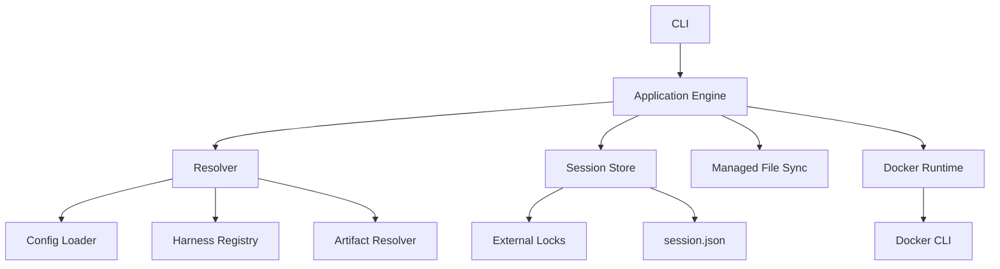
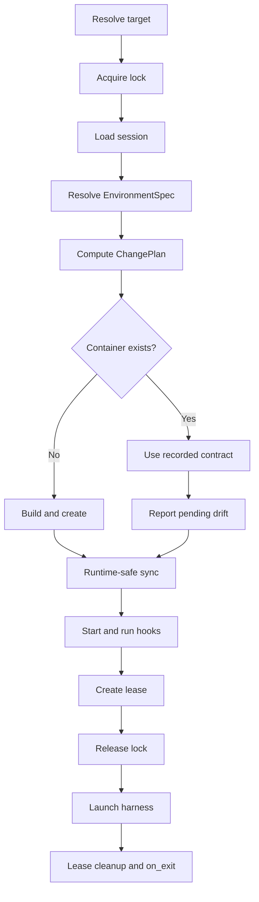

# Devbox Scratch Rewrite Plan

## Status

This document defines the intended rewrite. The rewrite starts in this repository with no code or state compatibility layer for the current implementation.

The plan is based on an inspection of the existing Go code, tests, human documentation, bundled assets, configuration model, proxy lifecycle, harness registry, session subsystem, and Docker integration.

## Executive Summary

Rewrite Devbox around one canonical environment model and one orchestration entry point while preserving the workflows explicitly selected for the rewrite:

- persistent Docker environments;
- profile-specific environment slots;
- current profile/project artifact types and precedence;
- configurable `on_exit` behavior with attached-command leases;
- complete session state management, including reset, prune, relocate, clone, and interrupted-transfer recovery, but no session aliases or permanent historical lineage;
- built-in harness definitions for Pi and OpenCode only;
- user-defined harnesses loaded from `~/.devbox/harnesses/<name>/harness.json`;
- user definitions overriding built-in definitions with the same name;
- managed harness configuration synchronized through a generic hash manifest plus schema-declared merge strategies for harness-owned mutable files.

Remove the proxy completely. Do not replace it with offline mode or claim that Devbox controls container egress.

The rewrite will simplify the implementation by consolidating ownership, resolution, state, and lifecycle policy. It will not pretend that retained features such as session transfer and safe auto-stop are intrinsically simple.

## Evidence From the Current Codebase

The current repository contains approximately:

| Area | Size or observation |
|---|---:|
| Go code, including tests | 37,000 lines |
| `internal/service` production code | 8,757 lines |
| `internal/service` tests | 13,358 lines |
| Go files that mention proxy behavior | 76 |
| Human documentation | 3,299 lines |

The baseline `make test` passes.

The main complexity sources are:

1. **Proxy behavior crosses abstraction boundaries.** It affects images, networks, certificates, mounts, labels, metadata, ownership preflight, rollback, logs, start/stop, and deletion.
2. **Harness declarations are compiled in.** The current registry is partly declarative, but config validation, defaults, image construction, auth, state, and transfer behavior all depend on the compiled registry.
3. **Open resolves the same environment through many representations.** Global settings, layer settings, artifacts, `OpenPlan`, creation settings, metadata, session records, leases, and environment transactions overlap.
4. **State has multiple authorities.** Docker labels, `metadata.json`, and `session.json` each own part of environment identity or behavior.
5. **Artifact resolution is powerful but non-obvious.** Explicit `--profile` changes profile/project precedence, and different artifact types compose differently.
6. **Safe `on_exit=stop` requires coordination.** Attached commands need leases, stale-process detection, locks, and cleanup after cancellation.
7. **Session transfer is transactional behavior.** Relocate and clone require deterministic multi-lock acquisition, ownership checks, destination staging, rollback, and interrupted-transfer recovery.

The rewrite must make these retained rules explicit and give each one a single owner.

## Product Goals

1. Make the effective environment predictable from one resolved specification.
2. Remove all proxy code, assets, configuration, state, commands, and documentation.
3. Let users define harnesses without recompiling Devbox.
4. Ship built-in definitions only for `pi` and `opencode`.
5. Use the same runtime path for built-in and user-defined harnesses.
6. Centralize environment identity, creation facts, session identity, activity, and transfer state in one durable record.
7. Keep destructive operations safe under concurrent CLI use.
8. Keep Docker ownership fail-closed through labels and a stable installation ID.
9. Make effective configuration and its merge provenance visible, and make reconciliation errors explain their reasons.
10. Keep the Go dependency set small and continue to use the Docker CLI.

## Non-Goals

- No Squid sidecar, HTTPS interception, CA management, allowlist, or proxy recovery.
- No offline mode. AI harnesses require network access.
- No network-security or egress-isolation claim.
- No migration, dual-read, dual-write, fallback, or importer for the current implementation.
- No support for Claude, Copilot, or Codex as built-ins. Users may define them as custom harnesses.
- No host command gateway or privileged host-control service.
- No background daemon.
- No Docker SDK unless command-line Docker proves incapable of satisfying a tested requirement.

## Accepted Product Decisions

### Profiles and environment identity

Keep profile slots. A workspace may have separate durable environments for named profiles and for the project slot.

Container identity remains a function of:

```text
canonical workspace path + slot
```

The reserved project slot remains distinct from profile names.

### Artifact types and precedence

Keep these profile/project artifacts:

- `config.json`
- `Dockerfile`
- `Dockerfile.full`
- `setup.sh`
- `entrypoint.sh`
- `<harness>/` configuration directory

Keep current precedence semantics:

- without explicit `--profile`, the selected/default profile is the base and project artifacts win;
- with explicit `--profile`, project artifacts are the base and profile artifacts win;
- `config.json` merges by schema;
- `Dockerfile`, `Dockerfile.full`, `setup.sh`, and `entrypoint.sh` use winner-by-existence;
- harness directories overlay recursively in the same base-to-winner order.

This behavior must exist in one pure resolver with table-driven tests. No other package may reimplement artifact precedence.

### Networking

Use one creation-time `network` setting for the container's primary network:

```json
{
  "network": "default"
}
```

Valid values:

- `default`: use Docker's default bridge behavior;
- `host`: use Docker host networking;
- any other value: use that existing Docker network as the primary network.

The CLI uses the same model:

```text
devbox <target> --network default
devbox <target> --network host
devbox <target> --network <existing-network>
```

`--network` overrides the resolved profile/project value for that open. It is a creation-time option; changing it requires container recreation. `host` is incompatible with published ports. Named networks must exist before any build or container mutation. Devbox never creates or deletes the selected network.

Replace the current `host_network` and `extra_networks` configuration fields with this scalar `network` field. As a scalar, a higher-priority layer replaces the lower-priority value instead of appending.

`devbox network connect|disconnect` manages secondary runtime network attachments, not desired configuration:

- connecting or disconnecting a secondary network does not change `EnvironmentSpec` or persisted `session.json` fingerprints;
- secondary attachments survive stop/start because they belong to the existing Docker container;
- secondary attachments do not survive container recreation;
- connect/disconnect is rejected in `host` mode;
- disconnecting the configured primary network is rejected with an instruction to change config and recreate;
- connecting an already attached network is a no-op;
- only existing user-owned Docker networks may be attached, and Devbox never deletes them.

This separation prevents runtime network commands from silently changing durable configuration.

### Lifecycle

Keep current configurable behavior:

- `on_exit: running` leaves the container running;
- `on_exit: stop` stops it after the last attached Devbox command exits;
- `open`, `shell`, and `exec` create attached-command leases;
- stale leases are detected and reaped;
- stop/recreate/delete/reset/transfer enforce the appropriate active-session rules;
- cancellation still runs bounded cleanup and preserves the foreground command exit status.

There is no idle-timeout feature in the initial rewrite.

### Sessions

Keep the complete feature set:

- list and show;
- activity timestamps and last action;
- reset with history-preservation policy;
- orphan pruning and explicit deletion;
- relocate;
- clone;
- same-workspace slot transfer;
- interrupted relocation recovery;
- active-command safety.

The rewrite must centralize this rather than spreading it across separate metadata, session, environment, and service abstractions.

### Harness override behavior

User definitions override built-ins by name. For example:

```text
~/.devbox/harnesses/pi/harness.json
```

replaces the embedded Pi definition completely. The registry must report the effective origin through scoped config `--show` output and `doctor` diagnostics.

## Design Principles

1. **One resolved model.** Resolve user input once into `EnvironmentSpec`; execution consumes it without re-reading config.
2. **One durable aggregate.** `session.json` is the host-side authority for one durable session slot; its Docker container is disposable runtime.
3. **One mutation lock owner.** Every session mutation goes through the session store and its external locks.
4. **Pure resolution, effectful execution.** Config, target, harness, artifact, and change resolution are pure where possible.
5. **Typed transitions.** Create, open, recreate, delete, reset, clone, and relocate are explicit operations, not flags that silently alter another operation's contract.
6. **No hidden fallback.** Invalid JSON, missing profiles, ownership mismatch, and corrupt state fail clearly.
7. **No harness-specific lifecycle branches.** Differences live in validated harness definitions.
8. **No prompt-driven core policy.** The engine returns a plan or typed requirement. The CLI may ask one question or require an explicit flag.
9. **Preserve user data by rule.** Regular managed files are not overwritten after user or harness modification. Structured merge files update only the keys explicitly owned by the harness definition.
10. **Names are lookup keys, labels prove ownership.** Deterministic names never authorize destructive operations.

## Target Architecture



### Ownership

- **CLI** owns Cobra commands, flags, prompts, rendering, signals, and exit codes.
- **Application Engine** owns use-case ordering and typed lifecycle transitions.
- **Resolver** produces the canonical desired `EnvironmentSpec` and source trace.
- **Harness Registry** loads, validates, and resolves embedded and user definitions.
- **Artifact Resolver** exclusively owns current profile/project precedence.
- **Session Store** owns durable records, leases, locks, harness state, and pending-transfer journals.
- **Managed File Sync** owns harness configuration projection and conflict detection.
- **Docker Runtime** translates typed Docker operations to CLI invocations and parses results.

No lower-level package imports the CLI or application engine.

## Proposed Repository Layout

```text
rewrite/
  cmd/devbox/
  internal/
    app/                 # use cases and transition ordering
    cli/                 # Cobra command tree and rendering
    config/              # strict JSON schemas and layer merge
    harness/             # registry, schema, validation, embedded definitions
    artifact/            # profile/project artifact resolution
    environment/         # EnvironmentSpec and change planning
    store/               # session persistence, leases, locks, state, journals
    filesync/            # managed harness file synchronization
    docker/              # typed Docker CLI adapter
    assets/              # base image/runtime assets
    ui/                  # terminal output and confirmation
  docs/
    dev/
    src/
  Makefile
  go.mod
```

Avoid a generic `service` package containing unrelated policy. The public application facade may be an `app.Engine`, but each dependency has a narrow concrete responsibility.

## Canonical Models

### `EnvironmentSpec`

`EnvironmentSpec` is immutable after resolution and contains:

- canonical workspace path;
- deterministic slot and container name;
- selected profile and whether it was explicit;
- resolved global and layer settings;
- resolved harness definition and origin;
- resolved artifact paths and source trace;
- image build plan;
- container create plan;
- harness config sync plan;
- hook plan;
- launch command;
- derived image, container, and runtime fingerprints.

All collection fields are copied before the spec is returned. Execution does not mutate it.

### Derived fingerprints

Use one canonical spec with three derived fingerprints:

| Fingerprint | Inputs | Required action |
|---|---|---|
| Image | Dockerfiles, Devbox image assets, harness install definition | rebuild image and recreate container |
| Container | image ID, mounts, env, ports, primary network, harness stores/auth, raw Docker args | recreate container |
| Runtime | hooks, harness config desired tree, runtime assets, launch defaults | synchronize or run without recreate |

The resolver produces a typed `ChangePlan`:

```text
NoChange | RuntimeSync | Restart | Recreate | RebuildAndRecreate
```

`ChangePlan` is internal application state, not a CLI command. The executor consumes that exact value. For an existing usable container, creation-time drift becomes a non-blocking pending-change diagnostic; the root flow continues with the recorded container contract and points to `devbox recreate <target>`.

### `SessionRecord`

Store one durable record at:

```text
~/.devbox/sessions/<container-slot>/session.json
```

It contains:

- schema version;
- immutable random session ID;
- deterministic container name, workspace, slot, and profile;
- harness name and effective definition origin;
- created time, last activity time, and last action;
- current image/container/runtime fingerprints needed to recreate the container;
- session-owned final image tag, image ID, and image-input fingerprint;
- a non-secret recorded launch contract containing harness name, binary, default/continue args, definition hash, and lifecycle policy;
- Docker ownership version;
- pending transfer journal summary;
- lifecycle policy required for stale-lease cleanup;
- managed config manifest version and location.

It does not retain permanent `cloned_from` or `relocated_from` history. Clone creates a new session ID; relocate preserves the session ID. Only an in-progress transfer journal is retained for recovery and removed after completion.

Do not split durable recreation metadata into another host-side record. Do not persist live Docker runtime facts as session authority; inspect Docker for those facts. Do not persist secrets in the record. Secret-bearing env values contribute through a salted/structured fingerprint and are redacted in config, status, and reconciliation output.

## State Layout

```text
~/.devbox/
  config.json
  profiles/
    <name>/
      config.json
      Dockerfile
      Dockerfile.full
      setup.sh
      entrypoint.sh
      <harness>/
  harnesses/
    <name>/
      harness.json
      defaults/
  auth/
    <harness>/
  cache/
    harnesses/<harness>/
  sessions/
    <container-slot>/
      session.json
      active/
      harnesses/
        <harness>/
          stores/<store-name>/
          managed-config.json
      transfer/
        journal.json
  state/
    installation-id
    locks/
      sessions/
        <hash>.operation.lock
        <hash>.record.lock
```

External lock paths remain outside removable session directories so deletion cannot unlink a live lock.

### Container/session boundary

A session is durable Devbox state and recreation identity. A container is disposable Docker runtime linked to the session through deterministic naming and ownership/session-ID labels.

Read and mutation commands preserve that boundary:

- `devbox list`, `status`, `start`, `stop`, `recreate`, and `delete` operate on containers;
- `devbox session list`, `show`, `reset`, `relocate`, `clone`, `prune`, and `delete` operate on durable sessions;
- `devbox delete --all` removes managed containers but never session state;
- `devbox session delete` refuses a session that still has a matching container or active lease.

Container views may show a linked session indicator. Session views may show the matching container as `running`, `stopped`, or `missing`. Those cross-references do not change which resource owns each command.

Exact read contracts:

- `devbox list` inventories live managed Docker containers only;
- `devbox status <target>` shows container image, state, mounts, ports, and networks, and reports a missing container with a hint to use `session show`;
- `devbox session list` inventories durable session directories, including sessions with no container;
- `devbox session show <target>` shows durable identity, workspace/slot, harness state, activity, leases, pending transfer, size, and only a minimal matching-container status.

## Configuration

### Global config

Use `~/.devbox/config.json` for machine-local defaults:

```json
{
  "version": 1,
  "default_profile": "",
  "default_harness": "",
  "global_env": [],
  "ignore_project_overrides": false
}
```

There are no proxy fields. A newly initialized home has no profiles and does not seed `default_profile` or `default_harness`. Pi and OpenCode definitions are embedded capabilities, not automatically selected configuration.

### Profile/project config

Keep the current layer fields except proxy fields, replacing `host_network` and `extra_networks` with the scalar `network` field. Preserve sparse layers and current list-append behavior for retained list fields; `network` follows normal scalar replacement.

Strict rules:

- unknown fields fail;
- unsupported versions fail;
- all migration logic is absent from the rewrite;
- validation runs after full resolution;
- CLI overrides apply last;
- config is read once per operation.

### Resolution trace

Every resolved value records its source:

```text
built-in default | global | profile | project | CLI
```

Scoped config commands expose this trace through `--show`:

```text
devbox global config --show
devbox profile config <name> --show
devbox project config <folder> --show [--profile <name>]
```

Without `--show`, each command opens its interactive dashboard. With `--show`, it prints the effective config and provenance tree non-interactively. `--json` makes that output machine-readable. There is no separate `--resolve`, `devbox config resolve`, or `devbox plan` command.

For profile config, effective resolution includes built-in defaults, global config, and the selected profile. For project config, it includes the exact global/profile/project precedence used by the root open flow, including explicit `--profile` behavior. This visibility is necessary because the accepted explicit-profile precedence rule is not intuitive.

## Guided First Run and Contextual Hints

### Fresh home

Initializing a new `~/.devbox` creates required directories and the sparse global config only. It does not seed profiles, select a default profile, or select a default harness. Embedded Pi and OpenCode definitions remain available for later selection.

When a folder has neither project config nor an applicable profile, the root flow stops before Docker work and gives explicit commands:

```text
No profile or project configuration applies to /work/api.

Create a reusable profile:
  devbox profile create default

Or configure only this project:
  devbox project create /work/api
```

Devbox never creates one implicitly.

When profiles exist but none is selected:

```text
No default profile is configured.

Open with an existing profile:
  devbox . --profile python

Set a default:
  devbox profile set python
```

The error also lists available profiles.

### Success hints

Successful create commands print a short next-step block.

After profile creation:

```text
Created profile "python".

Next:
  devbox profile init python
  devbox profile config python
  devbox profile set python
```

After project creation:

```text
Created /work/api/.devbox/config.json.

Next:
  devbox project init /work/api
  devbox project config /work/api
  devbox /work/api
```

`init` is described as the guided path for harness selection and optional artifacts, not as hidden work performed by `create`.

### State-derived guidance

Provide exact next commands for these common states:

| State | Guidance |
|---|---|
| `profile list` is empty | `devbox profile create <name>` |
| container list is empty, no sessions | configure a profile/project, then `devbox <folder>` |
| container list is empty, sessions exist | `devbox session list`, then `devbox start <target>` |
| selected profile is missing | exact `profile create` command plus available profiles |
| selected harness is missing | owning `profile config`, `project config`, or `init` command |
| profile/project already exists on `create` | its `config` and `init` commands |
| `init` runs before `create` | exact prerequisite `create` command |
| custom harness JSON is invalid | file, field error, and `devbox doctor` |
| container deletion succeeds | state-preserved message, `start`, and exact `session delete` command |
| session deletion is blocked by a container | exact `devbox delete` command first |
| primary network is missing | `docker network create <name>` or owning config command |
| command-name folder exists | explicit path such as `devbox ./status` |

Filtered cleanup guides users to preview first:

```text
Preview:
  devbox session prune --orphaned --dry-run
```

### Structured next steps

Hints are structured application data, not strings scattered across Cobra handlers:

```json
{
  "error": "profile_missing",
  "message": "Profile \"rust\" does not exist",
  "next_steps": [
    {
      "command": ["devbox", "profile", "create", "rust"],
      "reason": "Create the selected profile"
    }
  ]
}
```

Human rendering prints copyable shell commands. JSON rendering preserves argv arrays so callers do not parse prose.

### Hint guardrails

- show hints after creation, for actionable errors, and for meaningful empty states;
- do not print onboarding hints on every successful open;
- show at most three next commands and put the recommended action first;
- use exact resolved names and paths;
- quote human shell output safely;
- never silently perform a suggested mutation;
- keep non-interactive output concise while retaining structured `next_steps`;
- test hints as part of command contracts.

## Create, Init, and Harness Selection

`create` establishes the configuration owner. `init` performs guided initialization.

### Profiles

`devbox profile create <name>` creates a sparse profile config and does not prompt for a harness. It then points to `profile init`.

`devbox profile init <name> [--harness <name>]`:

1. uses an already configured profile harness when present;
2. otherwise lists effective Pi, OpenCode, and valid user-defined harnesses;
3. writes the selected harness to profile config;
4. offers optional `Dockerfile`, `Dockerfile.full`, `setup.sh`, `entrypoint.sh`, and selected-harness config files;
5. creates only selected missing artifacts.

### Projects

`devbox project create <folder>` creates sparse `.devbox/config.json` and points to `project init`.

`devbox project init <folder> [--harness <name|inherit>]` offers:

- inherit the currently effective profile/global harness;
- select Pi, OpenCode, or a valid user-defined harness explicitly;
- initialize optional artifacts for the resulting harness.

Inheritance is rejected when it resolves to no harness. The output points to profile initialization or asks for an explicit project harness.

### Re-running init

Initialization is idempotent:

- keep the configured harness by default;
- allow an explicit harness change;
- never overwrite existing artifacts;
- report created and skipped paths;
- use config-dashboard selections without prompting again.

Interactive choices have automation equivalents:

```text
devbox profile init python --harness pi
devbox project init . --harness inherit
```

A user may configure a harness through the dashboard and skip artifact initialization entirely. `init` is the recommended guided path, not a mandatory source of default files.

## Harness System

### Registry loading

1. Load embedded Pi and OpenCode definitions.
2. Enumerate `~/.devbox/harnesses/*/harness.json` in sorted order.
3. Strictly decode and validate every user definition.
4. Replace an embedded definition when a user definition has the same name.
5. Reject duplicate user definitions, invalid names, unsafe mount targets, and unsupported schema versions.
6. Return each effective definition with origin `builtin` or its user file path.

A malformed user definition is a hard error when that harness is selected. `doctor` validates every user definition and reports invalid entries without hiding valid ones. Config dashboards list only valid effective definitions and identify user overrides.

### Proposed harness schema

```json
{
  "version": 1,
  "name": "pi",
  "binary": "pi",
  "install": {
    "shell": "curl -fsSL https://pi.dev/install.sh | sudo -E sh",
    "path": ["/home/${user}/.local/bin"]
  },
  "launch": {
    "args": [],
    "continue_args": ["-c"]
  },
  "env": {
    "NPM_CONFIG_PREFIX": "/home/devuser/.local",
    "NPM_CONFIG_CACHE": "/home/devuser/.npm"
  },
  "stores": [
    {
      "name": "home",
      "scope": "environment",
      "target": "/home/devuser/.pi/agent"
    },
    {
      "name": "npm-global",
      "scope": "cache",
      "target": "/home/devuser/.local"
    },
    {
      "name": "npm-cache",
      "scope": "cache",
      "target": "/home/devuser/.npm"
    }
  ],
  "config": {
    "store": "home",
    "path": "."
  },
  "config_merge": [
    {
      "path": "settings.json",
      "strategy": "json-keys",
      "owned_keys": [
        "packages",
        "extensions",
        "skills",
        "prompts",
        "themes",
        "npmCommand"
      ]
    }
  ],
  "auth": [
    {
      "source": "auth.json",
      "target": "/home/devuser/.pi/agent/auth.json",
      "kind": "file",
      "create": true
    }
  ],
  "session": {
    "reset_preserve": ["sessions"],
    "relocate": true,
    "clone": true
  },
  "prepare": []
}
```

Schema rules:

- `install.shell` runs only inside the image build, never on the host.
- `${user}` is the only initial template variable.
- launch commands use argv arrays; shell parsing is not used for launch.
- store names are unique and targets are absolute.
- `scope` is `environment` or `cache`.
- config names one environment store and an optional relative subpath.
- `config_merge` declares structured files that cannot use whole-file synchronization because the harness mutates the same file.
- `json-keys` requires a relative JSON file path and a unique, non-empty `owned_keys` list. Paths and owned keys cannot overlap across declarations.
- auth sources are relative to `~/.devbox/auth/<harness>/` unless an explicit, validated host path feature is added later.
- auth targets may overlay files inside a mounted store.
- reset and transfer behavior comes from the definition, not Go branches.
- `prepare` is a list of explicit in-container argv commands. Avoid harness-specific shell generation in Go.

The exact schema must be proven against both Pi and OpenCode before it is frozen. A custom third harness fixture must exercise the same path in tests.

### Built-in defaults

Embed only:

```text
internal/harness/builtin/pi/
internal/harness/builtin/opencode/
```

Each directory contains `harness.json` and `defaults/`. Built-ins are parsed through the same strict loader as user definitions.

## Managed Harness Config Synchronization

Replace staged symlink projection with one host-side synchronizer. The synchronizer supports both ordinary whole-file management and structured merge strategies declared by the effective harness definition.

Pi requires structured merging because Pi and Devbox both mutate `settings.json`. The Pi definition must declare `settings.json` with `strategy: "json-keys"` and these Devbox-owned top-level keys:

```text
packages
extensions
skills
prompts
themes
npmCommand
```

This is required behavior, not an optional optimization. The merge engine is generic and available to built-in and user-defined harnesses; lifecycle code must not branch on the name `pi`.

### Inputs

Resolve the desired file tree in accepted precedence order:

1. effective harness built-in/user defaults;
2. lower-priority harness artifact directory;
3. winning harness artifact directory.

Only regular files and directories are accepted initially. Reject special files. Define symlink support separately if a real use case requires it.

### Manifest

Each environment/harness stores `managed-config.json` containing, for every managed relative path:

- desired source and source layer;
- synchronization strategy;
- destination store and relative path;
- hash last applied by Devbox for an ordinary file;
- declared owned keys and their desired hashes for a structured merge file;
- last synchronization time;
- conflict status when applicable.

### Ordinary file reconciliation

For each desired file without a declared merge strategy:

1. If destination is absent, copy atomically and record its hash.
2. If destination hash equals the last applied hash, update it to the new desired content.
3. If destination differs from the last applied hash, preserve it and report a conflict.
4. If an old managed file is no longer desired, remove it only when its live hash still equals the last applied hash.
5. Never delete unmanaged files or directories.

### `json-keys` reconciliation

For each file declared with `strategy: "json-keys"`:

1. Parse the desired file as a JSON object. Invalid desired JSON is a hard configuration error.
2. Parse the live file as a JSON object, or start with an empty object when the file is absent.
3. If the live file exists but is not a JSON object, preserve it and return a structured conflict instead of replacing it.
4. For each declared owned key, copy its desired value into the live object when present in the desired file.
5. Delete a declared owned key from the live object when it is absent from the desired file.
6. Preserve every key not declared in `owned_keys`, including keys Pi added or changed.
7. Serialize and replace the live file atomically.
8. Record the owned-key set and desired value hashes in the manifest.

Devbox intentionally overwrites declared owned keys: the resolved built-in/profile/project config is authoritative for those keys. It never modifies undeclared keys.

### Commit and error rules

1. Apply writes using temporary files and atomic replacement.
2. Commit the new manifest only after all non-conflicting writes succeed.
3. Return structured conflicts; do not hide them as warnings in logs.
4. A conflict in one path must not cause Devbox to claim that path was synchronized.

This preserves Pi's current required key-level behavior while making the mechanism available to any harness definition. It also makes project/profile config changes observable and testable.

## Docker and Image Model

Continue to shell out to the Docker CLI.

### Docker interface

Expose operations required by use cases rather than one broad interface copied from Docker:

- inspect/list managed environments;
- inspect/build images;
- create/start/stop/remove a container;
- execute attached, streaming, or captured commands;
- copy runtime assets;
- inspect the configured primary network and secondary runtime attachments;
- read process state needed for lease diagnosis.

Devbox does not create or delete user networks. Container creation selects the resolved primary network; runtime network commands only attach or detach secondary existing networks. There is no Devbox-owned network aggregate after proxy removal.

### Images

Preserve `Dockerfile` and `Dockerfile.full` behavior through one `ImageBuildPlan`:

- normal mode may build a user/profile intermediate image, then apply the Devbox runtime layer and selected harness installation;
- full mode uses `Dockerfile.full`, then appends the documented Devbox runtime contract;
- selected harness definition hash is part of the image fingerprint;
- changing a user override of Pi/OpenCode therefore becomes pending image drift for each affected session, but does not block opening its existing container;
- embedded runtime docs/assets have separate runtime hashes when they can be synchronized without rebuilding.

Image planning and image execution are separate. Tests assert generated plans without invoking Docker.

## Session-Scoped Images and Rebuild Isolation

Final runtime image tags are owned by sessions, not mutable profile/harness names:

```text
devbox/session:<session-id>
```

Two sessions with identical inputs can have separate tags pointing to the same Docker image ID. Docker still deduplicates content-addressed layers and reuses build cache.

### Why

Rebuilding one mutable shared profile image must not make unrelated sessions appear stale merely because a tag moved. A targeted forced rebuild changes only the selected session's image reference.

```text
Before:
  session A tag -> sha256:111
  session B tag -> sha256:111

After `devbox recreate A --image`:
  session A tag -> sha256:222
  session B tag -> sha256:111
```

Session B receives no drift warning from A's rebuild.

### Drift and rebuild rules

A session compares current resolved image inputs with its own recorded image-input fingerprint. It never compares its container against the current digest of a shared mutable tag.

- forced rebuild with unchanged inputs affects only targeted sessions;
- a real shared profile/Dockerfile change creates pending image drift for every session whose resolved inputs changed;
- those sessions still open their existing containers normally;
- `devbox recreate <target>` builds automatically when the target's image inputs changed;
- `--image` forces a fresh build even when inputs are unchanged;
- `recreate --all --image` may reuse Docker cache but updates each selected session independently.

### Cleanup

- container deletion preserves the session-owned image tag so the session can recreate its container;
- `delete --all` preserves session images and state;
- exact `session delete` removes its session-owned image tag after verifying no container remains;
- image tags are lookup/cache references, while image ID plus session/installation labels provide verification facts.

## Non-Blocking Configuration Drift

Existing containers are usable snapshots. Configuration changes do not block access and do not trigger implicit destructive recreation.

### Default open behavior

When an owned container exists, the root flow:

1. resolves current desired configuration;
2. compares it with the session's recorded container contract;
3. opens the existing container even when creation-time drift exists;
4. launches the harness recorded for that container;
5. applies only runtime-safe behavior compatible with the recorded harness;
6. prints a concise pending-change warning and recreation command.

Example:

```text
Warning: the existing container uses earlier creation settings.
  - primary network changed
  - environment changed

Using the existing container unchanged.
Apply changes later with:
  devbox recreate .

Launching pi...
```

There is no `--existing` mode because existing-container reuse is the default.

### Recorded versus current inputs

The session record contains the non-secret launch contract required to use the snapshot even if current profile/project config selects a different harness. Creation-time values remain recorded until explicit recreation.

Runtime-safe inputs may update without replacement:

- invocation-local terminal environment;
- current `entrypoint.sh`;
- managed harness config resolved specifically for the recorded harness;
- runtime assets and docs;
- one-off harness arguments compatible with the recorded harness.

Immutable creation inputs remain pending:

- image and Dockerfile inputs;
- harness installation/selection and store mounts;
- primary network;
- ports, mounts, container env, read-only mode, and raw Docker args.

### Container commands

`start`, `shell`, and `exec` operate on the actual existing container and do not require desired-config reconciliation. If no container exists, `start` recreates it from the durable session contract when possible; a brand-new configured folder creates from current resolved configuration.

`status` shows pending desired-versus-recorded drift without treating it as container failure.

### Hard failures

Reuse fails only when the existing runtime genuinely cannot be used safely:

- ownership mismatch;
- corrupt or missing recorded contract required to launch;
- pending relocation;
- an actual recorded bind source is missing and Docker cannot start;
- Docker start or exec failure.

A changed Dockerfile, image fingerprint, harness selection, network, port, mount declaration, or environment setting is not by itself a reason to block opening.

## Ownership and Safety

Keep:

- `devbox.managed=true`;
- stable installation ID label;
- durable environment/session ID label;
- exact environment identity validation;
- ownership verification before every destructive Docker operation;
- deterministic names only as lookup keys;
- atomic same-directory record writes;
- containment-checked recursive deletion.

With the proxy removed, the owned Docker aggregate contains only the main container and its image references. Primary and secondary user-created networks are never deleted by Devbox.

## Lifecycle and Lease Model

### Attached commands

The root target flow, `shell`, and `exec`:

1. acquire the session operation lock;
2. reject incompatible pending transfers;
3. ensure the environment is running;
4. create an attached-command lease containing host PID, process start identity, action, and requested `on_exit` policy;
5. release the operation lock;
6. run the attached Docker command;
7. reacquire the operation lock in bounded cleanup;
8. remove the lease;
9. reap stale leases;
10. apply last-attached-command `on_exit` behavior;
11. return the attached command's exit status unless cleanup is the only failure.

The lease subsystem belongs to the session store. Application workflows call it; they do not manipulate lease files.

### Start and stop

- `start <target>` means ensure running: start an existing container from its recorded contract; recreate a missing container from an existing durable session contract when possible; otherwise create a new session/container from current resolved configuration; run compatible runtime preparation; and leave it running without launching a harness or creating an attached-command lease.
- creation-time drift never blocks `start`; it emits the same pending-change diagnostic as the root open flow.
- `start` replaces the old `open --detach` behavior.
- `stop` rejects active leases unless a force option explicitly permits disruption.
- there is no proxy sidecar to coordinate.

### Recreate

```text
devbox recreate <target>
devbox recreate <target> --image
devbox recreate --all
devbox recreate --all --image
```

- default behavior recreates the container and performs an image build only when the resolved image plan requires it;
- `--image` forces an image rebuild before recreation;
- preserve the session record, harness stores, and activity;
- reject active leases;
- remove only a verified owned main container;
- create and health-check the replacement;
- commit new fingerprints only after success;
- restore intended running/stopped state.

The root open flow has no recreate flags and never performs destructive reconciliation implicitly.

## Open Flow



Rules:

- resolution happens before Docker mutation;
- a missing container with an existing durable session is recreated from that recorded contract when possible; a brand-new configured target is created from current resolved configuration;
- a usable existing container opens from its recorded contract even when creation-time config drift exists;
- drift produces a concise warning and `devbox recreate <target>` hint, never a blocking prompt or error;
- the root open flow never performs destructive recreation;
- setup runs once per container creation and records completion in the session record, not an opaque home marker;
- entrypoint hook runs on every open;
- these hooks are the only persisted pre-harness customization points; `open` has no `--init` or `--run` command injection;
- ad hoc commands use `devbox exec`, including `devbox exec <target> -- bash -s < script.sh` for a host script;
- harness config synchronization occurs before in-container preparation;
- record commit is part of successful creation.

## Session Operations

### Reset

- use the effective harness definition's `reset_preserve` patterns;
- reject active leases;
- support selected harness, all harnesses, one session, or all sessions;
- provide dry-run output;
- `--include-history` removes the complete selected harness stores that are session-scoped;
- auth and shared cache stores are never reset.

### Relocate and clone

Use one transfer engine with explicit mode-specific policy:

- acquire source and destination operation locks in sorted order;
- revalidate source, destination, ownership, leases, and harness transfer support while locked;
- stage destination state before source destruction;
- clone creates a new session ID without retaining permanent source history;
- relocate preserves the session ID without retaining permanent path history;
- a relocation journal records the authoritative destination before source cleanup;
- interrupted relocation exposes one recoverable pending state;
- retry resumes the recorded operation instead of starting another transfer;
- rollback is bounded and never silently destroys the last valid copy.

Keep transfer logic in one package and state machine. Do not express it through generic callbacks.

### Prune and delete

- container deletion and session-state deletion remain separate operations;
- `devbox session delete <target...>` accepts exact targets only and rejects a matching container or active lease;
- `devbox session prune` exclusively owns discovered/bulk cleanup through filters such as `--orphaned` and `--older-than`, plus `--dry-run` and explicit confirmation;
- `session delete` has no `--all`, `--orphaned`, or age-filter flags;
- complete lock sets are acquired before filtered destructive operations.

## CLI Surface

The CLI is resource-first. Global, profile, and project configuration stays under the resource that owns the edited layer.

### Runtime and session commands

```text
devbox <target> [-c] [-p NAME]
devbox list
devbox status <target>
devbox start <target>
devbox stop <target>
devbox delete [target...]
devbox delete --all|--stopped
devbox shell <target>
devbox exec <target> -- <argv...>
devbox logs <target>
devbox recreate <target> [--image]
devbox recreate --all [--image]
devbox network inspect|env|connect|disconnect
devbox session list|show|relocate|clone|reset|prune|delete
```

Container cleanup and session cleanup remain intentionally separate:

```text
devbox delete --all
devbox session delete <target...>
devbox session prune --orphaned [--older-than <duration>] [--dry-run]
```

`delete --all` removes containers only. `session delete` removes exact durable sessions only after their containers are gone. `session prune` owns discovered and filtered bulk state cleanup.

The root target flow accepts open options such as `--network <default|host|existing-network>`. There is no `open` subcommand. If a workspace name collides with a command, an explicit path disambiguates it: `devbox ./status`, `devbox ../status`, or `devbox /absolute/path/status`.

The root target flow has no `--detach`, `--recreate-container`, `--recreate-image`, `--init`, or `--run`. `start` owns detached preparation, `recreate` owns replacement, one-time preparation belongs in `setup.sh`, every-open preparation belongs in `entrypoint.sh`, and ad hoc commands use `devbox exec`.

Network command semantics:

```text
devbox network inspect <target>
devbox network env <target>
devbox network connect <secondary-network> <target>
devbox network disconnect <secondary-network> <target>
```

`network env` emits shell-safe exports specifically for scripting, including `source <(devbox network env <target>)` and single-value printing where supported. It remains a first-class shorthand rather than forcing scripts to transform inspect JSON.

`connect` and `disconnect` never edit profile/project config. They are rejected for host-network containers, and `disconnect` cannot remove the configured primary network.

### Global configuration

```text
devbox global config
devbox global config --show [--json]
```

Without `--show`, `global config` opens the interactive global dashboard. With `--show`, it prints normalized global settings and their built-in defaults.

### Profile commands

```text
devbox profile create <name>
devbox profile config <name>
devbox profile config <name> --show [--json]
devbox profile init <name> [--harness <name>]
devbox profile list
devbox profile set [name]
devbox profile delete <name>
```

- `create` creates the minimal profile directory and sparse `config.json` without selecting a harness.
- `config` opens the interactive profile dashboard.
- `config --show` prints the effective built-in/global/profile values and provenance.
- `init` selects the harness when not already configured, then interactively creates optional profile artifacts such as Dockerfiles, hooks, and harness config. It replaces `profile seed`.
- `set` remains an intentional convenience for changing the global default profile without opening the global dashboard.

### Project commands

```text
devbox project create <folder>
devbox project config <folder>
devbox project config <folder> --show [--profile <name>] [--json]
devbox project init <folder> [--harness <name|inherit>]
```

- `create` creates the project's minimal sparse `.devbox/config.json` without forcing a harness selection. It replaces the current meaning of `project init`.
- `config` opens the interactive project dashboard.
- `config --show` prints the exact effective built-in/global/profile/project values and provenance used by the root open flow.
- `init` chooses an explicit harness or valid inheritance when not already configured, then interactively creates optional project artifacts such as Dockerfiles, hooks, and harness config. It replaces `project seed`.

### Utility commands

```text
devbox doctor
devbox completion
devbox version
```

There is no `devbox harness` command group. Users manage `~/.devbox/harnesses/<name>/harness.json` directly. `doctor` validates all definitions, config dashboards expose valid harness choices, and scoped config `--show` output reports the selected definition and origin.

### Remove

- all proxy flags;
- proxy domains and allowlist config;
- proxy shell and logs;
- proxy health checks and doctor output;
- all harness command groups, including hidden deprecated harness commands;
- built-in Claude, Copilot, and Codex choices/defaults;
- top-level `devbox config` and its `global`, `profile`, and `project` children;
- `profile seed` and `project seed`;
- `devbox plan`, `config resolve`, and all `--resolve` forms;
- the `open` subcommand;
- `open --detach`, `--recreate-container`, `--recreate-image`, `--init`, and `--run`;
- `recreate image|container` subcommands;
- permanent clone/relocate lineage fields and output.

The scoped `config --show` modes expose the centralized resolver without introducing a separate planning or resolution command.

## Errors and Observability

Use typed errors for:

- invalid config or harness definition;
- missing selected profile;
- unknown harness;
- ownership mismatch;
- active lease conflict;
- managed config conflict;
- pending transfer;
- Docker command failure and passthrough exit status.

`--json` renders stable error codes and structured details for scoped config output, list, status, and doctor. Human errors include the failed operation, target, reason, and next command.

Non-blocking diagnostics such as pending creation-time drift use separate typed result data with reasons and suggested commands; they are not represented as errors or non-zero exit status.

Do not log and continue after a state commit failure. Do not convert corrupt state into absence.

## Implementation Phases

### Phase 0: Repository and contracts

- initialize Go module, Makefile, formatting, test, race, build, and integration targets;
- add architecture decision records for accepted behavior;
- define package dependency rules;
- create CLI smoke test harness;
- preserve this plan as the scope baseline.

**Exit criteria:** empty CLI builds, tests run, dependency direction is documented and enforced by review.

### Phase 1: Harness registry

- define strict v1 harness schema;
- encode Pi and OpenCode as embedded JSON definitions;
- load user definitions and apply user-overrides-built-in behavior;
- validate stores, auth, commands, paths, config merge declarations, reset patterns, and transfer policy;
- integrate definition validation and origin reporting into `doctor`, config dashboards, and scoped config `--show`;
- test a third custom harness fixture end to end through resolution.

**Exit criteria:** adding a valid custom harness needs no Go change.

### Phase 2: Config and artifact resolution

- define a fresh-home global config with no seeded profiles, default profile, or default harness;
- define global and layer schemas without proxy fields;
- implement current explicit-profile precedence in one resolver;
- resolve all artifact types and source traces;
- resolve CLI overrides;
- produce immutable `EnvironmentSpec` and fingerprints;
- implement global/profile/project config dashboards and their non-interactive `--show` provenance output before runtime mutation exists.

**Exit criteria:** table tests cover every profile/project/explicit-profile artifact combination and every source trace.

### Phase 3: Session store and locks

- implement home paths, installation ID, atomic writes, containment deletion, and external locks;
- define `SessionRecord` and validation;
- implement lease create/read/reap/close;
- implement pending transfer journal representation;
- add corruption and concurrency tests.

**Exit criteria:** all state transitions are atomic or have a tested recovery state.

### Phase 4: Docker runtime and ownership

- implement typed Docker CLI runner;
- implement batched inventory and inspect parsing;
- implement labels and fail-closed ownership verification;
- implement container create/start/stop/remove, exec, copy, logs, ports, primary network selection, and secondary runtime network attachment;
- add fake-runner unit tests and tagged real-Docker integration tests.

**Exit criteria:** no application package constructs raw Docker CLI arguments.

### Phase 5: Images and artifacts

- implement `ImageBuildPlan` for normal and full Dockerfiles;
- add selected harness installation from the effective definition;
- embed runtime entrypoint/docs/assets;
- implement image/container/runtime fingerprints and `ChangePlan`;
- implement session-scoped final image tags and recorded image-input fingerprints;
- ensure a targeted forced rebuild cannot move another session's image reference;
- test rebuild/recreate decisions independently of Docker.

**Exit criteria:** every creation-time input has one documented fingerprint owner, and rebuilding one session cannot create digest-only drift in another session.

### Phase 6: Managed harness config

- implement recursive overlay resolution;
- implement atomic hash-manifest synchronization for ordinary files;
- implement schema-declared `json-keys` merging and Pi's required owned-key declaration;
- report and preserve whole-file and structured-file conflicts;
- integrate environment and cache stores plus auth overlays;
- prove behavior against Pi, OpenCode, and a custom harness.

**Exit criteria:** Pi's Devbox-owned `settings.json` keys update without replacing Pi-owned keys; no staged symlink projection, legacy collapse, or harness-name-specific merge branch exists.

### Phase 7: Open and lifecycle

- implement the root target create/reuse flow, recorded launch contracts, non-blocking drift behavior, and command-name path disambiguation;
- implement ensure-running `start`, unified `recreate [--image]`, setup, and entrypoint hooks;
- implement attached lease lifecycle and signal-safe cleanup;
- implement `on_exit` last-lease behavior;
- implement root-target launch, shell, exec, start, stop, logs, container status/list, and separate session status/list views;
- preserve foreground exit codes.

**Exit criteria:** concurrent open/shell/exec and stale-lease cases pass unit and Docker integration tests.

### Phase 8: Session management

- implement list/show/reset/prune/delete;
- implement common clone/relocate engine and same-workspace slot transfer;
- implement pending relocation, retry, and rollback without permanent lineage;
- test failure injection at each transfer commit point.

**Exit criteria:** no tested interruption loses the only valid session-state copy or creates two authoritative transfer destinations.

### Phase 9: Remaining CLI, doctor, guidance, and docs

- implement resource-first `global config`, `profile create|config|init`, and `project create|config|init` command families;
- move harness selection into `profile/project init`, with explicit project inheritance validation and idempotent no-overwrite artifact seeding;
- implement centralized structured `next_steps`, fresh-home onboarding, create-success hints, empty-state guidance, and actionable error guidance;
- implement primary-network inspection and secondary runtime connect/disconnect for user-owned networks;
- implement doctor checks from registry, store, and Docker facts, including validation of every user harness definition;
- add shell completion;
- write guide, reference, and architecture documentation together;
- remove every proxy reference from code, schemas, defaults, help, tests, and docs.

**Exit criteria:** CLI help, schemas, defaults, docs, and tests describe the same behavior.

### Phase 10: Hardening and release preparation

- run unit, race, integration, build, and release tests;
- audit permissions and secret redaction;
- inspect dead code and duplicated policy;
- measure Docker command count for container list, root-target launch, status, and session cross-reference flows;
- test fresh installation only;
- write manual cutover instructions without implementing migration.

**Exit criteria:** release checklist passes on a fresh Devbox home and no current-state compatibility path exists.

## Testing Strategy

### Unit tests

- strict JSON decoding and validation;
- registry override and origin rules;
- complete artifact precedence matrix;
- immutable spec and deterministic fingerprints;
- fresh-home empty profile/default state;
- create/init harness-selection and inheritance rules;
- structured next-step selection and shell-safe rendering;
- managed ordinary-file conflict matrix;
- `json-keys` set/update/delete behavior, undeclared-key preservation, invalid JSON conflicts, and declaration validation;
- session record invariants;
- lease staleness and PID reuse defense;
- target resolution;
- change planning;
- transfer state machine and rollback.

### Integration tests without Docker

Use temporary homes, fixture projects, filesystem fault injection, and a command-recording Docker fake. Assert complete plans and operation order rather than private helper calls.

### Docker integration tests

Cover:

- Pi and OpenCode image creation;
- one custom harness definition;
- auth and store persistence;
- project/profile precedence;
- normal and full Dockerfile modes;
- ordinary config synchronization and conflicts;
- Pi `settings.json` owned-key updates while Pi-owned keys remain unchanged;
- the same `json-keys` strategy in a custom harness;
- concurrent attached commands and `on_exit`;
- recreation preserving state;
- session-scoped image tags, targeted forced rebuild isolation, and shared Docker-layer reuse;
- existing-container open/start under creation-time drift without blocking or implicit recreation;
- recorded-harness launch when current harness selection differs;
- first-run profile/project guidance and idempotent init flows;
- clone and relocate success/failure recovery;
- ownership rejection;
- default, host, and existing primary network creation;
- host/port conflict validation;
- secondary network connect/disconnect, primary disconnect rejection, and recreation behavior;
- configured ports.

### Contract tests

For each CLI command, test:

- human output essentials;
- JSON schema when supported;
- exit code;
- state mutation or non-mutation;
- Docker operations performed;
- behavior under cancellation.

## Complexity Guardrails

1. No compatibility code in the rewrite.
2. No proxy abstraction remains after proxy deletion.
3. No `switch harnessName` in lifecycle, image, state, reset, or transfer code.
4. No config or artifact reload after `EnvironmentSpec` resolution.
5. No second durable session/recreation metadata file.
6. No raw container-name destructive operation without a verified environment lock and ownership proof.
7. No ordinary managed config overwrite without manifest proof; structured files may update only keys declared as owned by the effective harness definition.
8. No command-specific implementation of profile/project precedence.
9. No generic transaction callback framework for transfer or lifecycle state machines.
10. Every added background process, sidecar, daemon, or journal requires an explicit architecture decision and failure-recovery design.

## Cutover and Development Isolation

There is no automatic compatibility with the current `~/.devbox`.

During development:

- build the binary under a distinct name such as `devbox-rewrite`;
- use an explicit isolated `DEVBOX_HOME`;
- use distinct development labels and container/image name prefixes;
- never inspect or mutate current Devbox resources by prefix alone.

Before final release, document a manual clean cutover:

1. stop current Devbox containers;
2. back up or move the current home directory;
3. remove or rename old deterministic containers that collide;
4. initialize a fresh rewrite home;
5. recreate profiles/projects and authenticate Pi/OpenCode or custom harnesses.

Do not turn these instructions into hidden startup migration.

## Definition of Done

The rewrite is complete when:

- proxy code and behavior do not exist;
- Pi and OpenCode work through parsed built-in definitions;
- a user can add or override a harness through `~/.devbox/harnesses/<name>/harness.json` without recompilation;
- profile slots and current artifact precedence pass a complete resolution matrix;
- managed harness config synchronization preserves modified ordinary files, reports conflicts, and applies schema-declared structured merges;
- Pi's declared `settings.json` keys update while all undeclared Pi-owned keys remain intact;
- `on_exit` remains safe with concurrent attached commands;
- all retained session operations work through one durable session record and transfer engine, with no permanent lineage;
- Docker destructive operations require lock ownership and installation labels;
- a fresh home contains no seeded profiles/default selection and guides the first root open to `profile create` or `project create`;
- create commands point to init, init owns harness selection and optional artifact seeding, and repeated init never overwrites existing files;
- scoped config `--show` output explains the effective merge tree, while non-blocking drift diagnostics explain pending rebuild/recreate actions without preventing access;
- final runtime image references are session-scoped, so a targeted forced rebuild never creates digest-only drift for another session;
- fresh-home unit, race, integration, build, and release checks pass;
- human docs, command help, defaults, schemas, and tests agree;
- no compatibility or migration path has been added.
