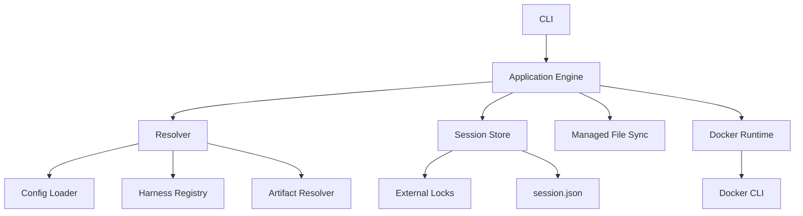
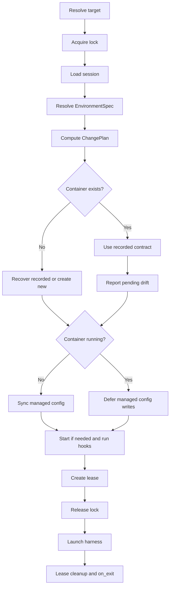

# Devbox Scratch Rewrite Plan

## Status

This document defines the intended rewrite. The normal runtime starts with no old-code or old-state compatibility layer. An explicitly invoked, removable migration utility is planned separately in [migration-plan.md](migration-plan.md); it converts the current Go home's data into normal new-format state.

The plan is based on an inspection of the existing Go code, tests, human documentation, bundled assets, configuration model, proxy lifecycle, harness registry, session subsystem, and Docker integration.

## Executive Summary

Rewrite Devbox around one canonical environment model and one orchestration entry point while preserving the workflows explicitly selected for the rewrite:

- persistent Docker environments;
- profile-specific environment slots;
- current profile/project artifact types, with explicit profiles isolated from project artifacts;
- configurable `on_exit` behavior with attached-command leases;
- complete session state management, including reset, prune, relocate, clone, and interrupted-transfer recovery, but no session aliases or permanent historical lineage;
- built-in harness definitions for Pi and OpenCode only;
- user-defined harnesses loaded from `~/.devbox/harnesses/<name>/harness.json`;
- user definitions overriding built-in definitions with the same name;
- managed harness configuration synchronized through a generic hash manifest plus schema-declared merge strategies for harness-owned mutable files.

Remove the proxy completely. Do not replace it with offline mode or claim that Devbox controls container egress.

The rewrite will simplify the implementation by consolidating ownership, resolution, state, and lifecycle policy. It will not pretend that retained features such as session transfer and safe auto-stop are intrinsically simple.

## Evidence From the Current Codebase

The current repository contains approximately:

| Area | Size or observation |
|---|---:|
| Go code, including tests | 37,000 lines |
| `internal/service` production code | 8,757 lines |
| `internal/service` tests | 13,358 lines |
| Go files that mention proxy behavior | 76 |
| Human documentation | 3,299 lines |

The baseline `make test` passes.

The main complexity sources are:

1. **Proxy behavior crosses abstraction boundaries.** It affects images, networks, certificates, mounts, labels, metadata, ownership preflight, rollback, logs, start/stop, and deletion.
2. **Harness declarations are compiled in.** The current registry is partly declarative, but config validation, defaults, image construction, auth, state, and transfer behavior all depend on the compiled registry.
3. **Open resolves the same environment through many representations.** Global settings, layer settings, artifacts, `OpenPlan`, creation settings, metadata, session records, leases, and environment transactions overlap.
4. **State has multiple authorities.** Docker labels, `metadata.json`, and `session.json` each own part of environment identity or behavior.
5. **Artifact resolution is powerful but non-obvious.** Explicit `--profile` changes profile/project precedence, and different artifact types compose differently.
6. **Safe `on_exit=stop` requires coordination.** Attached commands need leases, stale-process detection, locks, and cleanup after cancellation.
7. **Session transfer is transactional behavior.** Relocate and clone require deterministic multi-lock acquisition, ownership checks, destination staging, rollback, and interrupted-transfer recovery.

The rewrite must make these retained rules explicit and give each one a single owner.

## Product Goals

1. Make the effective environment predictable from one resolved specification.
2. Remove all proxy code, assets, configuration, state, commands, and documentation.
3. Let users define harnesses without recompiling Devbox.
4. Ship built-in definitions only for `pi` and `opencode`.
5. Use the same runtime path for built-in and user-defined harnesses.
6. Centralize environment identity, creation facts, session identity, activity, and transfer state in one durable record.
7. Keep destructive operations safe under concurrent CLI use.
8. Keep Docker ownership fail-closed through labels and a stable installation ID.
9. Make effective configuration and its merge provenance visible, and make reconciliation errors explain their reasons.
10. Keep the Go dependency set small and continue to use the Docker CLI.

## Non-Goals

- Linux is the only supported host platform. No macOS/Windows support, portability shims, or cross-platform fallback paths.
- No Squid sidecar, HTTPS interception, CA management, allowlist, or proxy recovery.
- No offline mode. AI harnesses require network access.
- No network-security or egress-isolation claim.
- No startup migration, dual-read, dual-write, old-format fallback, or importer inside the normal runtime. One-time cutover belongs exclusively to the separate migration utility.
- No support for Claude, Copilot, or Codex as built-ins. Users may define them as custom harnesses.
- No host command gateway or privileged host-control service.
- No background daemon.
- No Docker SDK unless command-line Docker proves incapable of satisfying a tested requirement.

## Accepted Product Decisions

### Profiles and environment identity

Keep profile slots. A workspace may have separate durable environments for named profiles and for the project slot.

Container identity remains a function of:

```text
canonical workspace path + slot
```

The reserved project slot remains distinct from profile names.

### Artifact types and precedence

Keep these profile/project artifacts:

- `config.json`
- `Dockerfile`
- `setup.sh`
- `entrypoint.sh`
- `<harness>/` configuration directory

Use one layer-selection rule for all profile/project artifacts:

- without explicit `--profile`, the default profile is the base when configured and project artifacts win, unless the participating project sets `inherit_profile: false`;
- `inherit_profile: false` excludes all profile artifacts, not global defaults; it makes the project standalone with respect to profiles;
- `ignore_project_overrides` excludes all project artifacts, including their `inherit_profile` setting, and uses the applicable profile;
- with explicit `--profile <name>`, use only the named profile and exclude all project artifacts;
- excluded project artifacts are not read, parsed, validated, merged, or fingerprinted; a malformed project `.devbox/config.json` cannot block explicit-profile startup;
- global settings and built-in defaults still apply in both cases, with CLI overrides last;
- `config.json` merges participating layers by schema;
- `Dockerfile`, `setup.sh`, and `entrypoint.sh` use winner-by-existence among participating layers;
- harness directories overlay recursively in the same base-to-winner order.

This deliberately replaces the current explicit-profile precedence reversal. Invalid participating configuration remains a hard error; exclusion is not an invalid-config fallback.

Read a participating project's sparse config once to determine `inherit_profile` before loading a default profile. An excluded profile is not loaded or validated, so a missing or malformed default profile cannot block a standalone project. Reject `inherit_profile` in global and profile config. With explicit `--profile`, do not read project config to discover this setting.

This behavior must exist in one pure resolver with table-driven tests. No other package may reimplement artifact precedence.

### Networking

Use one creation-time `network` setting for the container's primary network:

```json
{
  "network": "default"
}
```

Valid values:

- `default`: use Docker's default bridge behavior;
- `host`: use Docker host networking;
- any other value: use that existing Docker network as the primary network.

The CLI uses the same model:

```text
devbox open <target> --network default
devbox open <target> --network host
devbox open <target> --network <existing-network>
```

`--network` overrides the resolved profile/project value for that open. It is a creation-time option; changing it requires container recreation. `host` is incompatible with published ports. Named networks must exist before any build or container mutation. Devbox never creates or deletes the selected network.

Replace the current `host_network` and `extra_networks` configuration fields with this scalar `network` field. As a scalar, a higher-priority layer replaces the lower-priority value instead of appending.

`devbox network connect|disconnect` manages secondary runtime network attachments, not desired configuration:

- connecting or disconnecting a secondary network does not change `EnvironmentSpec` or persisted `session.json` fingerprints;
- secondary attachments survive stop/start because they belong to the existing Docker container;
- secondary attachments do not survive container recreation;
- connect/disconnect is rejected in `host` mode;
- disconnecting the configured primary network is rejected with an instruction to change config and recreate;
- connecting an already attached network is a no-op;
- only existing user-owned Docker networks may be attached, and Devbox never deletes them.

This separation prevents runtime network commands from silently changing durable configuration.

### Lifecycle

Keep current configurable behavior:

- `on_exit: running` leaves the container running;
- `on_exit: stop` stops it after the last attached Devbox command exits;
- `open`, `shell`, and `exec` create attached-command leases;
- stale leases are detected and reaped;
- stop/recreate/delete/reset/transfer enforce the appropriate active-session rules;
- cancellation still runs bounded cleanup and preserves the foreground command exit status.

There is no idle-timeout feature in the initial rewrite.

### Sessions

Keep the complete feature set:

- list and show;
- activity timestamps and last action;
- reset with history-preservation policy;
- orphan pruning and explicit deletion;
- relocate;
- clone;
- same-workspace slot transfer;
- interrupted relocation recovery;
- active-command safety.

The rewrite must centralize this rather than spreading it across separate metadata, session, environment, and service abstractions.

### Harness override behavior

User definitions override built-ins by name. For example:

```text
~/.devbox/harnesses/pi/harness.json
```

replaces the embedded Pi definition completely. The registry must report the effective origin through scoped config `--show` output and actionable errors.

## Design Principles

1. **One resolved model.** Resolve user input once into `EnvironmentSpec`; execution consumes it without re-reading config.
2. **One durable aggregate.** `session.json` is the host-side authority for one durable session slot; its Docker container is disposable runtime.
3. **One mutation lock owner.** Every session mutation goes through the session store and its external locks.
4. **Pure resolution, effectful execution.** Config, target, harness, artifact, and change resolution are pure where possible.
5. **Typed transitions.** Create, open, recreate, delete, reset, clone, and relocate are explicit operations, not flags that silently alter another operation's contract.
6. **No hidden fallback.** Invalid participating configuration, missing selected profiles, ownership mismatch, and corrupt state fail clearly. Existing-container `start`, `shell`, and `exec` use recorded contracts without loading desired config; this is their normal contract, not an error fallback.
7. **No harness-specific lifecycle branches.** Differences live in validated harness definitions.
8. **No prompt-driven core policy.** The engine returns a plan or typed requirement. The CLI may ask one question or require an explicit flag.
9. **Preserve user data by rule.** Regular managed files are not overwritten after user or harness modification. Structured merge files update only the keys explicitly owned by the harness definition.
10. **Names are lookup keys, labels prove ownership.** Deterministic names never authorize destructive operations.

## Target Architecture



### Ownership

- **CLI** owns Cobra commands, flags, prompts, rendering, signals, and exit codes.
- **Application Engine** owns use-case ordering and typed lifecycle transitions.
- **Resolver** produces the canonical desired `EnvironmentSpec` and source trace.
- **Harness Registry** loads, validates, and resolves embedded and user definitions.
- **Artifact Resolver** exclusively owns profile/project layer participation and artifact precedence.
- **Session Store** owns durable records, leases, locks, harness state, and pending-transfer journals.
- **Managed File Sync** owns harness configuration projection and conflict detection.
- **Docker Runtime** translates typed Docker operations to CLI invocations and parses results.

No lower-level package imports the CLI or application engine.

## Proposed Repository Layout

```text
rewrite/
  cmd/devbox/
  internal/
    app/                 # use cases and transition ordering
    cli/                 # Cobra command tree and rendering
    config/              # strict JSON schemas and layer merge
    harness/             # registry, schema, validation, embedded definitions
    artifact/            # profile/project artifact resolution
    environment/         # EnvironmentSpec and change planning
    store/               # session persistence, leases, locks, state, journals
    filesync/            # managed harness file synchronization
    docker/              # typed Docker CLI adapter
    assets/              # base image/runtime assets
    ui/                  # terminal output and confirmation
  docs/
    dev/
    src/
  Makefile
  go.mod
```

Avoid a generic `service` package containing unrelated policy. The public application facade may be an `app.Engine`, but each dependency has a narrow concrete responsibility.

## Canonical Models

### `EnvironmentSpec`

`EnvironmentSpec` is immutable after resolution and contains:

- canonical workspace path;
- deterministic slot and container name;
- selected profile and whether it was explicit;
- resolved global and layer settings;
- resolved harness definition and origin;
- resolved artifact paths and source trace;
- image build plan;
- container create plan;
- harness config sync plan;
- hook plan;
- launch command;
- a secret-free typed input snapshot with derived image, container, and runtime fingerprints and detailed comparison reasons.

All collection fields are copied before the spec is returned. Execution does not mutate it.

### Derived fingerprints

Use one canonical spec with three derived fingerprints:

| Fingerprint | Inputs | Required action |
|---|---|---|
| Image | Dockerfile, included build context and permissions, ignore rules, generated Devbox image layer, effective harness definition, build arguments | rebuild image and recreate container |
| Container | image ID, mounts, env, ports, primary network, harness stores/auth, raw Docker args, per-container setup inputs | recreate container |
| Runtime | every-open entrypoint hook, harness config desired tree, runtime assets, launch defaults | synchronize or run without recreate |

The resolver produces a typed `ChangePlan`:

```text
NoChange | RuntimeSync | Recreate | RebuildAndRecreate
```

The implementation captures `environment.Inputs` from the same resolved bytes and settings used for creation. Its typed image/container/runtime sections generate both aggregate fingerprints and structured `pending_input_changes` (`scope`, `code`, `field`, optional key/path and safe before/after values). Env values are represented by keyed hashes and reported by variable name only; source file contents are hashed, not saved or displayed. Source locations explain content changes but do not independently change image fingerprints. Relative input names, contents, and relevant permissions remain significant. Reasons identify independent leaf changes rather than repeating derived image-to-container hash propagation.

`ChangePlan` describes differences, not permission to mutate. The application applies command policy to it: explicit recreation applies creation-time changes; `open` reports them as pending and uses the recorded container contract. Managed harness config synchronization is deferred while the container is running. Starting a stopped container is a lifecycle operation, not a `Restart` change kind.

### `SessionRecord`

Store one durable record at:

```text
~/.devbox/sessions/<container-slot>/session.json
```

It contains:

- schema version `2` (strict current format; older development records require a clean reset, with no compatibility reader or migration);
- required image/container/runtime input snapshots, with committed fingerprints validated against them;
- immutable random session ID;
- deterministic container name, workspace, slot, and profile;
- harness name and effective definition origin;
- created time, last activity time, and last action;
- image/container/runtime fingerprints for change detection, not as substitutes for recreation inputs;
- session-owned final image tag, image ID, and image-input fingerprint;
- concrete non-secret creation settings: workspace binding and read-only mode, other mounts, ports, primary network, public raw Docker arguments, and container metadata;
- the recorded harness store/auth layout and non-secret runtime preparation contract, so recovery does not depend on a newer harness definition;
- secret-source references and verification fingerprints, never secret values;
- required hook/input paths and hashes for recorded preparation, plus setup completion tied to the container instance;
- a non-secret recorded launch contract containing harness name, binary, default/continue args, configured harness args, default shell, definition hash, and lifecycle policy;
- Docker ownership version;
- lifecycle policy required for stale-lease cleanup;
- managed config manifest version and location.

Creation and recreation commit all input snapshots. Runtime synchronization advances only its snapshot and fingerprint together; warnings and status inspection never advance baselines. Recovery preserves recorded image/container inputs. Transfers commit the destination's own resolved inputs.

It does not retain permanent `cloned_from` or `relocated_from` history. Clone creates a new session ID; relocate preserves the session ID. Only an in-progress transfer journal is retained for recovery and removed after completion. Session views expose its pending summary; the journal is external to both removable session trees.

Do not split durable recreation metadata into another host-side record. Do not persist live Docker runtime facts as session authority; inspect Docker for those facts. Do not persist secrets in the record. Classify sensitivity by destination field. Environment/auth values are sensitive regardless of whether they are literal or substituted. Names, paths, networks, launch argv, raw Docker arguments, and other ordinary settings are public configuration, including their substitutions; those fields must not contain secrets. Secret-bearing env values contribute through a salted/structured fingerprint and are redacted in config, status, and reconciliation output.

### Missing-container recovery

Recovery restores the recorded container contract; explicit `recreate` applies current configuration. They are not interchangeable operations.

Recovery requires:

- a valid session record and no incompatible active lease or pending transfer;
- the exact recorded image ID, with valid installation ownership, available locally;
- recorded bind sources, session stores, auth sources, and primary network available and valid;
- required recorded preparation inputs available with matching hashes;
- every required secret-bearing value recoverable from a recorded source reference and matching its recorded verification fingerprint.

For sensitive config environment inputs, retain a file/field/index reference with keyed fingerprints of the source expression and resolved assignment. Reread that exact expression and expand it once from the invoking process environment; do not copy literal credentials or expressions containing credentials into the record. Managed auth references identify paths, not copies of credentials; normal credential rotation does not change the recorded mount contract. Literal secret-bearing inputs with no source reference are not persisted and make exact recovery unavailable. Do not invent a source, store a secret, or silently replace an old value with a changed one.

If these conditions hold, create from the recorded image and settings, preserve session identity/state, and rerun required per-container preparation. Do not rebuild a missing image or consult current config as an automatic recovery fallback. If an input is missing or changed, return an actionable recovery error before container mutation and point to `devbox recreate <target>` to explicitly use current configuration. An existing container does not need its old host env values merely to start or run commands.

## State Layout

```text
~/.devbox/
  config.json
  profiles/
    <name>/
      config.json
      Dockerfile
      setup.sh
      entrypoint.sh
      <harness>/
  harnesses/
    <name>/
      harness.json
      defaults/
  auth/
    <harness>/
  cache/
    harnesses/<harness>/
  sessions/
    <container-slot>/
      session.json
      active/
      harnesses/
        <harness>/
          stores/<store-name>/
          managed-config.json
  state/
    installation-id
    transfers/
      <source-container>.json
    locks/
      sessions/
        <hash>.operation.lock
        <hash>.record.lock
```

External lock paths remain outside removable session directories so deletion cannot unlink a live lock.

### Container/session boundary

A session is durable Devbox state and recreation identity. A container is disposable Docker runtime linked to the session through deterministic naming and ownership/session-ID labels. Container/session names use `devbox-<folder>-<12-hex-hash>.profile-<name>` or `devbox-<folder>-<12-hex-hash>.project`, hashing the full canonical workspace path and slot. The canonical folder basename is lowercased, sanitized to `a-z0-9_.-` with invalid runs replaced by `-`, and limited to 32 characters. Edge punctuation is trimmed; an empty result becomes `workspace`. The prefix is independent of the Docker ownership namespace.

Read and mutation commands preserve that boundary:

- `devbox list`, `status`, `start`, `stop`, `recreate`, and `delete` operate on containers;
- `devbox session list`, `show`, `reset`, `relocate`, `clone`, `prune`, and `delete` operate on durable sessions;
- `devbox delete --all` removes managed containers but never session state;
- `devbox session delete` refuses a session that still has a matching container or active lease.

Container views may show a linked session indicator. Session views may show the matching container as `running`, `stopped`, or `missing`. Those cross-references do not change which resource owns each command.

Exact read contracts:

- `devbox list` inventories live managed Docker containers only;
- `devbox status <target>` shows container image, state, mounts, ports, and networks, and reports a missing container with a hint to use `session show`;
- `devbox session list` inventories durable session directories, including sessions with no container;
- `devbox session show <target>` shows durable identity, workspace/slot, harness state, activity, leases, pending transfer, size, and only a minimal matching-container status.

## Configuration

### Global config

Use `~/.devbox/config.json` for machine-local defaults:

```json
{
  "version": 1,
  "default_profile": "",
  "default_harness": "",
  "global_env": [],
  "ignore_project_overrides": false
}
```

There are no proxy fields. A newly initialized home has no profiles and does not seed `default_profile` or `default_harness`. Pi and OpenCode definitions are embedded capabilities, not automatically selected configuration.

| Field | Type | Default | Contract |
|---|---|---|---|
| `version` | integer | `1` | Supported schema version only |
| `default_profile` | string | `""` | Profile used when applicable and not selected explicitly |
| `default_harness` | string | `""` | Harness fallback when no layer or CLI selection applies |
| `global_env` | string array | `[]` | `KEY=VALUE` literals or `KEY` host passthrough when set |
| `ignore_project_overrides` | boolean | `false` | Exclude all project artifacts |

### Profile/project config

Layers remain sparse. Missing fields inherit; present scalar values replace. Lists append only where the table specifies append; `default_shell` is an argv value and replaces as a whole.

| Field | Type | Default | Layer behavior |
|---|---|---|---|
| `version` | integer | `1` | Validate supported version |
| `on_exit` | string | `"stop"` | Replace; `running` or `stop` |
| `default_shell` | string array | `["bash"]` | Replace; must be non-empty |
| `harness` | string | `""` | Replace; empty uses global fallback, otherwise an effective registry name |
| `harness_args` | string array | `[]` | Append exact argv entries |
| `network` | string | `"default"` | Replace primary network; `default`, `host`, or an existing network |
| `docker_args` | string array | `[]` | Append subject to Devbox-owned argument restrictions |
| `extra_mounts` | string array | `[]` | Append validated mount declarations |
| `extra_env` | string array | `[]` | Append `KEY=VALUE` entries with valid env names |
| `extra_ports` | string array | `[]` | Append validated published-port declarations |
| `vscode` | object | `{}` | Contains only the optional `extensions` string array; extensions append |
| `inherit_profile` | boolean | `true` | Project-only layer-selection setting; `false` excludes all profile artifacts |

`inherit_profile` is not a container setting or a merged profile value. Ordinary project creation leaves it absent; creation from a profile writes `false`. Do not deduplicate appended arguments as a substitute for correct layer selection.

Remove `proxy`, `host_network`, and `extra_networks` fields rather than accepting them as aliases. Global harness auth-path overrides are not part of this initial schema; managed auth sources follow the harness definition contract.

Strict rules:

- use standard JSON; comments and trailing commas are not supported in the initial rewrite;
- unknown fields fail;
- unsupported versions fail;
- normal config load/save code has no migration logic or dependency on the separate migration utility;
- validation runs after full resolution;
- CLI overrides apply last;
- config is read once per operation.

### Host environment substitution

Global, profile, and project config string values may reference the host process environment with `${env:NAME}`:

```json
{
  "extra_env": ["WORK_TOKEN=${env:WORK_TOKEN}"]
}
```

The `env:` prefix explicitly selects a host environment variable, not a container variable or shell expression.

- Capture the host environment once per operation and pass that snapshot into resolution.
- Expand decoded string values, including strings in arrays, in participating config files before schema merge and final validation. Do not substitute property names or raw JSON text; replacement values remain strings.
- An unset referenced variable is an error identifying the file, field, and variable name without disclosing its value. A variable set to an empty string is present; ordinary field validation still applies.
- Expand once only. Do not interpret replacement text as another reference, run shell commands, support default-value expressions, or load `.env` files automatically.
- Preserve expressions in source files and dashboard saves; never write expanded values back into configuration.
- Track substituted values through merge provenance. Redact environment/auth values in human and JSON diagnostics, including validation errors; ordinary configuration fields are public. Do not persist the host-environment snapshot or dump expanded configuration into session records. Persist only the defined non-secret recorded settings and source references; secret-bearing values contribute only through secret-safe fingerprints.
- Apply this syntax only to Devbox global/profile/project configuration, not harness definitions, copied harness files, Dockerfiles, hooks, CLI arguments, or durable state. Harness-definition `${user}` remains a separate existing template contract.

Excluded project configuration contributes no variable references and cannot fail explicit-profile resolution because a host variable is unset. Ordinary image/container/runtime change planning handles changes in expanded values; there is no separate environment-refresh lifecycle.

Terminal display passthrough is invocation-local, not substituted desired config. Capture the existing Devbox display-variable allowlist once per invocation. Supply present values before configured env at creation/recovery and as overrides on each attached `open`, `shell`, and `exec`. Do not persist these values or add env-source references or fingerprints. Changing terminals needs no recreation, and forwarding does not import host dotfiles or change recorded shell argv.

### Resolution trace

Every resolved value records its source:

```text
built-in default | global | profile | project | CLI
```

Scoped config commands expose this trace through `--show`:

```text
devbox global config --show
devbox profile config <name> --show
devbox project config <folder> --show [--profile <name>]
```

Without `--show`, each command opens a numbered terminal settings menu. With `--show`, it prints the effective config and provenance tree non-interactively. `--json` makes that output machine-readable and requires `--show`; project config's `--profile` override also requires `--show`. There is no separate `--resolve`, `devbox config resolve`, or `devbox plan` command.

Menus use canonical line input and shared selection/text controls without a TUI dependency. Config submenus, profile/project init, and profile selection share bold headings, aligned numbered choices, wrapped text, and dim secondary instructions; terminal output checks, `NO_COLOR`, and `TERM=dumb` control styling without changing input rules. Local source values remain separate from effective/redacted display values. Each submitted operation immediately re-reads under the owning configuration lock, rejects a changed edited field, and preserves unrelated concurrent edits and source expressions. Reset removes the local key; list controls edit local contributions only. The overview uses a short scope title and Setting/Value/Source columns, without a full-path or lifecycle banner. It shares its value formatter with human `--show`: scalars and shell commands inline, other list entries below the setting, a source beside each entry, and long values wrapped rather than truncated. Empty values display as `None`. Human nested fields use dotted paths for their source annotations; `--show --json` retains the original structure and complete values. Lists open directly with add/edit/remove actions relevant to their contents and reset only for an existing source key. Each operation saves immediately after validation; there are no drafts, save/discard actions, or additional confirmations. Back only navigates. Invalid or conflicting operations are reported without changing the saved field, and the editor reloads current source before the next operation. Source types and supported literal values are validated before saving, while effective cross-field and host-dependent validation remains with the normal resolver. Resolution errors stay visible without blocking local editing; malformed source schemas still require file repair. Enter submits input. Cancellation/EOF abandons incomplete input and retains completed changes.

For profile config, effective resolution includes built-in defaults, global config, and the selected profile. For project config, it includes exactly the participating layers used by the `open` flow: built-in defaults, global config, the applicable profile, and project overrides when enabled. Explicit `--profile` excludes the project layer and all project artifacts; project `inherit_profile: false` excludes the profile layer and all profile artifacts. `--show` reports excluded layers without loading them.

The human provenance display shows participating layers in their actual application order, effective values and their sources, contributions to appended lists, and winning artifact paths. It identifies layers excluded by configuration rather than implying they participated. JSON output exposes the same information. Both render the resolver's source trace; there is no separate visualization resolver or command. Human source labels use `default` or the edited scope name, and `inherited - global` / `inherited - profile` for lower-layer contributions. Non-empty list headings have no aggregate source label. The resolver records per-entry layer names while merging lists; `trace.entry_sources` aligns with resolved values even when entries are identical or environment values are redacted. The overview includes inherited entries, but editors only expose the selected layer's entries. Menu labels follow effective provenance, not whether the edited file contains the key. If resolution fails, known source values retain their owning-scope label while unavailable values are labelled `unknown`.

## Guided First Run and Contextual Hints

### Fresh home

Initializing a new `~/.devbox` creates required directories and the sparse global config only. It does not seed profiles, select a default profile, or select a default harness. Embedded Pi and OpenCode definitions remain available for later selection.

When a folder has neither project config nor an applicable profile, the root flow stops before Docker work and gives explicit commands:

```text
No profile or project configuration applies to /work/api.

Create a reusable profile:
  devbox profile create default

Or configure only this project:
  devbox project create /work/api
```

Devbox never creates one implicitly.

When a profile is needed because no project configuration applies, but profiles exist and none is selected:

```text
No default profile is configured.

Open with an existing profile:
  devbox open . --profile python

Set a default:
  devbox profile set python
```

The error also lists available profiles.

### Success hints

Successful create commands print a short next-step block.

After profile creation:

```text
Created profile "python".

Next:
  devbox profile init python
  devbox profile config python
  devbox profile set python
```

After project creation:

```text
Created /work/api/.devbox/config.json.

Next:
  devbox project init /work/api
  devbox project config /work/api
  devbox open /work/api
```

`init` is described as the guided path for harness selection and optional artifacts, not as hidden work performed by `create`.

### State-derived guidance

Provide exact next commands for these common states:

| State | Guidance |
|---|---|
| `profile list` is empty | `devbox profile create <name>` |
| container list is empty, no sessions | configure a profile/project, then `devbox open <folder>` |
| container list is empty, sessions exist | `devbox session list`, then `devbox start <target>` |
| selected profile is missing | exact `profile create` command plus available profiles |
| selected harness is missing | owning `profile config`, `project config`, or `init` command |
| profile/project already exists on `create` | its `config` and `init` commands |
| `init` runs before `create` | exact prerequisite `create` command |
| custom harness JSON is invalid | identify the file and validation error; correct it before retrying |
| container deletion succeeds | state-preserved message, `start`, and exact `session delete` command |
| session deletion is blocked by a container | exact `devbox delete` command first |
| primary network is missing | `docker network create <name>` or owning config command |
| recorded recovery input is missing or changed | identify the input without secrets; `devbox recreate <target>` to use current config |
| managed config changes are deferred while running | stop when safe, then open the target to synchronize before startup |

Filtered cleanup guides users to preview first:

```text
Preview:
  devbox session prune --orphaned --dry-run
```

### Structured next steps

Hints are structured application data, not strings scattered across Cobra handlers:

```json
{
  "error": "profile_missing",
  "message": "Profile \"rust\" does not exist",
  "next_steps": [
    {
      "command": ["devbox", "profile", "create", "rust"],
      "reason": "Create the selected profile"
    }
  ]
}
```

Human rendering prints copyable shell commands. JSON rendering preserves argv arrays so callers do not parse prose.

### Hint guardrails

- show hints after creation, for actionable errors, and for meaningful empty states;
- do not print onboarding hints on every successful open;
- show at most three next commands and put the recommended action first;
- use exact resolved names and paths;
- quote human shell output safely;
- never silently perform a suggested mutation;
- keep non-interactive output concise while retaining structured `next_steps`;
- test hints as part of command contracts.

## Create, Init, and Harness Selection

`create` establishes the configuration owner. `init` performs guided initialization.

### Profiles

`devbox profile create <name>` creates a sparse profile config and does not prompt for a harness. It then points to `profile init`.

`devbox profile init <name> [--harness <name>]`:

1. uses an already configured profile harness when present;
2. otherwise lists effective Pi, OpenCode, and valid user-defined harnesses;
3. writes the selected harness to profile config;
4. offers optional `Dockerfile`, `setup.sh`, `entrypoint.sh`, and selected-harness config files;
5. creates only selected missing artifacts.

### Projects

`devbox project create <folder>` creates sparse `.devbox/config.json` and points to `project init`.

`devbox project create <folder> --from-profile <name>` instead initializes a new project `.devbox/` with a one-time copy of the named profile's supported configuration and artifacts:

- copy `config.json`, Dockerfiles, hooks, and harness configuration directories that exist in the source profile;
- copy source content, not effective values merged with global settings or defaults;
- preserve source values and variable expressions without expanding them; add project-only `inherit_profile: false` to the copied config;
- validate the source and refuse an existing destination `.devbox/` before copying; do not merge into or overwrite an existing project;
- do not establish a link or synchronize future profile changes;
- do not change global defaults or the inheritance default for other projects.

The resulting project is standalone with respect to profiles, so the copied lists are not appended to the source profile a second time. Global defaults and env still apply. This is a source-configuration copy, not a flattened snapshot of the effective environment. Users can explicitly re-enable profile inheritance in project config; `project init` remains available for subsequent guided initialization.

`devbox project init <folder> [--harness <name|inherit>]` offers:

- inherit the harness from participating lower layers (global only when `inherit_profile: false`);
- select Pi, OpenCode, or a valid user-defined harness explicitly;
- initialize optional artifacts for the resulting harness.

Inheritance is rejected when it resolves to no harness. The output points to profile initialization or asks for an explicit project harness.

### Re-running init

Initialization is idempotent:

- keep the configured harness by default;
- allow an explicit harness change;
- never overwrite existing artifacts;
- report created and skipped paths;
- use config-dashboard selections without prompting again.

Interactive choices have automation equivalents:

```text
devbox profile init python --harness pi
devbox project init . --harness inherit
```

A user may configure a harness through the dashboard and skip artifact initialization entirely. `init` is the recommended guided path, not a mandatory source of default files.

## Harness System

### Registry loading

1. Load embedded Pi and OpenCode definitions.
2. Enumerate `~/.devbox/harnesses/*/harness.json` in sorted order.
3. Strictly decode and validate every user definition.
4. Replace an embedded definition when a user definition has the same name.
5. Reject duplicate user definitions, invalid names, unsafe mount targets, and unsupported schema versions.
6. Return each effective definition with origin `builtin` or its user file path.

A malformed user definition is a hard error when that harness is selected. Registry enumeration reports invalid user definitions without hiding valid ones. Config dashboards list only valid effective definitions and identify user overrides.

### Proposed harness schema

```json
{
  "version": 1,
  "name": "pi",
  "binary": "pi",
  "install": {
    "shell": "curl -fsSL https://pi.dev/install.sh | sudo -E sh",
    "path": ["/home/${user}/.local/bin"]
  },
  "launch": {
    "args": ["--tui-mode", "fullscreen"],
    "continue_args": ["-c"]
  },
  "env": {
    "NPM_CONFIG_PREFIX": "/home/devuser/.local",
    "NPM_CONFIG_CACHE": "/home/devuser/.npm"
  },
  "stores": [
    {
      "name": "home",
      "scope": "environment",
      "target": "/home/devuser/.pi/agent"
    },
    {
      "name": "npm-global",
      "scope": "cache",
      "target": "/home/devuser/.local"
    },
    {
      "name": "npm-cache",
      "scope": "cache",
      "target": "/home/devuser/.npm"
    }
  ],
  "config": {
    "store": "home",
    "path": "."
  },
  "config_merge": [
    {
      "path": "settings.json",
      "strategy": "json-keys",
      "owned_keys": [
        "packages",
        "extensions",
        "skills",
        "prompts",
        "themes",
        "npmCommand"
      ]
    },
    {
      "path": "models.json",
      "strategy": "json-keys",
      "owned_keys": ["providers"]
    }
  ],
  "auth": [
    {
      "source": "auth.json",
      "target": "/home/devuser/.pi/agent/auth.json",
      "kind": "file",
      "create": true
    }
  ],
  "session": {
    "reset_preserve": ["sessions"],
    "relocate": true,
    "clone": true
  },
  "prepare": []
}
```

Schema rules:

- `install.shell` runs only inside the image build, never on the host.
- `${user}` is the only initial template variable.
- launch commands use argv arrays; shell parsing is not used for launch.
- store names are unique and targets are clean absolute paths. Relative declaration paths must be canonical and remain within their owner.
- `scope` is `environment` or `cache`.
- config names one environment store and an optional relative subpath.
- `config_merge` declares structured files that cannot use whole-file synchronization because the harness mutates the same file.
- `json-keys` requires a relative JSON file path and a unique, non-empty `owned_keys` list. Paths and owned keys cannot overlap across declarations.
- auth sources are relative to `~/.devbox/auth/<harness>/` unless an explicit, validated host path feature is added later.
- auth targets may overlay files inside a mounted store, but cannot obscure a declared store.
- mount ancestors are derived from declared store/auth targets: the runtime image creates image-owned parents as `devuser`; create/start prepares nested parents in their host backing source using the recorded contract. Neither path recursively changes existing ownership or adds persistence.
- reset and transfer behavior comes from the definition, not Go branches.
- `prepare` is a list of explicit in-container argv commands. Avoid harness-specific shell generation in Go.

The exact schema must be proven against both Pi and OpenCode before it is frozen. A custom third harness fixture must exercise the same path in tests.

### Built-in defaults

Embed only:

```text
internal/harness/builtin/pi/
internal/harness/builtin/opencode/
```

Each directory contains `harness.json` and `defaults/`. Built-ins are parsed through the same strict loader as user definitions. Pi's default launch includes `--tui-mode fullscreen` (upstream experimental). It overrides Pi's saved `tuiMode`; later `harness_args` or one-off `--tui-mode regular` arguments take precedence. Existing recorded Pi environments must be recreated to adopt the changed definition. No harness-specific engine branch or setting-merge rule is added.

## Managed Harness Config Synchronization

Replace staged symlink projection with one host-side synchronizer. The synchronizer supports both ordinary whole-file management and structured merge strategies declared by the effective harness definition.

Pi requires structured merging because Pi and Devbox both mutate `settings.json`. The Pi definition must declare `settings.json` with `strategy: "json-keys"` and these Devbox-owned top-level keys:

```text
packages
extensions
skills
prompts
themes
npmCommand
```

Pi also declares `models.json` with `strategy: "json-keys"` and `owned_keys: ["providers"]`. The whole `providers` object follows the selected desired file rather than deep-merging provider entries; other live top-level keys remain untouched.

This is required behavior, not an optional optimization. The merge engine is generic and available to built-in and user-defined harnesses; lifecycle code must not branch on the name `pi`.

### Inputs

Resolve the desired file tree in accepted precedence order:

1. effective harness built-in/user defaults;
2. profile harness artifact directory, when applicable;
3. project harness artifact directory, only when project overrides participate.

Explicit `--profile` excludes the project directory entirely, matching all other artifact types.

Copy regular files and traverse directories in harness config trees. Warn with each source path and skip symlinks and other non-regular entries without following links; skipped entries do not override lower-layer files. Carry warnings through defaults, layer resolution, source copying, and seeding to user output. Config-root symlinks and filesystem read failures remain errors. Preserving symlinks is separate work; Docker build-context validation is unchanged.

### Synchronization timing

Managed harness config is written only while the matching container is stopped or absent and no attached-command lease is active. Hold the session operation lock across this check, synchronization, and startup. This prevents Devbox from merging files while a harness or background process in the container is writing them; atomic file replacement alone does not provide that protection.

- Creation and explicit recreation synchronize before the new container starts.
- Root open synchronizes a stopped container before starting it.
- Root open of a running container defers managed config changes, preserves live files and the applied manifest, and reports pending synchronization. It never stops the container implicitly.
- To apply deferred changes, stop when safe and then open the target. Config-independent existing-container `start`, `shell`, and `exec` preserve managed config rather than loading new desired files.
- Deferral is a diagnostic, not a successful synchronization or a reason to advance applied fingerprints.

This boundary covers Devbox-controlled operations and container writers. It does not claim coordination with external host tools editing the same files or direct Docker lifecycle commands outside Devbox.

### Manifest

Each environment/harness stores `managed-config.json` containing, for every managed relative path:

- desired source and source layer;
- synchronization strategy;
- destination store and relative path;
- hash and managed mode last applied by Devbox for an ordinary file;
- declared owned keys and their desired hashes for a structured merge file;
- last synchronization time;
- conflict status when applicable.

### Ordinary file reconciliation

For each desired file without a declared merge strategy:

1. If destination is absent, copy atomically and record its hash.
2. If destination hash equals the last applied hash, update it to the new desired content.
3. If destination differs from the last applied hash, preserve it and report a conflict.
4. If an old managed file is no longer desired, remove it only when its live hash still equals the last applied hash.
5. Never delete unmanaged files or directories.

### `json-keys` reconciliation

For each file declared with `strategy: "json-keys"`:

1. Parse the desired file as a JSON object. Invalid desired JSON is a hard configuration error.
2. Parse the live file as a JSON object, or start with an empty object when the file is absent.
3. If the live file exists but is not a JSON object, preserve it and return a structured conflict instead of replacing it.
4. For each declared owned key, copy its desired value into the live object when present in the desired file.
5. Delete a declared owned key from the live object when it is absent from the desired file.
6. Preserve every key not declared in `owned_keys`, including keys Pi added or changed.
7. Serialize and replace the live file atomically.
8. Record the owned-key set and desired value hashes in the manifest.

Devbox intentionally overwrites declared owned keys: the resolved built-in/profile/project config is authoritative for those keys. It never modifies undeclared keys.

### Commit and error rules

1. Apply writes using temporary files and atomic replacement.
2. Commit the new manifest only after all non-conflicting writes succeed.
3. Return structured conflicts; do not hide them as warnings in logs.
4. A conflict in one path must not cause Devbox to claim that path was synchronized.

This preserves Pi's current required key-level behavior while making the mechanism available to any harness definition. It also makes project/profile config changes observable and testable.

## Docker and Image Model

Continue to shell out to the Docker CLI.

### Docker interface

Expose operations required by use cases rather than one broad interface copied from Docker:

- inspect/list managed environments;
- inspect/build images;
- create/start/stop/remove a container;
- execute attached, streaming, or captured commands;
- copy runtime assets;
- inspect the configured primary network and secondary runtime attachments;
- read process state needed for lease diagnosis.

Devbox does not create or delete user networks. Container creation selects the resolved primary network; runtime network commands only attach or detach secondary existing networks. There is no Devbox-owned network aggregate after proxy removal.

### Images

Use one layered `ImageBuildPlan`:

- a user/profile `Dockerfile` may build an intermediate image, then Devbox always applies its runtime layer and selected harness installation;
- without a user Dockerfile, Devbox uses its standard Debian base;
- users customize a Debian-compatible base; Devbox owns the user/permissions, required runtime packages, and harness installation on top;
- `Dockerfile.full` is removed: there is no alternate user-owned runtime contract;
- selected harness definition hash is part of the image fingerprint;
- changing a user override of Pi/OpenCode therefore becomes pending image drift for each affected session, but does not block opening its existing container;
- embedded runtime docs/assets have separate runtime hashes when they can be synchronized without rebuilding.

The mandatory runtime includes Bash, CA certificates, curl, git, sudo, procps, vim, zip, unzip, jq, net-tools, and iputils-ping, plus system-wide interactive Bash aliases `ll='ls -alF'` and `vi='vim'`. These image inputs apply to default and custom-base images; ordinary recreation rebuilds when they change.

Image planning and image execution are separate. Tests assert generated plans without invoking Docker.

## Session-Scoped Images and Rebuild Isolation

Final runtime image tags are owned by sessions, not mutable profile/harness names:

```text
devbox/session:<session-id>
```

Two sessions with identical inputs can have separate tags pointing to the same Docker image ID. Docker still deduplicates content-addressed layers and reuses build cache.

### Why

Rebuilding one mutable shared profile image must not make unrelated sessions appear stale merely because a tag moved. A targeted forced rebuild changes only the selected session's image reference.

```text
Before:
  session A tag -> sha256:111
  session B tag -> sha256:111

After `devbox recreate A --image`:
  session A tag -> sha256:222
  session B tag -> sha256:111
```

Session B receives no drift warning from A's rebuild.

### Drift and rebuild rules

A session compares current resolved image inputs with its own recorded image-input fingerprint. It never compares its container against the current digest of a shared mutable tag.

- forced rebuild with unchanged inputs affects only targeted sessions;
- a real shared profile/Dockerfile change creates pending image drift for every session whose resolved inputs changed;
- those sessions still open their existing containers normally;
- `devbox recreate <target>` builds automatically when the target's image inputs changed;
- ordinary required builds may use Docker build cache;
- `--image` forces a no-cache build of the target's Devbox-controlled image stages even when inputs are unchanged; it does not by itself promise refreshed upstream base images;
- `recreate --all --image` applies the same no-cache policy to each selected session independently; Docker may still deduplicate resulting layers.

### Cleanup

- container deletion preserves the session-owned image tag so the session can recreate its container;
- `delete --all` preserves session images and state;
- exact `session delete` removes only its session-owned image tag after verifying no matching container remains, the tag points to the recorded image ID, and the image carries valid installation ownership;
- session tags may reference the same image ID; do not force-remove a shared image or another session's tag;
- containers carry installation and session ownership labels; Devbox-built images carry installation ownership labels, not per-session labels;
- image tags are lookup/cache references; the session record associates its tag and image ID with the session. Image verification uses that recorded association and installation ownership, not a session label on a shared image.

## Non-Blocking Configuration Drift

Existing containers are usable snapshots. Valid creation-time configuration changes do not block access and do not trigger implicit destructive recreation. Invalid participating configuration is a separate error, not drift.

### Default open behavior

When an owned container exists, the root flow:

1. resolves current desired configuration;
2. compares it with the session's recorded container contract;
3. prints any creation-drift warning and recreation command first, before recovery, synchronization, startup, or entrypoint output, then continues immediately;
4. opens the existing container even when creation-time drift exists;
5. applies only runtime-safe behavior compatible with the recorded harness;
6. launches the harness recorded for that container.

Drift remains a non-fatal diagnostic, not an error.

Example:

```text
Warning: this container differs from current configuration:
  - network: default -> host
  - environment variable API_TOKEN changed

Opening the existing container without applying these creation changes.
Recreate to apply changes:
  devbox-neo recreate <container-name>
```

There is no `--existing` mode because existing-container reuse is the default.

### Recorded versus current inputs

The session record contains the non-secret launch contract required to use the snapshot even if current profile/project config selects a different harness. Creation-time values remain recorded until explicit recreation.

Runtime-safe inputs may update without replacement:

- invocation-local terminal environment;
- current `entrypoint.sh`;
- managed harness config resolved specifically for the recorded harness and compatible recorded store layout, synchronized only while stopped or before first startup;
- runtime assets and docs;
- one-off harness arguments compatible with the recorded harness.

Immutable creation inputs remain pending:

- image and Dockerfile inputs;
- harness installation/selection and store mounts;
- primary network;
- ports, mounts, container env, read-only mode, and raw Docker args.

### Container commands

For an existing container, `start`, `shell`, and `exec` do not load desired global/profile/project configuration or current harness definitions. They use the recorded contract and existing managed files. Exact name/profile-slot targeting remains available if folder targeting cannot identify a unique recorded session without desired config.

If no container exists but a session does, `start` uses the strict recorded recovery conditions. Only a brand-new target with no durable session is created from current resolved configuration. `shell` and `exec` require an existing container and never turn into creation commands.

`status` reports live container facts even when desired configuration cannot be resolved. It reports either pending drift or an explicit desired-config diagnostic; invalid desired config does not imply container failure. `status --all [--profile NAME] [--json]` applies this comparison across existing installation-managed containers using batched inventory, with separate state and change columns. It excludes retained sessions without containers and keeps invalid records, ownership/instance mismatches, and pending transfers visibly unclassified. Both container and image drift recommend ordinary recreation. It detects changed local inputs, not newer upstream releases.

### Hard failures

`devbox open` fails on invalid participating configuration, including malformed JSON, an unknown selected harness, or an unset `${env:NAME}` reference. Excluded layers are never loaded. There is no fallback from a failed desired resolution to an apparently successful normal open; the error points to config-independent existing-container `start`, `shell`, or `exec` when applicable.

Runtime reuse also fails for:

- ownership mismatch;
- corrupt or missing recorded contract required to launch;
- pending relocation;
- an actual recorded bind source is missing and Docker cannot start;
- Docker start or exec failure.

A changed Dockerfile, image fingerprint, harness selection, network, port, mount declaration, or environment setting is not by itself a reason to block opening.

## Ownership and Safety

Keep:

- `devbox.managed=true`;
- stable installation ID label;
- durable environment/session ID labels on containers, not shared images;
- installation ownership labels on Devbox-built images;
- exact environment identity validation;
- ownership verification before every destructive Docker operation;
- deterministic names only as lookup keys;
- atomic same-directory record writes;
- containment-checked recursive deletion.

With the proxy removed, the owned Docker aggregate contains only the main container and its image references. Primary and secondary user-created networks are never deleted by Devbox.

## Lifecycle and Lease Model

### Attached commands

`open`, `shell`, and `exec`:

1. acquire the session operation lock;
2. reject incompatible pending transfers;
3. ensure the environment is running;
4. create an attached-command lease containing host PID, process start identity, action, and requested `on_exit` policy;
5. release the operation lock;
6. run the attached Docker command;
7. reacquire the operation lock in bounded cleanup;
8. remove the lease;
9. reap stale leases;
10. apply last-attached-command `on_exit` behavior;
11. return the attached command's exit status unless cleanup is the only failure.

The lease subsystem belongs to the session store. Application workflows call it; they do not manipulate lease files.

### Start and stop

- `start <target>` means ensure running: start an existing container without loading desired config; recover a missing container only under the recorded recovery conditions; create from current config only when no durable session exists. Run recorded compatible preparation and leave it running without launching a harness or creating an attached-command lease.
- existing-container `start` does not compute desired drift or synchronize new managed config. Invalid desired config and unset host variables unrelated to starting the recorded container cannot block it.
- `start` replaces the old `open --detach` behavior.
- `stop` rejects active leases unless a force option explicitly permits disruption.
- there is no proxy sidecar to coordinate.

### Recreate

```text
devbox recreate <target>
devbox recreate <target> --image
devbox recreate --all
devbox recreate --all --image
```

- default behavior recreates the container and performs an image build only when the resolved image plan requires it;
- `--image` forces a no-cache image rebuild before recreation;
- preserve the session record, harness stores, and activity;
- reject active leases;
- remove only a verified owned main container;
- synchronize managed config while the container is absent or stopped, before replacement startup;
- create, start, and health-check the replacement;
- commit new fingerprints only after success;
- restore intended running/stopped state.

The `open` command has no recreate flags and never performs destructive reconciliation implicitly.

## Open Flow



Rules:

- resolution happens before Docker mutation;
- normal open validates participating desired config before mutation; valid drift warns, invalid config fails;
- a missing container with an existing durable session follows the strict recorded recovery conditions; unavailable recovery inputs require explicit `recreate`, never automatic creation from current config;
- a brand-new configured target with no durable session is created from current resolved configuration;
- a usable existing container opens from its recorded contract even when creation-time config drift exists;
- drift produces a concise warning and `devbox recreate <target>` hint, never a blocking prompt or error;
- the `open` command never performs destructive recreation;
- setup runs once per container creation and records completion in the session record, not an opaque home marker;
- entrypoint hook runs on every open;
- these hooks are the only persisted pre-harness customization points; `open` has no `--init` or `--run` command injection;
- ad hoc commands use `devbox exec`, including `devbox exec <target> -- bash -s < script.sh` for a host script;
- managed harness config synchronization occurs while stopped or absent, before startup and in-container preparation; running containers retain their live files and defer managed config changes;
- record commit is part of successful creation.

## Session Operations

### Reset

- use the effective harness definition's `reset_preserve` patterns;
- reject active leases and require every matching container to be stopped or absent;
- bulk reset acquires the complete lock set and checks every target before changing any state;
- support selected harness, all harnesses, one session, or all sessions;
- provide dry-run output;
- `--include-history` removes the complete selected harness stores that are session-scoped;
- auth and shared cache stores are never reset.

### Relocate and clone

Use one transfer engine with explicit mode-specific policy:

- acquire source and destination operation locks in sorted order;
- revalidate source, destination, ownership, leases, and harness transfer support while locked;
- clone requires the source container to be stopped or absent and leaves the destination stopped;
- relocate stops a running source before copying state and preserves its intended running/stopped state at the destination; if destination preparation fails before source teardown, restart a previously running source during bounded rollback;
- absence of Devbox leases is not proof that a running container has no background or IDE-attached writers;
- stage destination state before source destruction;
- clone creates a new session ID without retaining permanent source history;
- relocate preserves the session ID without retaining permanent path history;
- one external `state/transfers/<source-container>.json` journal reserves both endpoints atomically and records the authoritative destination before source cleanup;
- interrupted relocation exposes one recoverable pending state;
- retry resumes the recorded operation instead of starting another transfer; before commitment it recopies the source using unchanged destination inputs, and after commitment it only recovers the committed destination if needed and finishes source cleanup;
- rollback is bounded and never silently destroys the last valid copy.

Keep transfer logic in one package and state machine. Do not express it through generic callbacks.

### Prune and delete

- container deletion and session-state deletion remain separate operations;
- `devbox session delete <target...>` accepts exact targets only and rejects a matching container or active lease;
- `devbox session prune` exclusively owns discovered/bulk cleanup through filters such as `--orphaned` and `--older-than`, plus `--dry-run` and explicit confirmation;
- `session delete` has no `--all`, `--orphaned`, or age-filter flags;
- complete lock sets are acquired before filtered destructive operations.

## CLI Surface

The CLI is resource-first. Global, profile, and project configuration stays under the resource that owns the edited layer.

### Runtime and session commands

```text
devbox open <target> [-c] [-p NAME]
devbox list [--sort name|last-active] [--wide] [--json]
devbox status <target> [--json]
devbox status --all [--profile NAME] [--json]
devbox start <target>
devbox stop <target>
devbox delete [target...]
devbox delete --all|--stopped
devbox shell <target>
devbox exec <target> -- <argv...>
devbox logs <target>
devbox recreate <target> [--image]
devbox recreate --all [--image]
devbox network inspect|env|connect|disconnect
devbox session list|show|relocate|clone|reset|prune|delete
```

`list` shows name, state, profile, last recorded Devbox activity, and folder. Default ordering is by name; `--sort last-active` puts newest activity first, breaks ties by name, and puts unknown activity last. `--wide` uses exact UTC activity timestamps and adds harness, last action, and Docker container creation time. Stopped and missing rows are dimmed on supported terminal output, while running rows and error/pending-transfer details remain undimmed. `NO_COLOR`, `TERM=dumb`, and non-terminal output disable styling. Align cells before adding ANSI escapes. JSON uses the same selected ordering. Listing does not load desired configuration or add per-row Docker calls.

`session list [--sort name|last-active] [--json]` shows name, recorded harness, profile/project slot, last activity, live container state, and folder. The `CONTAINER` column is a cross-reference, not a session lifecycle state. It retains missing-container sessions and corrupt-record/pending-transfer diagnostics, uses the same sorting and styling rules as container listing, and applies the selected ordering to JSON. Cleanup filters remain exclusive to prune.

Container cleanup and session cleanup remain intentionally separate:

```text
devbox delete --all
devbox session delete <target...>
devbox session prune --orphaned [--older-than <duration>] [--dry-run]
```

`delete --all` removes containers only. `session delete` removes exact durable sessions only after their containers are gone. `session prune` owns discovered and filtered bulk state cleanup.

The `open` command accepts open options such as `--network <default|host|existing-network>`. Because the target follows an explicit command, workspace names do not collide with top-level command names.

The `open` command has no `--detach`, `--recreate-container`, `--recreate-image`, `--init`, or `--run`. `start` owns detached preparation, `recreate` owns replacement, one-time preparation belongs in `setup.sh`, every-open preparation belongs in `entrypoint.sh`, and ad hoc commands use `devbox exec`.

Network command semantics:

```text
devbox network inspect <target>
devbox network env <target>
devbox network connect <secondary-network> <target>
devbox network disconnect <secondary-network> <target>
```

`network env` emits shell-safe exports specifically for scripting, including `source <(devbox network env <target>)` and single-value printing where supported. It remains a first-class shorthand rather than forcing scripts to transform inspect JSON.

`connect` and `disconnect` never edit profile/project config. They are rejected for host-network containers, and `disconnect` cannot remove the configured primary network.

### Global configuration

```text
devbox global config
devbox global config --show [--json]
```

Without `--show`, `global config` opens the interactive global dashboard. With `--show`, it prints normalized global settings and their built-in defaults.

### Profile commands

```text
devbox profile create <name>
devbox profile config <name>
devbox profile config <name> --show [--json]
devbox profile init <name> [--harness <name>]
devbox profile list
devbox profile set [name] [--clear]
devbox profile delete <name>
```

- `create` creates the minimal profile directory and sparse `config.json` without selecting a harness.
- `config` opens the interactive profile dashboard.
- `config --show` prints the effective built-in/global/profile values and provenance.
- `init` selects the harness when not already configured, then interactively creates optional profile artifacts such as Dockerfiles, hooks, and harness config. It replaces `profile seed`.
- `set` remains an intentional convenience for changing the global default profile without opening the global dashboard; `--clear` clears that selection without prompting.

### Project commands

```text
devbox project create <folder> [--from-profile <name>]
devbox project config <folder>
devbox project config <folder> --show [--profile <name>] [--json]
devbox project init <folder> [--harness <name|inherit>]
```

- `create` creates the project's minimal sparse `.devbox/config.json` without forcing a harness selection, or copies a named profile's supported configuration and artifacts with `--from-profile`. The copy writes `inherit_profile: false`, refuses an existing `.devbox/`, and creates no ongoing link. It replaces the current meaning of `project init`.
- `config` opens the interactive project dashboard.
- `config --show` prints the exact effective built-in/global/profile/project values and provenance used by the `open` flow.
- `init` chooses an explicit harness or valid inheritance when not already configured, then interactively creates optional project artifacts such as Dockerfiles, hooks, and harness config. It replaces `project seed`.

### Retained workflow contracts

| Workflow | Rewrite contract |
|---|---|
| One-off launch options | Retain continue, harness selection/args, `on_exit`, read-only workspace, extra mounts/env/ports, and validated raw Docker args; `network` replaces old network flags |
| Existing-container access | `start`, `shell`, and `exec` use recorded settings without desired config; folder plus explicit profile or exact container name selects the slot |
| IDE attachment | `start` replaces detach; retain non-root user/workspace devcontainer metadata and `vscode.extensions` container metadata |
| Agent documentation | Keep `/devbox/docs`, `/devbox/AGENTS.md`, and built-in documentation skills; init does not copy the Devbox skill into profile/project config, but explicit user overrides remain supported |
| Network scripting | Keep inspect JSON, shell-safe env exports, single-value printing, and generated `/devbox/network/env` and `/devbox/network/inspect.json` runtime facts |
| Authentication | Preserve managed host auth and login persistence; arbitrary global auth-path overrides are outside the initial rewrite schema |
| Automation | Keep non-interactive create/config display, explicit init selections, dry-run session operations, and command exit-code/cancellation contracts; do not require dashboards for the first working path |
| Docker escape hatch | Raw arguments cannot override Devbox-owned identity, labels, primary network, managed mounts, `DEVBOX_*` env, or image/command boundaries; value-taking raw options use one `--option=value` token |

These are retained contracts, not additional command families. Removed workflows remain listed below rather than being silently reintroduced for parity.

### Utility commands

```text
devbox completion
devbox version
```

Completion uses Cobra hooks for appropriate session/live-container targets, profiles, harnesses, transfer slots, and fixed option values, while retaining folder completion where supported. Generated shell scripts register `devbox-neo` and an existing `dbx` shortcut against the same handlers, without defining or changing the shortcut. It is read-only: no home initialization, lock creation, or Docker mutation. Use the selected home, bounded installation-filtered Docker inventory for live container names, and registry enumeration for valid harness choices. Suggestions are lookup hints, not ownership proof; unavailable sources quietly omit suggestions.

There is no `devbox harness` command group. Users manage `~/.devbox/harnesses/<name>/harness.json` directly. Registry enumeration validates definitions, config dashboards expose valid harness choices, and scoped config `--show` output reports the selected definition and origin. A general doctor command is not planned; status owns pending-change inspection.

### Remove

- all proxy flags;
- proxy domains and allowlist config;
- proxy shell and logs;
- proxy health checks and doctor output;
- all harness command groups, including hidden deprecated harness commands;
- built-in Claude, Copilot, and Codex choices/defaults;
- top-level `devbox config` and its `global`, `profile`, and `project` children;
- `profile seed` and `project seed`;
- `devbox plan`, `config resolve`, and all `--resolve` forms;
- the `open` subcommand;
- `open --detach`, `--recreate-container`, `--recreate-image`, `--init`, and `--run`;
- `recreate image|container` subcommands;
- permanent clone/relocate lineage fields and output.

The scoped `config --show` modes expose the centralized resolver without introducing a separate planning or resolution command.

## Errors and Observability

Use typed errors for:

- invalid config or harness definition;
- missing selected profile;
- unknown harness;
- ownership mismatch;
- active lease conflict;
- managed config conflict;
- recorded recovery unavailable, with missing or changed input details redacted as needed;
- pending transfer;
- Docker command failure and passthrough exit status.

`commanderror.Error` and `commanderror.Step` carry shared codes, safe messages, known targets, next-step argv, and underlying causes. Resource and lifecycle failures use the same CLI renderer. Commands that already support `--json` emit one error object on stdout with `error`, `message`, `operation`, optional `target`, `next_steps`, and `related_errors`, then exit nonzero. Success JSON formats are unchanged. Interactive/streaming commands retain human errors on stderr and untouched child output; no global JSON mode is added. Flag-parse diagnostics do not echo rejected values. Causes stay available to `errors.Is`/`errors.As` without being serialized. Joined cleanup failures remain visible; Docker/child exit codes remain authoritative. Human next commands preserve an explicit home and are shell-quoted; external Docker diagnostic commands do not receive Devbox flags.

Non-blocking diagnostics such as valid creation-time drift and deferred managed-config synchronization use separate typed result data with reasons and suggested commands; they are not represented as errors or non-zero exit status. Invalid participating configuration remains an error in normal open.

Do not log and continue after a state commit failure. Do not convert corrupt state into absence.

## Implementation Phases

Build the first complete runtime path before dashboards or exhaustive package implementations. These phases order delivery; they do not permit temporary harness-specific branches, bypassed safety checks, or a second architecture that must later be replaced. Use explicit fixture configuration for the early path, not implicit first-run defaults.

### Phase 0: Repository and contracts

- initialize Go module, Makefile, formatting, test, race, build, and integration targets;
- record the accepted config field table, command contracts, recovery inputs, ownership rules, and package dependencies;
- create CLI smoke tests and a command-recording Docker fake;
- preserve this plan as the scope baseline and enforce development-home/resource isolation.

**Exit criteria:** empty CLI builds, tests run, and the first runtime path has explicit input/output and safety contracts.

### Phase 1: First end-to-end path with Pi

- parse an embedded Pi definition through the generic harness schema, including its declared stores, auth, and `json-keys` strategy;
- resolve an explicitly configured profile once into `EnvironmentSpec`, including creation settings, source trace, and image/container/runtime fingerprints;
- implement the session record, installation identity, external operation locks, ownership checks, and leases needed for this path;
- build through a typed Docker adapter with installation-owned images and session-scoped tags;
- synchronize managed config while stopped, create/start the container, and launch Pi with bounded cleanup and `on_exit`;
- reopen the same container without recreation, report valid drift without blocking, and explicitly recreate while preserving session identity/state;
- implement `recreate --image` as a no-cache build and preserve foreground exit status;
- keep fixtures and direct config files sufficient to exercise the path; do not build dashboards first.

**Exit criteria:** a real-Docker test passes create → open → reopen → drift warning → recreate with state preserved. Safety checks are part of the path, not later hardening placeholders.

### Phase 2: Prove the same path with OpenCode and custom definitions

- encode OpenCode and run it through the same end-to-end path without lifecycle branches by harness name;
- load user definitions, validate declarations, and implement user-overrides-built-in behavior and origin reporting;
- verify ordinary managed files, structured merges, auth persistence, and environment/cache store mappings for both harnesses;
- run a third custom harness fixture through the same resolver/runtime contracts;
- finalize the harness schema only after those cases demonstrate that it is sufficient.

**Exit criteria:** both built-ins pass the path, and adding a valid custom harness needs no Go change. This gate precedes dashboard implementation.

### Phase 3: Complete configuration, artifacts, and image contracts

- implement the full sparse global/profile/project schemas, fresh-home defaults, CLI overrides, and retained field validation;
- implement default-profile/project layering, explicit-profile isolation, and project-only `inherit_profile: false` in one resolver;
- implement `${env:NAME}` using one host-environment snapshot, source-expression preservation, secret-source references, and redacted diagnostics;
- complete every artifact's resolution and source trace, including ordinary overlays and stopped-only managed-config synchronization;
- complete layered Dockerfile build plans, setup/entrypoint contracts, and embedded runtime assets/docs;
- document and test the build-context and fingerprint inputs, normal cache use, forced no-cache builds, shared-image ownership, and targeted rebuild isolation;
- implement scoped config `--show` and JSON provenance output without requiring an interactive dashboard.

**Exit criteria:** the full layer/artifact matrix passes, every creation-time input has one documented fingerprint owner, and targeted rebuilding cannot create digest-only drift in another session.

### Phase 4: Recovery and complete container lifecycle

- implement exact recorded recovery, including missing/changed input diagnostics and explicit recreation when recovery is unavailable;
- implement config-independent existing-container `start`, `shell`, and `exec`, with strict invalid-config behavior in normal open;
- complete target/slot resolution and command-name path disambiguation;
- complete lease staleness, signal-safe cleanup, `on_exit`, setup completion, and stopped-only sync/deferral tests;
- implement container list/status/logs/delete, batched Docker inventory, retained IDE metadata, and network runtime facts/commands;
- add corruption, concurrency, ownership, and failed-commit tests.

**Exit criteria:** recovery never silently adopts current configuration; existing-container escape commands work with broken desired config; concurrent attached-command and stale-lease cases pass unit and Docker integration tests.

### Phase 5: Durable session management

- implement separate session list/show/reset/prune/delete views and operations;
- implement the common clone/relocate engine, same-workspace slot transfer, and pending transfer journal;
- enforce stopped-container reset/clone rules and stop-before-copy relocation with intended-state restoration;
- implement retry and bounded rollback without permanent lineage;
- test failure injection at each transfer commit point and complete-lock-set preflight for bulk operations.

**Exit criteria:** no tested interruption loses the only valid state copy or creates two authoritative destinations; reset and copy never proceed against a running source merely because it has no Devbox lease.

### Phase 6: Dashboards, initialization, guidance, and docs

- complete resource-first `global config`, `profile create|config|init`, and `project create|config|init`, including interactive dashboards;
- implement `project create --from-profile` as a one-time supported-artifact copy with `inherit_profile: false`, no destination overwrite, no flattening, and no ongoing synchronization;
- implement explicit init harness choices, valid inheritance, automation equivalents, and idempotent no-overwrite artifact seeding;
- implement centralized structured `next_steps`, fresh-home onboarding, creation/empty-state hints, and actionable errors;
- add shell completion and write guide, reference, and architecture docs together;
- check the retained workflow table and removed-feature list against help, schemas, tests, defaults, and assets.

**Exit criteria:** CLI help, schemas, defaults, docs, and tests describe the same behavior; no proxy or old-format compatibility has entered the normal runtime.

### Phase 7: Hardening and release preparation

- run unit, race, integration, build, and release tests;
- audit permissions, source-reference handling, and secret redaction;
- inspect dead code, duplicated policy, and implicit fallbacks;
- measure Docker command count for list, root-target launch, status, and session cross-reference flows;
- test fresh installation and document manual clean cutover;
- coordinate the separate migration plan's acceptance tests before directing existing users to its cutover tool; verify that the normal binary builds and functions without migration code.

**Exit criteria:** release checklist passes on a fresh Devbox home and all retained workflow contracts are covered.

## Testing Strategy

### Unit tests

- strict standard-JSON decoding, exact field/default validation, rejection of comments, and whole-argv replacement for `default_shell`;
- host environment substitution: embedded and array string references, unset versus empty variables, JSON-safe replacement, non-recursive expansion, source-expression preservation, redacted human/JSON errors and provenance, and fingerprint changes;
- registry override and origin rules;
- complete artifact precedence matrix and provenance rendering for layer order, scalar sources, appended-list contributions, winning artifacts, and excluded layers;
- explicit-profile isolation: malformed project JSON, unset project variable references, and project Dockerfiles/hooks/harness files neither affect resolution nor enter fingerprints;
- project-only `inherit_profile`: default true, false excludes every profile artifact and missing/invalid default profiles, global project exclusion takes priority, and global/profile schemas reject the field;
- immutable spec and deterministic fingerprints;
- fresh-home empty profile/default state;
- create/init harness-selection and inheritance rules;
- project creation from a profile: supported artifacts and source expressions preserved, only `inherit_profile: false` added to config, no double-applied lists, missing/invalid source handling, existing-destination refusal without mutation, and no ongoing synchronization;
- structured next-step selection and shell-safe rendering;
- managed ordinary-file conflict matrix and stopped-only synchronization; running-container deferral leaves live files, applied manifest, and applied fingerprints unchanged;
- `json-keys` set/update/delete behavior, undeclared-key preservation, invalid JSON conflicts, and declaration validation;
- session record invariants and complete non-secret recovery settings/source references;
- recorded recovery with matching inputs, missing image/bind/network/preparation inputs, unset or changed secret references, and unrecoverable literal secrets; failures do not fall back to current config or persist secrets;
- invalid participating config fails normal open while existing-container `start`, `shell`, and `exec` do not load it;
- lease staleness and PID reuse defense;
- target resolution;
- change planning without a restart kind, normal cache use versus forced no-cache builds, and shared-image tag/label ownership;
- stopped-container reset/clone preconditions, stop-before-copy relocation, and transfer state machine/rollback.

### Integration tests without Docker

Use temporary homes, fixture projects, filesystem fault injection, and a command-recording Docker fake. Assert complete plans and operation order rather than private helper calls.

### Docker integration tests

Cover:

- Pi and OpenCode image creation;
- one custom harness definition;
- auth and store persistence;
- default-profile/project precedence and explicit-profile startup with malformed excluded project configuration;
- default-base and custom-base layered Dockerfile builds;
- ordinary config synchronization and conflicts while stopped, running-container deferral, and application after stop then open;
- Pi `settings.json` owned-key updates while stopped, with undeclared Pi-owned keys unchanged;
- the same `json-keys` strategy in a custom harness;
- concurrent attached commands and `on_exit`;
- recreation preserving state and exact missing-container recovery without current-config fallback;
- missing/changed recovery inputs require explicit recreation, while existing containers remain startable without their original host secret values;
- session-scoped image tags, shared image IDs with installation-only image ownership labels, targeted no-cache rebuild isolation, and safe tag cleanup;
- existing-container open under valid creation-time drift without blocking or implicit recreation;
- invalid participating config blocks normal open but not config-independent existing-container start/shell/exec;
- recorded-harness launch when current harness selection differs;
- first-run profile/project guidance, standalone project copying without duplicate lists, and idempotent init flows;
- a Dockerfile added by init produces pending image drift only when it changes effective image inputs; opening remains non-blocking and explicit recreation performs the required build;
- reset/clone rejection for running containers even with no Devbox leases, and relocate stop-before-copy plus success/failure state restoration;
- ownership rejection;
- default, host, and existing primary network creation;
- host/port conflict validation;
- secondary network connect/disconnect, primary disconnect rejection, and recreation behavior;
- configured ports.

### Contract tests

For each CLI command, test:

- human output essentials;
- JSON schema when supported;
- exit code;
- state mutation or non-mutation;
- Docker operations performed;
- behavior under cancellation.

## Complexity Guardrails

1. No compatibility code in normal runtime packages. Only the separately invoked migration package reads old formats; normal packages never import it or read its journal.
2. No proxy abstraction remains after proxy deletion.
3. No `switch harnessName` in lifecycle, image, state, reset, or transfer code.
4. No config or artifact reload after `EnvironmentSpec` resolution.
5. No second durable session/recreation metadata file.
6. No raw container-name destructive operation without a verified environment lock and ownership proof.
7. No managed harness config writes while the container is running. Ordinary files require manifest proof; structured files may update only declared owned keys while stopped.
8. No command-specific implementation of profile/project precedence.
9. No generic transaction callback framework for transfer or lifecycle state machines.
10. Every added background process, sidecar, daemon, or journal requires an explicit architecture decision and failure-recovery design.

## Cutover and Development Isolation

There is no automatic compatibility with the current `~/.devbox`. Users may perform a manual clean cutover or explicitly run the separate utility described in [migration-plan.md](migration-plan.md).

The migration utility stages converted data, keeps the original home at `~/.devbox.old`, handles approved project-config changes separately, and creates fresh rewrite containers from copied portable state. Its journal, source schemas, and old-resource handling stay outside normal runtime packages. It never teaches the rewrite to adopt old containers or accept old records.

During development:

- build the development binary as `devbox-neo`;
- default the development rewrite to `~/.devbox-neo`, with `--home` taking priority over `DEVBOX_HOME`; reject the conventional old `~/.devbox` and its descendants even when selected through an override or symlink alias;
- use temporary isolated homes for tests, not the user's persistent `~/.devbox-neo`;
- use `devbox-` container/session names, while retaining `devbox-rewrite.*` ownership labels and `devbox-rewrite/` image tags; earlier container/session names without a folder or with `devbox-rewrite-` require a clean session reset, with no automatic migration or deletion;
- never inspect or mutate current Devbox resources by prefix alone.

Retain this manual clean-cutover alternative for users who do not want to import old state:

1. stop current Devbox containers;
2. back up or move the current home directory;
3. remove or rename old deterministic containers that collide;
4. initialize a fresh rewrite home;
5. recreate profiles/projects and authenticate Pi/OpenCode or custom harnesses.

Do not turn either cutover path into hidden startup migration. The migration utility has its own implementation sequence, failure-recovery tests, and removal criteria; the normal runtime retains the same current-format contracts for fresh and imported sessions.

## Definition of Done

The rewrite is complete when:

- proxy code and behavior do not exist;
- Pi and OpenCode work through parsed built-in definitions;
- a user can add or override a harness through `~/.devbox/harnesses/<name>/harness.json` without recompilation;
- profile slots, default-profile/project layering, explicit-profile isolation, and standalone `inherit_profile: false` projects pass a complete resolution matrix;
- `${env:NAME}` resolves from one host-environment snapshot in participating configuration without rewriting expressions, exposing env/auth values in diagnostics, or persisting secret-bearing values in session records;
- managed harness config synchronization preserves modified ordinary files, reports conflicts, applies schema-declared structured merges only while stopped, and defers changes without marking them applied while running;
- Pi's declared `settings.json` keys update while all undeclared Pi-owned keys remain intact;
- `on_exit` remains safe with concurrent attached commands;
- all retained session operations work through one durable session record and transfer engine, with no permanent lineage and stopped-container safety for state reset/copy;
- missing-container recovery uses concrete recorded settings and available verified inputs, never saved secrets or an implicit current-config fallback;
- Docker destructive operations require lock ownership and installation labels;
- a fresh home contains no seeded profiles/default selection and guides the first `open` to `profile create` or `project create`;
- create commands point to init, profile copying writes `inherit_profile: false` without duplicate list inheritance, init owns harness selection and optional artifact seeding, and repeated init never overwrites existing files;
- scoped config `--show` explains effective values, exclusions, and provenance; valid drift diagnostics are non-blocking, invalid participating config fails normal open, and existing-container start/shell/exec remain config-independent;
- final image tags are session-scoped but image ownership is installation-scoped, so shared image IDs are valid and targeted no-cache rebuilds never create digest-only drift for another session;
- Pi and OpenCode pass the same end-to-end create/open/reopen/drift/recreate path before dashboards are implemented;
- fresh-home unit, race, integration, build, and release checks pass;
- human docs, command help, defaults, schemas, and tests agree;
- no compatibility or migration path exists in the normal runtime, and removing the separate migration utility does not affect ordinary imported sessions.
