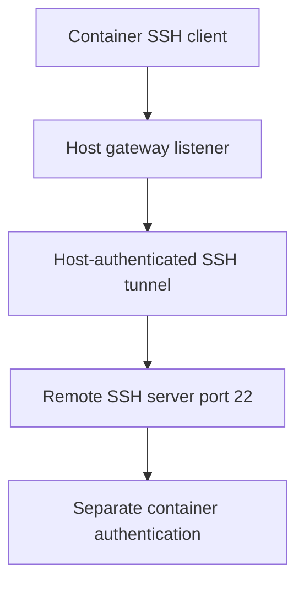
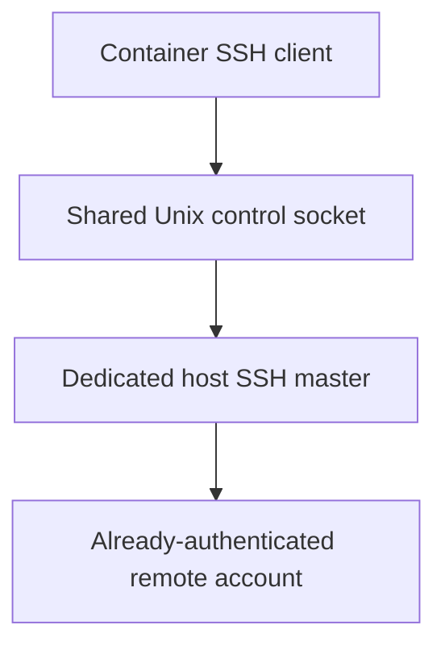

# Preset SSH access from a Devbox container

Status: proposals only. No implementation or schema decision is approved.

Scope: the rewrite in `/workspace/rewrite`, currently built as `devbox-neo`. This is remote command access from a local container, not remote workspaces, remote Docker, or filesystem mounting.

## Goal and the main decision

Open a container with a known way for the agent to access a selected SSH server, without making the agent discover addresses, ports, or authentication setup.

“Preset SSH connection” can mean two different things:

- **Reachable:** the container has an address it can connect to, but still authenticates itself.
- **Already authenticated:** the host logs in once, and the container can reuse that connection.

The proposed `-L ...:localhost:22` command provides the first, not the second. Which behavior is wanted remains an open decision.

**Recommendation:** if the goal is already-authenticated remote command access, prototype a dedicated shared SSH control socket (proposal C). If the container can authenticate directly, direct SSH (proposal A) is simpler. Use the TCP tunnel (proposal B) when host-only network access is the actual problem.

## What the original command does

Illustrative host-side command; placeholders are not literal values:

```sh
ssh -M -S "$PWD/.devbox-ssh" \
  -o ServerAliveInterval=30 \
  -o ServerAliveCountMax=3 \
  -o ExitOnForwardFailure=yes \
  -N \
  -L <docker-gateway>:<local-port>:localhost:22 \
  <user>@<host>
```

| Part | Meaning | Needed? |
|---|---|---|
| `<user>@<host>` | The host computer authenticates to this SSH server. | Yes, or an SSH config alias. |
| `-N` | Do not run a remote command; keep the connection open. | Appropriate for a tunnel or idle shared connection. |
| `-L ...` | Listen on the host gateway and send incoming TCP connections through SSH to port 22 on the remote server's loopback interface. | Only for TCP forwarding. |
| `-M` | Make this SSH process a connection-sharing master. | Not needed for forwarding alone; useful for reuse/control. |
| `-S path` | Put the master's Unix control socket at this path. It is not a TCP port or a private-key file. | Needed when explicitly controlling or sharing this master. |
| `ServerAliveInterval=30` | After 30 seconds without receiving server data, send an encrypted “are you still there?” request. | Optional, but useful for detecting broken connections. |
| `ServerAliveCountMax=3` | Give up after roughly three unanswered probes: about 90 seconds with the interval above. | Three is already OpenSSH's default; explicit for clarity. |
| `ExitOnForwardFailure=yes` | Exit if SSH cannot establish the requested forwarding listener, such as when the port is occupied. | Recommended for a managed forward. |

The keepalive options do **not** reconnect SSH. They help detect a dead connection instead of leaving an apparently live process hanging. They can also help with idle network timeouts. They do not set an initial connection timeout.

`ExitOnForwardFailure` does **not** prove that the remote `localhost:22` is reachable or that a later login will succeed. Those failures occur when a client uses the forward.

The command remains in the foreground: neither `-M` nor `-N` backgrounds it.

### The authentication catch



The inner SSH connection still needs a key, agent, or password and host-key verification. The outer tunnel does not transfer its authenticated identity to that inner connection.

Also, `localhost:22` is interpreted on the remote server. It need not be the port or interface used by the outer connection.

## Proposal A: direct SSH with a dedicated identity

Let the container connect directly to the remote server. Give it a known SSH alias and a deliberately scoped authentication source.

Agent-facing shape:

```sh
ssh devbox-remote 'hostname'
```

Possible authentication choices are a dedicated mounted key or access to a dedicated host SSH agent. Prefer an identity restricted to the intended server/account over exposing the user's full SSH directory or everyday agent.

**Benefits**

- No gateway listener, forwarded port, or host tunnel lifecycle.
- Normal SSH, SCP, and SFTP behavior.
- Configuration plus a small agent instruction may be enough; no new Devbox feature is inherently required.

**Costs and limits**

- The container must have a usable network route to the server.
- A mounted key is readable by the container. An agent avoids copying the key but still grants signing authority to processes that can access its socket.
- Host VPN routing and host-only SSH config are not automatically available inside Docker.
- Host-key trust and non-interactive authentication must be configured explicitly.

**Choose this when:** direct connectivity works and giving the container a dedicated SSH identity is acceptable.

## Proposal B: a managed host-side TCP tunnel

Implement the basic command suggested in the request. The host authenticates using its SSH configuration, and Devbox publishes a specific forwarded endpoint for the agent.

Proposed invocation, not existing syntax:

```sh
devbox-neo . --ssh-tunnel my-server
```

The agent receives the actual address, port, user, and instructions through managed runtime facts. Do not require it to guess a fixed port.

**Benefits**

- Uses host-only connectivity, such as a VPN or SSH jump-host setup.
- Keeps outer-connection credentials on the host.
- Presents an ordinary TCP endpoint to container tools.

**Costs and limits**

- Still needs separate container authentication and host-key verification. Do not disable host-key checking to hide the forwarded-address mismatch; identify the actual server explicitly.
- Adds listener selection, port collisions, process cleanup, and concurrent-open behavior.
- Binding a gateway address is not per-container access control. Other reachable containers or host processes may access that listener.
- The `host.docker.internal` alias and a selected network's gateway are not guaranteed to be the same address on custom networks. Publish the verified endpoint, not an assumed alias.
- Host-network mode needs its own explicit loopback binding rule. Reject unsupported network layouts rather than falling back to `0.0.0.0`.

**Choose this when:** the container needs the host's network path, not its authenticated SSH session. For one-off use, a user-managed tunnel plus existing network inspection may be enough.

## Proposal C: share a dedicated authenticated SSH control socket

Start an SSH master on the host and expose only its control socket to the selected container. Container SSH clients use that socket to ask the host master to open additional remote sessions. No TCP forward or second SSH login is needed.

Illustrative host command:

```sh
ssh -M -S "$private_runtime_dir/control" \
  -o ServerAliveInterval=30 \
  -o ServerAliveCountMax=3 \
  -N my-server
```

Illustrative container command, assuming the socket directory has been mounted:

```sh
ssh -S /devbox/ssh/control my-server 'hostname'
```

The host alias selects the master's actual user/server; container-side instructions must describe that recorded identity rather than let an arbitrary alias imply another destination.



**Benefits**

- Closest to “open the container with SSH already connected.”
- Keeps private keys and initial login prompts on the host.
- No gateway address or port allocation.
- Can use the host's existing SSH config and authentication setup.

**Costs and limits**

- The socket grants real authority: remote commands as the authenticated account, and master-control operations. A read-only bind does not make this a read-only remote connection.
- Use a dedicated master, not the user's unrelated existing SSH master. Container access can disrupt that master.
- OpenSSH normally falls back to a fresh connection when a control socket is unavailable. A managed interface must fail clearly instead of silently trying another login; verify how to enforce that in the prototype.
- Requires a Linux proof of concept for socket access across the bind mount, host/container UID checks, and socket replacement. Mount a dedicated directory rather than pinning an individual socket inode.
- A connection failure interrupts active remote commands. Reconnecting cannot safely imply replaying those commands.

**Choose this when:** the host should authenticate once and deliberately delegate access to that remote account to the agent.

## Fit with the current rewrite

Verified current behavior:

- `internal/app/network.go` exposes `DEVBOX_HOST`, `DEVBOX_DEFAULT_GATEWAY_IP`, and inspected networks. Host networking reports `127.0.0.1` as the host address.
- `internal/docker/runtime.go` owns the Docker host alias and typed container inspection.
- `docs/src/reference/configuration.md` documents mounts/env and confirms that `setup.sh` and `entrypoint.sh` run **inside** the container. They are not host tunnel startup hooks.
- `docs/src/architecture/runtime.md` describes application-owned lifecycle, external locks, attached-command leases, and staging managed `/devbox` facts before harness access.
- The rewrite plan explicitly excludes a background daemon and a host command gateway. None of these proposals requires a general host command execution service.

If native integration is selected, keep orchestration in `internal/app`, SSH process mechanics in a narrow component, and mount rendering in the existing Docker adapter. Do not add harness-specific lifecycle branches or a generic host-hook framework for this feature.

Reuse the existing runtime-documentation path to tell the agent the remote account, exact command, and connection limitations. Detailed live SSH facts should have one source, rather than separate hardcoded instructions for Pi and OpenCode.

Keep control sockets outside `$PWD`: the workspace is shared and editable, paths can be too long, and separate profiles must not collide. Choose a short private runtime directory with explicit ownership and cleanup; its final path is not decided here.

## Decisions before implementation

1. **Access:** is separate container authentication acceptable, or must the host login be reused? This chooses between B and C more than any CLI flag does.
2. **Lifetime:** is SSH available only during an attached Devbox command, or whenever the container remains running with `on_exit=running`? Start with attached-command lifetime if acceptable; persistent availability adds process supervision and crash-recovery work.
3. **Concurrency:** should multiple opens share one connection per environment/target? If yes, reuse environment locking and lease coordination; one exiting client must not disconnect another.
4. **Preset:** is an invocation flag enough initially, or must a profile/project remember the target? Prefer an existing host SSH alias over duplicating SSH's host/user/key/jump configuration. A saved preset needs explicit merge and recorded-recovery rules before adding a field.
5. **Failure:** should failed initial SSH setup abort launch? Recommended for an explicitly requested connection: yes. After launch, report connection loss without silently rerunning remote commands or destroying the workspace.

No automatic reconnection, multi-target registry, migration, remote workspace support, or general host-control API is proposed for the first version.

## Suggested next step and validation

First prove the selected access mechanism manually on a Linux Docker host. For C, confirm host authentication, socket mount permissions, remote execution, missing-master failure without fresh login, and cleanup. For B, confirm actual container-to-listener reachability and the separate inner login.

Only then design the smallest native lifecycle integration. Test startup failure, cancellation, concurrent opens, stale sockets/processes, independent profile slots, `on_exit` behavior, and cleanup ownership. Tunnel tests also need bind conflicts and default/custom/host-network coverage. Socket tests need restart/replacement and permission-denied coverage.

Run `make test` in the rewrite for implementation changes, plus real SSH/Docker acceptance tests. Unit fakes alone do not establish network or socket behavior. Update guide/reference/architecture docs and embedded agent guidance together when behavior actually ships; this proposal does not change the runtime contract.

## Sources

- [Rewrite runtime contract](rewrite-plan.md)
- Runtime architecture: `docs/src/architecture/runtime.md` in the repository; `/devbox/docs/architecture/runtime.md` in containers.
- Current configuration: `docs/src/reference/configuration.md` in the repository; `/devbox/docs/reference/configuration.md` in containers.
- Current network commands: `docs/src/reference/commands.md` in the repository; `/devbox/docs/reference/commands.md` in containers.
- [OpenSSH client configuration](https://man.openbsd.org/ssh_config): `ControlMaster`, `ControlPath`, `LocalForward`, `ServerAliveInterval`, `ServerAliveCountMax`, and `ExitOnForwardFailure`.
