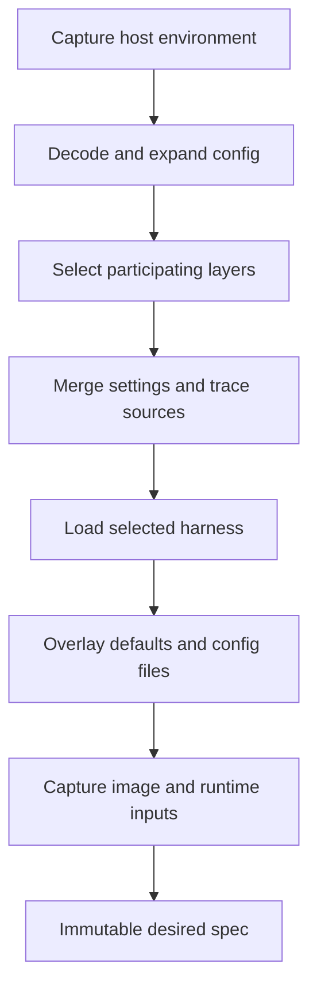
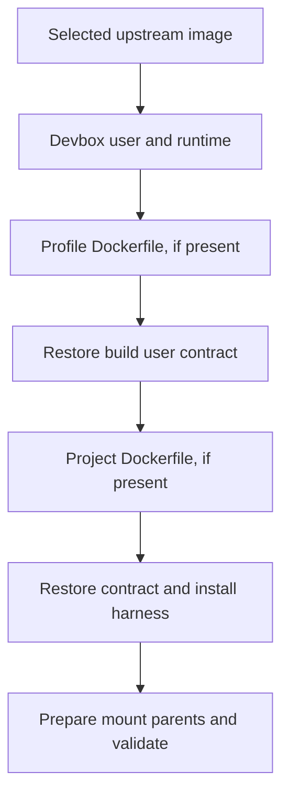

# Configuration and images

Configuration has three distinct owners: `resource` edits source files, `artifact` decides which layers participate, and `environment` compiles their resolved values into an executable plan. Keeping those jobs separate prevents editors, lifecycle commands, and status output from implementing different precedence rules.

## Resolution pipeline

`config.Decode` rejects duplicate JSON keys as well as schema errors. Duplicate-key rejection matters because different JSON consumers otherwise disagree about the same file's meaning. Source parsing and effective validation are separate: editing a literal source field should not require unrelated inherited or host-dependent fields to resolve.

`artifact.Select` owns participation; the full resolver and direct session lookup share it:

- Explicit profile selection replaces the default base profile, without excluding project artifacts.
- Selected directories are generic sources with optional `inherit` metadata. An `inherit: false` cutoff removes all preceding sources, even an explicitly selected profile, before their settings or artifacts are read.
- Global or invocation project exclusion removes the project and its inheritance choice.
- Recorded source references pin a saved session independently of changed defaults. Project configuration lives in the workspace's `.devbox/` directory.
- An empty resolved harness falls back to the global default.

Target selection reads only identity-affecting settings, without expanding unrelated env references or loading harness/build inputs. `RetainSources` walks backwards and stops at the last inheritance cutoff, so excluded directories need not be available. The frontend determines environment identity from retained profile/project participation; the generic merger has no config-name field or naming rules. Full resolution validates participating sources before runtime preparation. Configured `harness_args` requires a harness in the same file; only layers naming the final selected harness contribute arguments and argument provenance. Invocation arguments are appended at launch and never saved as desired configuration.

This ordering makes excluded broken/missing layers irrelevant instead of reading them and then trying to suppress their errors. Project-init inheritance previews use the same resolver with a proposed layer.

Dockerfiles, `setup.sh`, and `before-open.sh` contribute ordered chains. Harness configuration overlays files by relative path: definition defaults, profile, then project. Scalars replace and declared lists append; shell argv replaces as a unit.

### Provenance is resolution data

`artifact.Trace` records layers, exclusions, ordered artifact paths, aggregate contributors, and `EntrySources`. Each list contribution adds source labels at merge time in the same order as values. Duplicates remain distinct; excluded layers add nothing; shell replacement replaces its sources too. Global env passthrough filters absent host variables before provenance is counted.

Menus and `--show` consume this trace rather than guessing ownership from matching values or local key presence. Human output uses dotted paths for nested fields; JSON preserves value structure and exposes `entry_sources`. Display rows never feed configuration saves.

## Host substitution and sensitive values

Resolution captures one host environment snapshot, then expands `${env:NAME}` in decoded string values once. Property names are not expanded. Expansion is non-recursive; unset and present-empty values remain distinct. Source bytes are retained so edits and copies preserve the original expressions.

Sensitivity follows the destination field, not the variable name or substitution mechanism. Env/auth values are sensitive; paths, networks, argv, and other settings remain public. This lets diagnostics explain ordinary changes without accidentally treating every host-dependent path as a secret.

Sensitive config env is recorded as file/field/index references plus installation-keyed hashes of both the expression and resolved assignment. Recovery rereads exactly those entries. An unrelated file edit does not invalidate recovery, while changing the expression or assignment does. Definition env is reconstructed from its verified recorded definition source. Public creation commands accept no configuration overrides; lasting env settings belong in source files.

The Docker adapter renders creation env through a private `0600` temporary file. Neither values nor its temporary path enter the session record. Display redacts env values and never serializes the host snapshot. Terminal display passthrough is a separate invocation-local channel described in [lifecycle](lifecycle.md#invocation-local-terminal-metadata).

## Source mutation and initialization

`resource` owns profile/project creation, init, default selection, and setting changes. Configuration-owner locks live outside the directories being edited.

Creation stages a complete source tree beside the destination, then publishes it with Linux `RENAME_NOREPLACE`. Even an existing empty directory is preserved. Interrupted staging is not adopted as a configuration owner. Init validates requested artifacts, writes missing files with no-replace publication, and commits harness selection after seeding. Existing files are not refreshed.

Profile-to-project copying uses `artifact.SourceTree`, not the effective runtime tree. It copies supported profile sources and active build-context inputs, preserves permissions and expressions, and writes `inherit: false`. Global values and harness defaults are not flattened into the project.

### Immediate field edits

The CLI keeps raw local JSON separate from effective/redacted display data. Each completed scalar or list operation calls `resource.SetConfigField`:

1. Acquire the owner lock and reread current source.
2. Compare the edited field against the value the editor loaded.
3. Reject a same-field conflict; preserve unrelated concurrent changes.
4. Patch only that field, or remove its source key for reset.
5. Validate source shape/literal constraints and save.

List editors reload before operations and after failures. Rejected edits are not retained as a draft or retried implicitly. Effective-resolution failures do not disable local repair; cross-field and runtime-resource constraints remain the resolver/runtime's responsibility.

## Declarative harnesses

`harness.Load` resolves one selected definition. Registry enumeration separately sorts effective entries and reports invalid overrides. A selected invalid user definition fails; it does not silently become the built-in. Loading one harness does not require unrelated registry entries to validate.

Definitions declare installation commands/PATH, launch and continuation argv, env, environment/cache stores, config ownership, auth overlays, preparation argv, and transfer capabilities. Pi's fullscreen default is an ordinary launch argument; configured and one-off arguments follow it without a Pi-specific engine branch.

Built-in defaults and user defaults use the same recursive regular-file reader. It skips symlinks and other special entries with source-qualified warnings, never follows them, and treats root-path/read failures as fatal. Warnings flow through resolution into application stderr and through source-seeding/copy results into text or JSON. A skipped higher-layer entry does not erase a lower-layer regular file.

Store/auth declarations constrain targets to clean paths beneath the container user's home. Validation prevents overlapping stores and auth mounts that obscure stores. `Definition.MountParents` derives ancestor ownership rather than scattering harness-specific path fixes through startup.

## Layered image compilation

`artifact.ReadBuildContext` captures each contributing Dockerfile, its effective ignore rules, regular files, directory entries, and permissions. Ignored paths are excluded before unsupported entries are rejected. Each captured tree supplies its own build execution and fingerprint inputs; contexts are never overlaid.

`environment.ImageBuildPlan` contains the upstream image reference, generated preparation/boundary/finalization layers, and ordered captured user stages:

Preparation validates a Debian/Ubuntu base, installs runtime tools, and creates the requested development UID/GID. Conflicting accounts fail without being renamed or recursively changing ownership. Boundary layers restore the development USER, HOME, shell, and working directory while retaining user PATH additions. Finalization installs the harness without runtime cache/prefix overrides, prepends its required paths, and verifies binary availability.

Execution supplies `DEVBOX_BASE`, `DEVBOX_USER`, `DEVBOX_USER_HOME`, `DEVBOX_WORKSPACE`, `DEVBOX_UID`, and `DEVBOX_GID`. Each custom stage receives the preceding image's unique temporary tag. Docker image layer ancestry verifies that customization retained the supplied base; this is a runtime contract check, not a security sandbox. Captured stage inputs and generated layer bytes are fingerprinted in order. `--image` disables cache across every controlled stage.

Each stage is staged in a separate directory. Cleanup verifies image identity and installation ownership before removing all intermediate tags, on success or failure. Source directory permissions are restored in staging and owner access is restored before cleanup. Unchanged image inputs can reuse Docker's build cache across environments; container-only settings do not independently invalidate image installation.

### Mount-parent ownership

A parent directory belongs either to the image or to an enclosing bind-backed harness mount. `Definition.MountParents` makes this distinction explicit:

- Image-owned ancestors are created as `devuser` after installation and checked for writable/searchable permissions during the runtime build.
- Ancestors inside another managed mount are prepared in that mount's host backing source before create/start.

This avoids Docker creating root-owned parents for nested mounts. An incompatible custom base fails rather than triggering recursive ownership changes. Host preparation rejects symlink paths and missing backing roots; it never replaces missing durable state with an empty tree. Extra user mounts are outside this preparation contract, and preparing an ancestor does not make unmounted descendants persistent.

## Managed configuration ownership

`filesync` owns byte/key reconciliation, not lifecycle safety. The application must hold the operation lock and prove the container is stopped or absent before synchronizing. Creation/recreation and transfer destination creation synchronize before materialization; ordinary access uses `startAccess` and checks backing roots first.

### Ordinary files

The desired source is authoritative. Synchronization restores desired bytes and private modes even when a live file was edited locally or its source hash did not change. Formerly managed paths that disappear from desired config are removed regardless of their current content. Unmanaged paths are untouched.

The manifest describes applied ownership and supports running-container deferral. Its hashes are not a local-edit protection mechanism. This gives managed files one predictable owner while leaving unrelated harness history alone.

### Shared JSON

A `json-keys` declaration owns only listed top-level keys. Desired values replace those keys; absent desired keys are removed. Other live keys and existing file permissions survive. Pi's `models.json` declaration owns the entire `providers` value rather than merging individual providers.

Malformed live JSON is a conflict because the synchronizer cannot safely preserve undeclared settings. Writes use same-directory temporary files, and the new manifest commits after non-conflicting writes succeed. The engine advances runtime inputs and launch state only after the preparation stage succeeds.

An incompatible definition cannot synchronize into a recorded layout. Recreation is the boundary that adopts changed ownership and mounts; rollback and committed-transfer recovery instead restore recorded transaction behavior.
