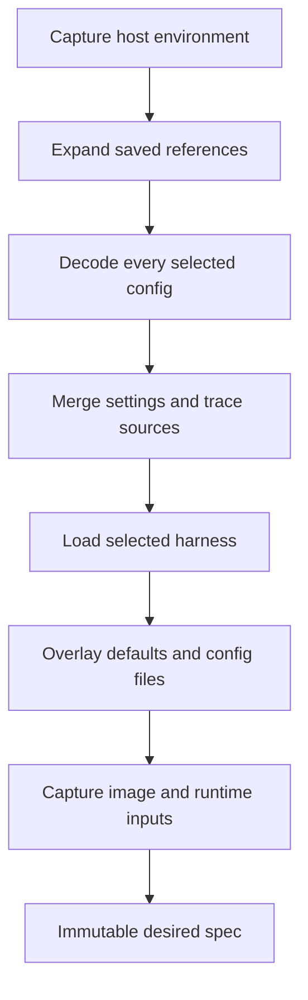
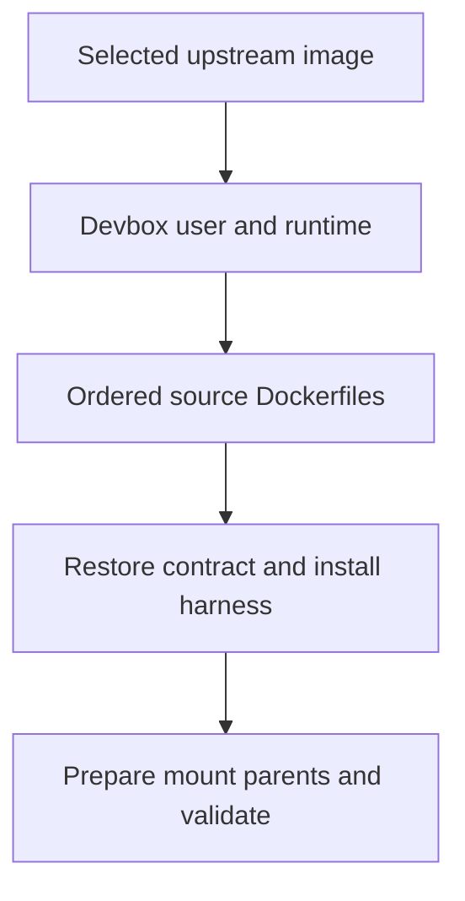

# Configuration and images

Configuration has three distinct owners: `resource` edits source files, `artifact` composes explicitly selected sources, and `environment` compiles their resolved values into an executable plan. Keeping those jobs separate prevents editors, lifecycle commands, and status output from implementing different precedence rules.

## Resolution pipeline

`config.Decode` rejects duplicate JSON keys as well as schema errors. Duplicate-key rejection matters because different JSON consumers otherwise disagree about the same file's meaning. Source parsing and effective validation are separate: editing a literal source field should not require unrelated inherited or host-dependent fields to resolve.

### Selecting sources

`app.Locate` selects saved session identity using an exact full name, a folder-local name, or a folder's saved default. It never resolves config to find a session. This keeps broken sources from blocking lookup and repair.

`config.Reference` preserves relative/fixed intent. CLI capture resolves relative arguments against the invoking cwd, then records them relative to the canonical workspace. `ResolveReferences` expands the saved chain at the runtime boundary, requires its directories, and rejects duplicate canonical paths. Composition receives absolute `config.Source` inputs. There is no discovery, global baseline, or inheritance cutoff.

Source-chain edits validate structure and duplicates without requiring complete runnable settings. They compare the displayed session ID and source list under the operation lock, preserve unrelated latest fields, and save only desired references. Startup/recreation resolve from the reread locked record, not a pre-lock source snapshot.

### Merging settings and artifacts

The full resolver starts with built-in defaults and expands every explicit source in order. Scalars replace earlier values, declared lists append, and shell argv replaces as a unit. Runnable operations require a nonempty final harness selection.

Harness selection precedes argument merging. A configured `harness_args` list must name its harness in the same file; only lists matching the final harness contribute arguments and provenance. One-off launch arguments are appended later and are not saved.

Dockerfiles, `setup.sh`, and `before-open.sh` form ordered chains. Harness files overlay by relative path: definition defaults followed by the source chain. Import previews use the same resolver, binding proposed settings to one source directory without changing participation.

### Provenance is resolution data

`artifact.Trace` records sources, ordered artifact paths, aggregate contributors, and `EntrySources`. Each list contribution adds labels in the same order as values. Duplicate entries remain distinct; shell replacement replaces its sources too. Trace labels are diagnostic, not session identity.

Menus and `--show` consume this trace rather than guessing ownership from matching values or local key presence. Human output uses dotted paths for nested fields; JSON preserves value structure and exposes `entry_sources`. Display rows never feed configuration saves.

## Host substitution and sensitive values

Resolution captures one host environment snapshot, then expands `${env:NAME}` in decoded string values once. Property names are not expanded. Expansion is non-recursive; unset and present-empty values remain distinct. Source bytes are retained so edits and copies preserve the original expressions.

Sensitivity follows the destination field, not the variable name or substitution mechanism. Env/auth values are sensitive; paths, networks, argv, and other settings remain public. This lets diagnostics explain ordinary changes without accidentally treating every host-dependent path as a secret.

Sensitive config env is recorded as file/field/index references plus installation-keyed hashes of both the expression and resolved assignment. Recovery rereads exactly those entries. An unrelated file edit does not invalidate recovery, while changing the expression or assignment does. Definition env is reconstructed from its verified recorded definition source. Public creation commands accept no configuration overrides; lasting env settings belong in source files.

The Docker adapter renders creation env through a private `0600` temporary file. Neither values nor its temporary path enter the session record. Display redacts env values and never serializes the host snapshot. Terminal display passthrough is a separate invocation-local channel described in [lifecycle](lifecycle.md#invocation-local-terminal-metadata).

## Source mutation and initialization

`resource` owns directory creation, setting edits, and optional-artifact setup. Its named-config listing scans the selected home's `configs/` directory and parses each source independently so invalid entries remain visible without Docker or session state. Arbitrary path-based configs have no global registry and appear only in saved source chains. Canonical directory paths key external configuration-owner locks. Folder defaults belong to `store`, not config files.

Creation checks for `config.json` before prompts, repeats the check under the owner lock, validates setup, and claims the config file with no-replace publication before adding artifacts. Existing directories are allowed, but an existing config file is never replaced. Optional-file planning/publication is shared with editing and adds only missing files. A generation target may differ from, or exist without, the persistent harness setting.

Named-config deletion holds that owner lock, scans all saved desired and committed session sources, then removes the directory and syncs its parent. A source at or beneath the directory blocks recursive deletion; both the saved path and its canonical target are checked so deleting an alias cannot break a reference unnoticed. The same usage scan finds selected and committed users, but the directory editor and blocked-deletion error present each saved session once, without exposing that internal distinction. It returns known users alongside any inventory errors; symlink entries, corrupt session state, and pending transfers still block deletion, while an incomplete config directory can be deleted. Session creation and source edits do not take the config lock, so the reference check is a current-state safeguard rather than a concurrency guarantee.

Prompts hold no owner locks. Back/cancellation retain only pending creation choices. Once creation publishes its config, an artifact failure is reported as partial setup and repaired through `config edit`, not repeated creation. The standalone importer uses `artifact.SourceTree` to capture source artifacts/build contexts without flattening effective defaults.

### Immediate field edits

The CLI keeps raw local JSON separate from effective/redacted display data. Each completed scalar or list operation calls `resource.SetConfigField`:

1. Acquire the owner lock and reread current source.
2. Compare the edited field against the value the editor loaded.
3. Reject a same-field conflict; preserve unrelated concurrent changes.
4. Patch only that field, or remove its source key.
5. Validate source shape/literal constraints and save.

List editors reload before operations and after failures. Rejected edits are not retained as a draft or retried implicitly. Effective-resolution failures do not disable local repair; cross-field and runtime-resource constraints remain the resolver/runtime's responsibility.

## Declarative harnesses

`harness.Load` resolves one selected definition. Registry enumeration separately sorts effective entries and reports invalid overrides. A selected invalid user definition fails; it does not silently become the built-in. Loading one harness does not require unrelated registry entries to validate.

Definitions declare installation commands/PATH, launch and continuation argv, env, environment/cache stores, config ownership, auth overlays, preparation argv, and transfer capabilities. Pi's fullscreen default is an ordinary launch argument; configured and one-off arguments follow it without a Pi-specific engine branch.

Built-in defaults and user defaults use the same recursive regular-file reader. It skips symlinks and other special entries with source-qualified warnings, never follows them, and treats root-path/read failures as fatal. Warnings flow through resolution into application stderr and through source-seeding/copy results into text or JSON. A skipped higher-layer entry does not erase a lower-layer regular file.

Claude's built-in definition uses the same declarations: `sessions/<container>/harnesses/claude/stores/home/` mounts at `/home/devuser/.claude`, where defaults and ordered `<config>/claude/` files supply managed configuration. `auth/claude/.credentials.json` overlays the store's `.credentials.json`; `auth/claude/.claude.json` mounts at `/home/devuser/.claude.json`. Both auth files are shared rather than transferred with session state. Its native executable under `/home/devuser/.local/bin` remains image-local; no Claude cache store is declared. `settings.json` owns only `tui` and `pluginConfigs`.

Store/auth declarations constrain targets to clean paths beneath the container user's home. Validation prevents overlapping stores and auth mounts that obscure stores. `Definition.MountParents` derives ancestor ownership rather than scattering harness-specific path fixes through startup.

## Layered image compilation

`artifact.ReadBuildContext` captures each contributing Dockerfile, its effective ignore rules, regular files, directory entries, and permissions. Ignored paths are excluded before unsupported entries are rejected. Each captured tree supplies its own build execution and fingerprint inputs; contexts are never overlaid.

`environment.ImageBuildPlan` contains the upstream image reference, generated preparation/boundary/finalization layers, and ordered captured user stages:

Preparation validates a Debian/Ubuntu base, installs runtime tools, and creates the requested development UID/GID. Conflicting accounts fail without being renamed or recursively changing ownership. Boundary layers restore the development USER, HOME, shell, and working directory while retaining user PATH additions. Finalization installs the harness without runtime cache/prefix overrides, prepends its required paths, and verifies binary availability. Pi's managed installer runs as `devuser` under the image-only `/home/devuser/.pi/image/`, because installing into the persistent `/home/devuser/.pi/agent/` store (or the shared `.local` cache mount) would hide its executable when Docker mounts state. The image-owned `.pi` parent is then checked for user write/search access before container creation.

Execution supplies `DEVBOX_BASE`, `DEVBOX_USER`, `DEVBOX_USER_HOME`, `DEVBOX_WORKSPACE`, `DEVBOX_UID`, and `DEVBOX_GID`. Each custom stage receives the preceding image's unique temporary tag. Generated boundary/final stages skip only Docker's default-value warning for `DEVBOX_BASE`: the builder always supplies that stage-specific tag, so no static default describes it. Docker image layer ancestry verifies that customization retained the supplied base; this is a runtime contract check, not a security sandbox. Captured stage inputs and generated layer bytes are fingerprinted in order. `--image` disables cache across every controlled stage.

Each build stage uses a separate temporary directory. Cleanup verifies image identity and installation ownership before removing all intermediate tags, on success or failure. Source directory permissions are restored in staging and owner access is restored before cleanup. Unchanged image inputs can reuse Docker's build cache across environments; container-only settings do not independently invalidate image installation.

### Mount-parent ownership

A parent directory belongs either to the image or to an enclosing bind-backed harness mount. `Definition.MountParents` makes this distinction explicit:

- Image-owned ancestors are created as `devuser` after installation and checked for writable/searchable permissions during the runtime build.
- Ancestors inside another managed mount are prepared in that mount's host backing source before create/start.

This avoids Docker creating root-owned parents for nested mounts. An incompatible custom base fails rather than triggering recursive ownership changes. Host preparation rejects symlink paths and missing backing roots; it never replaces missing durable state with an empty tree. Extra user mounts are outside this preparation contract, and preparing an ancestor does not make unmounted descendants persistent.

## Managed configuration ownership

`filesync` owns byte/key reconciliation, not lifecycle safety. The application must hold the operation lock and prove the container is stopped or absent before synchronizing. Creation/recreation and transfer destination creation synchronize before materialization; ordinary access uses `startAccess` and checks backing roots first.

### Ordinary files

The desired source is authoritative. Synchronization restores desired bytes and private modes even when a live file was edited locally or its source hash did not change. Formerly managed paths that disappear from desired config are removed regardless of their current content. Unmanaged paths are untouched.

The manifest describes applied ownership and supports running-container deferral. Its hashes are not a local-edit protection mechanism. This gives managed files one predictable owner while leaving unrelated harness history alone.

### Shared JSON

A `json-keys` declaration owns only listed top-level keys. Desired values replace those keys; absent desired keys are removed. Other live keys and existing file permissions survive. Pi's `models.json` declaration owns the entire `providers` value rather than merging individual providers.

Malformed live JSON is a conflict because the synchronizer cannot safely preserve undeclared settings. Writes use same-directory temporary files, and the new manifest commits after non-conflicting writes succeed. The engine advances runtime inputs and launch state only after the preparation stage succeeds.

An incompatible definition cannot synchronize into a recorded layout. Recreation is the boundary that adopts changed ownership and mounts; rollback and committed-transfer recovery instead restore recorded transaction behavior.
