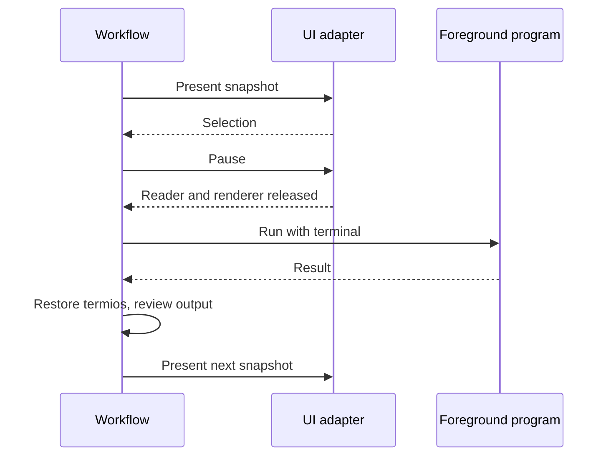

# Interactive frontend

`cli/frontend*.go` owns navigation and operation forms. `cliui` presents them; application/resource/store services retain validation, locking, and persistence. Direct commands and menus call those same services without recursive Cobra execution.

## Synchronous workflows, asynchronous rendering

A command owns one `Runner`. Workflows are ordinary nested functions with local drafts. The runner sends immutable screen snapshots to one Bubble Tea goroutine and receives selections; only the workflow goroutine invokes handlers.

Collections contain objects with stable keys. Actions are separate commands, and fields carry values/status rather than preformatted descriptions. Filtering maps selections back to the displayed snapshot; labels never dispatch behavior.

Nested workflows share a navigation frame. Foreground operations refresh it after success or failure because partial changes may have occurred. Parent menus retain the updated frame instead of restoring stale inventory. UI snapshots are deep copies and cannot observe that mutation. Restore selection by key, not row index.

Config browsing does not initialize Docker. Session inventory errors remain visible without removing config navigation. Inventory updates are synchronous, not background polling. Refresh failure is reported separately from the operation outcome.

## Forms and saves

Session creation and source editing share config-chain controls with different save callbacks. Both nested and standalone config creation use `cli.createConfig` and `resource.CreateConfig`.

The shared source picker orders suggestions as named configs, workspace configs, then invoking-directory configs. Canonical directory identity deduplicates both search roots and candidates; the first candidate wins, retaining its named/fixed or discovered/relative reference semantics. Each discovered row retains its search root so selecting a workspace-relative name cannot accidentally choose a same-named config under the invoking directory. Typed paths still use the invoking directory, and all relative selections are captured against the session workspace. Workspace/current-directory discovery failures are reported without removing candidates from other roots; discovery never saves a selection. The standalone config browser has no workspace target and keeps its separate current-directory inventory.

Drafts remain local until explicit submission. Optional-file drafts copy slices so cancellation cannot mutate the accepted selection. A successfully created config is independently saved; cancellation of its parent session draft does not remove it.

Browser creation supplies a materialization callback so build errors return to the populated form. A committed creation whose final Stop failed opens the saved session for recovery rather than retrying Create. Other successful one-shot forms close; failures retain inputs.

`cliui.TextRequest` supplies initial source values, validation, and sensitivity. Pending text belongs to the workflow. Control characters use JSON-string input because the single-line widget sanitizes them. Sensitive input is masked; plain prompts suppress echo and restore termios.

Saved edits are not rolled back by Back/Exit. Session-config receipts point to exact Status targets without implying container settings were applied. Provenance comes from the resolver, not comparisons of displayed values.

## One terminal reader

`Pause` uses Bubble Tea's blocking handoff. The UI must not read or redraw while a harness, shell, logs, SSH, or result acknowledgement owns the terminal. Foreground operations restore termios before acknowledgement: a cancelled Docker client can leave raw mode enabled, preventing Enter from producing a newline.

`Finish` joins the UI goroutine and restores the terminal without cancelling later command work. Command-context cancellation requests graceful Quit rather than Bubble Tea's force-exit path, which skips the input-reader join. Join the cancellation callback too. The pinned Ultraviolet version includes its StreamEvents reader-join fix; `reader_test.go` protects that contract.

`SignalContext` routes foreground SIGINT to the current operation; menu Ctrl-C and SIGTERM cancel the command. Confirmation defaults to No and leaves an audit line in the normal terminal. Redirected/dumb-terminal interaction keeps plain prompts.

## Presentation boundaries

Keep objects separate from application actions. Session operations are direct entries; forms collect actual inputs, not another category choice. The preview is detailed, while the action menu uses compact target context. Relative activity uses existing recorded timestamps, not new session state.

Folder rows use the shortest unique path suffix across the complete session inventory, including explicitly opened empty folders. Filtering does not recompute labels. The frontend supplies a separate list label; full paths remain in preview labels and stable keys, preserving search, selection, ordering, and dispatch.

The direct folder editor and default picker share `folderSessionScreen` so changing the instruction does not shift rows. Default changes update markers and receipts. Source-specific settings dashboards and combined inspection remain distinct views.

Keep error/partial-result output visible before returning. Color-independent markers, scrolling, and narrow-layout tests are part of the interaction contract.

## Completion

Completion bypasses store initialization and locking record readers. Config directories provide named suggestions; session IDs and folder-local names come from readable saved settings, without requiring valid applied runtime state. Harness enumeration uses valid effective definitions. Live container suggestions use bounded installation-filtered inventory and tolerate unavailable Docker.

Completion must not seed state, create locks, resolve a full environment, or mutate Docker. Generated scripts register completion for `dbx` only.
