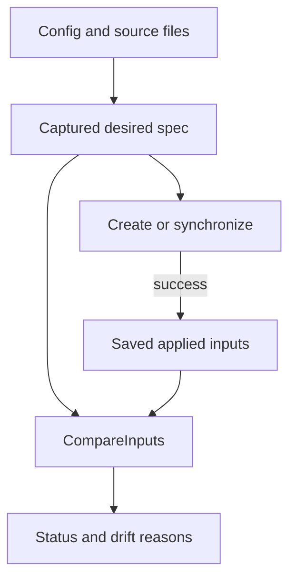
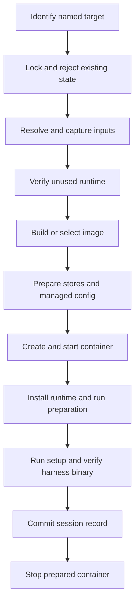
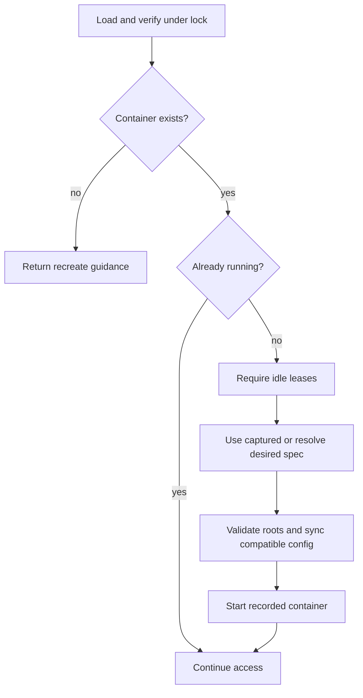
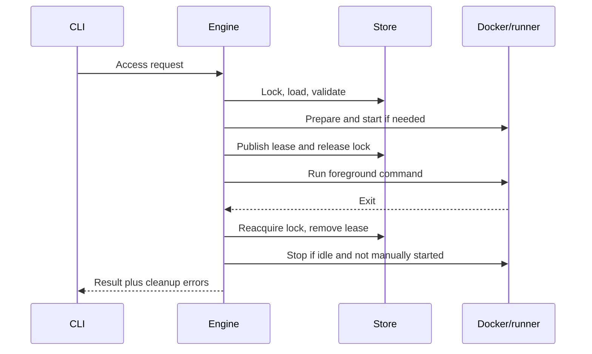

# Lifecycle and applied state

`app.Engine` owns environment transitions. It resolves desired inputs before executing them, validates the recorded environment under an operation lock, and commits state only at defined application points. Docker execution consumes the captured plan rather than rereading source files.

The lifecycle code stays in one `app` package, with files organized by responsibility:

| File | Ownership |
|---|---|
| `engine.go` | Dependencies, request/result types, resolution, and ownership checks |
| `open.go` | Open sequencing and harness launch |
| `create.go`, `creation_record.go` | Creation/recreation, record assembly, materialization, and commit cleanup |
| `mount_plan.go`, `mounts.go` | Store/auth mount planning, managed-config synchronization, and recorded mount-parent preparation |
| `startup.go` | Ordinary stopped-to-running preparation |
| `durable_stores.go` | Previously committed harness-store validation |
| `attach.go` | Attachment leases and last-command cleanup |

Command-specific orchestration remains explicit; sharing preparation does not make creation, ordinary access, recovery, and transfer rollback interchangeable.

## Desired specification versus recorded contract

`environment.Spec` is the captured desired environment for an operation. It includes resolved configuration, harness definition, source files, image plan, and `environment.Inputs`.

The saved `store.Record` records identity, actual image/container association, current mounts/launch settings, and a compact applied comparison baseline. It is not a historical reconstruction recipe. Existing containers keep creation settings until explicit recreation commits.

### One input model

`environment.Inputs` has committed absolute source directories plus image, container, and runtime snapshots. Aggregate fingerprints and detailed changes both derive from it. There is no second settings registry or diagnostic file scan that can disagree with lifecycle decisions.

| Scope | Representative inputs | Baseline advances |
|---|---|---|
| Image | Base image, ordered Dockerfiles/contexts/ignore rules, build args, generated preparation/boundary/finalization layers, harness definition | Creation/recreation commit |
| Container | Image dependency, mounts, network, env verification, ordered setup inputs | Creation/recreation commit |
| Runtime | Managed files, launch settings, ordered before-open inputs, runtime assets | Successful application through `Record.ApplyRuntime` |

Schema `7` validates public settings and aggregate content hashes, never file contents or env values. Managed trees and build contexts contribute one digest each rather than a persisted per-file inventory. Applied source directories retain provenance for config-usage reporting, not authority to reconstruct historical inputs.

`CompareInputs` emits public-setting and category changes in stable order. Action priority is image over container over runtime. The image-to-container hash dependency does not become a duplicate user-facing reason. Dockerfiles/scripts retain specific reasons; build-context and managed-tree reasons deliberately do not enumerate changed filenames.

Source paths explain changes but do not themselves change fingerprints when effective input bytes are identical. Relative context/config paths remain semantic inputs. Env diagnostics expose names, not values or hashes. The applied container fingerprint includes the actual image ID rather than only a mutable tag.

## New-session creation

`Engine.Create` checks workspace/name uniqueness under the namespace lock, allocates a session ID and storage directory, acquires its operation lock, and resolves the explicit sources. Container creation allocates a separate Docker name. It then enters the shared creation pipeline. Creation never changes a folder default.

The ordered `setup.sh` chain belongs to the per-container contract. Before-open scripts and harness attachment are not part of standalone `create`. Successful creation leaves the environment stopped.

`createAs` prepares resources before passing explicit inputs to the side-effect-free `creationRecord` helper. The caller owns ID allocation and clock reads; the helper assembles fields and applies the existing activity/action/manual-start rules for new sessions, recreation, and prepared destinations. Materialization supplies the setup-container ID before publication.

The record commits only after startup, declared preparation, setup, and binary-availability checks succeed. If the final stop fails, the committed environment remains usable and the error recommends `stop`; it is not presented as an absent session that can be created again.

Recreation selects saved identity and rereads it under the operation lock before resolving its current desired references. A later default change cannot retarget the invocation. Source edits do not rename the session; a replaced durable ID fails rather than being adopted.

Recreation uses current desired inputs while preserving the session ID and stores. An unchanged available image can be reused; changed image inputs trigger a cached build, and `--image` forces a no-cache build. Running/stopped intent is retained. Container-local state is replaceable, not transferred into the new container.

## Ordinary access and synchronization

`app.startAccess` is the shared boundary for `open`, `start`, `shell`, `exec`, and `ssh`. A changed workspace blocks new access until explicit recreation; stopping and cleanup still use the applied runtime.

`open` resolves its invocation first and supplies that spec. Other access commands resolve only if an existing stopped container needs startup. A running `start`, `shell`, `exec`, or `ssh` therefore does not depend on current desired configuration. All these access paths return structured recreate guidance for a missing container; none builds images or creates replacement containers. A pruned image does not trigger replacement of a healthy existing container.

For a stopped container, `syncRecordedConfig` first validates durable backing roots. A matching harness-definition hash permits managed synchronization into the recorded layout, followed by runtime input application. A different definition cannot redefine mount/config ownership in place; adoption waits for recreation. Launch updates follow the recorded-definition compatibility rules.

Invalid participating configuration or malformed live shared JSON blocks startup. The engine does not bypass synchronization to provide a shell, because that would create a separate startup contract with different applied-state guarantees.

### Open on a running container

`open` still resolves desired settings and reports creation drift. It does not write managed files while running. If the existing ownership manifest already matches the desired files, runtime-only hook/launch changes can advance the runtime baseline. Otherwise it reports deferral without advancing the file manifest or claiming the files were applied.

Before Docker inspection, synchronization, startup or hook output, `open` reports source differences from the last applied creation baseline. The message explains that only explicit recreation applies creation changes or replaces missing runtime. This is a warning, not authorization to replace the container. Runtime changes remain visible in status without being mislabeled as creation changes.

The engine appends each typed diagnostic to `Result.Diagnostics`, then calls `Engine.OnDiagnostic` synchronously at that reporting point. The CLI supplies the renderer in `cli/diagnostics.go`; it writes immediately to stderr, rather than waiting for the operation to return. A nil callback suppresses delivery but retains diagnostic collection. Callbacks may run under the operation lock and must not reenter session operations or mutate diagnostic slices. Resolution warnings still render directly in `app`, and child-process streams remain separate from typed diagnostic delivery.

The ordered `before-open.sh` chain runs on each Open before attachment. Each script is a separate process; failure stops the chain and blocks attachment. Existing containers launch their recorded harness; a newly selected definition does not silently change the container's installed capabilities.

## Missing runtime and explicit recreation

Containers and images are disposable, but their absence does not authorize replacement. Open, Start, Shell, Exec and SSH return `container_missing` with an exact `dbx recreate <session-id>` step. They leave saved identity, applied state and history unchanged. Logs/status never build runtime. A healthy container remains usable when its image has been pruned.

Only explicit recreation replaces an existing session's runtime. Under the operation lock, it resolves current selected sources and calls the creation pipeline with the previous record. It preserves session ID, directory, creation time, history, defaults and manual-start intent. It reuses a matching available installation-owned image or builds a new one; it does not reconstruct historical configuration or adopt unowned images.

The creation path checks previously committed harness-store roots before creating directories; missing durable stores are errors, not empty replacements. Still-requested previously mounted named volumes must exist. A new runtime association commits only after materialization succeeds.

Committed transfer retries finish source cleanup even when destination runtime is missing. They verify any existing association but do not rebuild, resolve destination config or recopy committed stores. Once cleanup releases the endpoints, the user can explicitly recreate the destination.

## Attached-command leases

The operation lock covers loading, ownership validation, stopped synchronization, startup, and lease creation. The foreground command then runs without that lock.

Cleanup uses an independent bounded context so cancellation of the foreground operation does not skip state cleanup. It removes the lease, reaps stale processes, and reads current manual-start intent while holding the operation lock. The last attachment stops the container only when `manual_start` is false. A failed hook or lease setup stops a newly started automatic container when no other attachment exists.

Leases contain Linux process start ticks and boot identity to distinguish PID reuse. Corrupt or unverifiable leases fail closed rather than being assumed idle. Foreground SSH controllers use the same lease owner as Docker attachments.

### Manual start and Docker restart

`manual_start` belongs to the session, not to config fingerprints or individual leases:

| Operation | Effect on `manual_start` |
|---|---|
| Explicit `start` | Set, even when already running |
| Successful `stop` | Clear; a rejected stop leaves it unchanged |
| Attach or detach a command | No change |

The value survives recreation and reboot. Docker enforces it through `unless-stopped` when set and `no` otherwise; raw Docker options cannot override this policy.

`saveManual` updates Docker's policy and saves the record under the operation lock. If saving fails, it attempts to restore the previous policy so a failed command does not silently change reboot behavior.

At boot, Docker starts the existing container without CLI preparation. It does not apply changed config or restore harness processes, SSH connections, or terminal attachments.

## Invocation-local terminal metadata

The CLI captures the `app.TerminalEnv` allowlist once into the engine. During materialization it prepends those values to a temporary env plan, before harness and configured values. Terminal values do not participate in the saved comparison baseline, including during rebuilding.

Attached harness, shell, and exec commands receive current terminal variables through Docker exec overrides, with or without TTY allocation. Present empty host values are forwarded; absent keys do not clear container values. Internal hooks/preparation inherit creation env rather than attachment overrides.

This separates display capabilities from environment configuration: changing terminals does not cause drift or require recreation, and no host dotfiles need importing.

## Runtime documentation and network facts

`assets` embeds the human docs, development notes, and container agent guidance. The engine stages that bundle with inspected network facts in a private `.runtime-*` directory, then copies it into a verified running container's `/devbox` directory.

The adapter applies root-owned read-only permissions for `devuser`, excluding the live `/devbox/ssh` mount from recursive ownership/permission changes. Host staging is removed on success or failure. Runtime preparation precedes setup, before-open hooks, and harness access.

Network commands inspect actual attachments under the operation lock. Secondary-network changes cannot detach the configured primary and do not change creation fingerprints. Managed changes refresh in-container facts while running; external Docker changes appear on the next refresh.

Pi/OpenCode inherit the `devbox` skill through harness defaults. Artifact setup leaves it inherited, while explicit config-directory overrides use normal tree resolution. Claude inherits a `CLAUDE.md` that imports `/devbox/AGENTS.md`; its optional harness-file setup includes that import. The asset content hash is a runtime input, not an image input, so updated guidance does not itself require an image rebuild.
