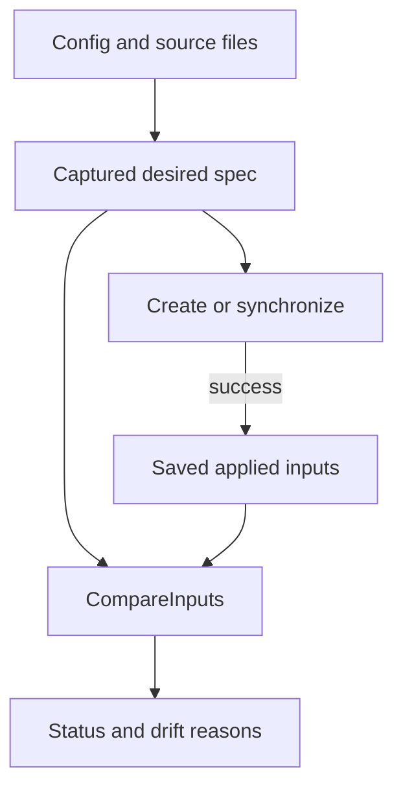
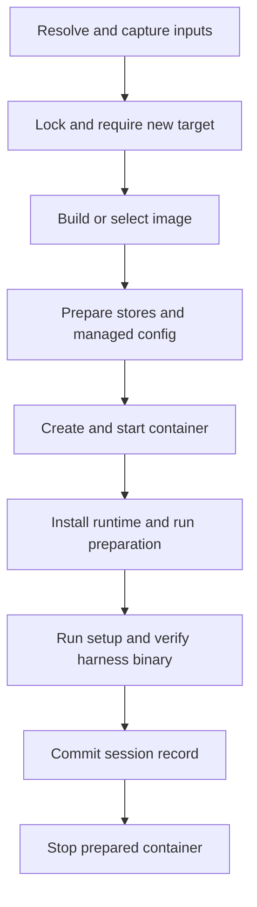
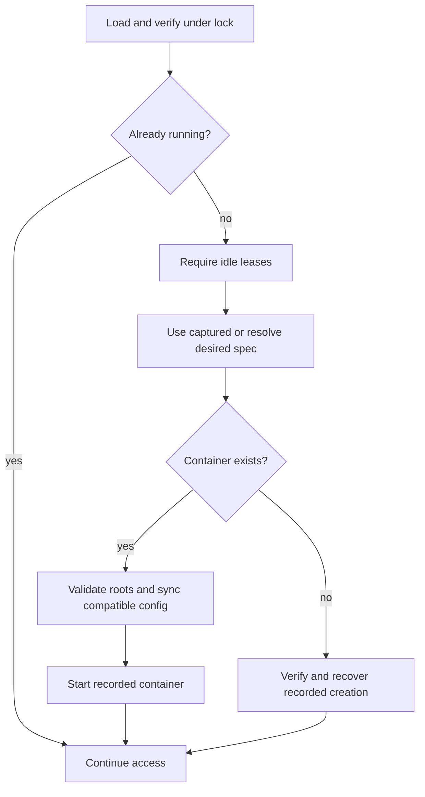
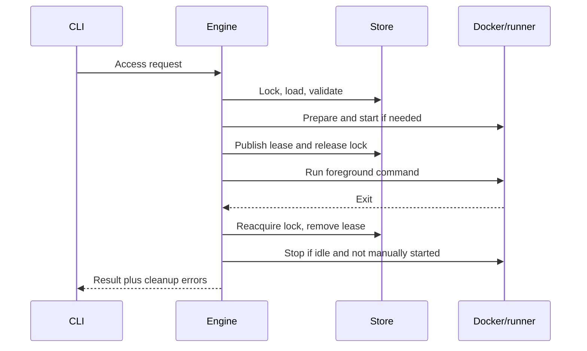

# Lifecycle and applied state

`app.Engine` owns environment transitions. It resolves desired inputs before executing them, validates the recorded environment under an operation lock, and commits state only at defined application points. Docker execution consumes the captured plan rather than rereading source files.

## Desired specification versus recorded contract

`environment.Spec` is the captured desired environment for an operation. It includes resolved configuration, harness definition, source files, image plan, and `environment.Inputs`.

The saved `store.Record` is the applied contract: identity, actual image/container association, recorded mounts and launch settings, source verification data, and applied input snapshots. Existing containers keep their recorded creation settings until recreation commits.

### One input model

`environment.Inputs` has image, container, and runtime snapshots. Aggregate fingerprints and detailed changes both derive from it. There is no second settings registry or diagnostic file scan that can disagree with lifecycle decisions.

| Scope | Representative inputs | Baseline advances |
|---|---|---|
| Image | Dockerfile/context/ignore rules, build args, generated runtime layer, harness definition | Creation/recreation commit |
| Container | Image dependency, mounts, network, env verification, setup input | Creation/recreation commit |
| Runtime | Managed files, launch settings, entrypoint, runtime assets | Successful application through `Record.ApplyRuntime` |

Snapshots contain public values and hashes, not file contents or secret values. Schema `3` requires all three and validates their fingerprints. Historical baselines are not inferred from current source files.

`CompareInputs` emits leaf changes in stable order. Action priority is image over container over runtime. The image-to-container hash dependency does not become a duplicate user-facing reason. Dockerfile and ignore entries also appear only once per physical change even when included in the context.

Source paths explain changes but do not themselves change fingerprints when effective input bytes are identical. Relative context/config paths remain semantic inputs. Env diagnostics expose names, not values or hashes. The applied container fingerprint includes the actual image ID rather than only a mutable tag.

## New-session creation

`Engine.Create` resolves the spec, locks the target, and rejects existing records, pending transfers, unmatched containers, or uncommitted session contents. It then enters the shared creation pipeline.

`setup.sh` belongs to the per-container contract. The every-open entrypoint and harness attachment are not part of standalone `create`. Successful creation leaves the environment stopped.

The record commits only after startup, declared preparation, setup, and binary-availability checks succeed. If the final stop fails, the committed environment remains usable and the error recommends `stop`; it is not presented as an absent session that can be created again.

Recreation uses current desired inputs while preserving the session ID and stores. An unchanged available image can be reused; changed image inputs trigger a cached build, and `--image` forces a no-cache build. Running/stopped intent is retained. Container-local state is replaceable, not transferred into the new container.

## Ordinary access and synchronization

`app.startAccess` is the shared boundary for `open`, `start`, `shell`, `exec`, and `ssh`.

`open` resolves its invocation first and supplies that spec. Other access commands resolve only if startup is needed. A running `start`, `shell`, `exec`, or `ssh` therefore does not depend on current desired configuration. `shell`, `exec`, and `ssh` reject a missing container before this boundary; `open` and `start` may recover it.

For a stopped container, `syncRecordedConfig` first validates durable backing roots. A matching harness-definition hash permits managed synchronization into the recorded layout, followed by runtime input application. A different definition cannot redefine mount/config ownership in place; adoption waits for recreation. Launch updates follow the recorded-definition compatibility rules.

Invalid participating configuration or malformed live shared JSON blocks startup. The engine does not bypass synchronization to provide a shell, because that would create a separate startup contract with different applied-state guarantees.

### Open on a running container

`open` still resolves desired settings and reports creation drift. It does not write managed files while running. If the existing ownership manifest already matches the desired files, runtime-only hook/launch changes can advance the runtime baseline. Otherwise it reports deferral without advancing the file manifest or claiming the files were applied.

Before recovery, synchronization, startup, or entrypoint output, Open emits image/container drift reasons and the recreation command. This is a warning, not authorization to replace the container. Runtime changes remain visible in status without being mislabeled as creation changes.

`entrypoint.sh` runs on each Open before attachment. Existing containers launch their recorded harness; a newly selected definition does not silently change the container's installed capabilities.

## Missing-container recovery

Recovery materializes the recorded creation contract, not a newly resolved one. Before creating anything it verifies:

- the recorded image and bind inputs;
- existing named external volumes;
- the exact recorded definition source and its installation-keyed digest;
- setup source content;
- recoverable environment source entries.

A new user override cannot replace a recorded built-in definition during recovery. Missing durable roots are not recreated as empty state. Environment values are reconstructed from recorded source references; changed or missing values can require explicit recreation with current configuration.

Compatible desired runtime config can synchronize during ordinary recovery, but image/container settings remain recorded. Transaction rollback and committed-transfer recovery follow their recorded transaction rather than resolving newer desired configuration.

## Attached-command leases

The operation lock covers loading, ownership validation, stopped synchronization, startup, and lease creation. The foreground command then runs without that lock.

Cleanup uses an independent bounded context so cancellation of the foreground operation does not skip state cleanup. It removes the lease, reaps stale processes, and reads current manual-start intent while holding the operation lock. The last attachment stops the container only when `manual_start` is false. A failed hook or lease setup stops a newly started automatic container when no other attachment exists.

Explicit `start` records manual intent even if the container is already running. Successful `stop` clears it; rejected stop leaves it intact. Attachments never change it. Intent persists across CLI processes, container recreation/recovery, and host reboot. Docker's managed restart policy is `unless-stopped` for manual sessions and `no` otherwise; raw Docker options cannot override it. Intent is session state, not a desired-input fingerprint or per-lease policy. Changing restart policy and publishing the record occur under the operation lock; a failed record save attempts to restore the prior Docker policy.

Docker boot restart uses the existing container, not normal CLI preparation: it does not resolve changed desired config, relaunch harnesses, or restore SSH/terminal attachments. Subsequent ordinary CLI access retains its normal preparation rules.

Leases contain Linux process start ticks and boot identity to distinguish PID reuse. Corrupt or unverifiable leases fail closed rather than being assumed idle. Foreground SSH controllers use the same lease owner as Docker attachments.

## Invocation-local terminal metadata

The CLI captures the `app.TerminalEnv` allowlist once into the engine. During materialization it prepends those values to a temporary env plan, before harness and configured values. The saved creation contract and fingerprints remain unchanged, including during recovery.

Attached harness, shell, and exec commands receive current terminal variables through Docker exec overrides, with or without TTY allocation. Present empty host values are forwarded; absent keys do not clear container values. Internal hooks/preparation inherit creation env rather than attachment overrides.

This separates display capabilities from environment configuration: changing terminals does not cause drift or require recreation, and no host dotfiles need importing.

## Runtime documentation and network facts

`assets` embeds the human docs, development notes, and container agent guidance. The engine stages that bundle with inspected network facts in a private `.runtime-*` directory, then copies it into a verified running container's `/devbox` directory.

The adapter applies root-owned read-only permissions for `devuser`, excluding the live `/devbox/ssh` mount from recursive ownership/permission changes. Host staging is removed on success or failure. Runtime preparation precedes setup, per-open entrypoint hooks, and harness access.

Network commands inspect actual attachments under the operation lock. Secondary-network changes cannot detach the configured primary and do not change creation fingerprints. Managed changes refresh in-container facts while running; external Docker changes appear on the next refresh.

Pi/OpenCode inherit the `devbox` skill through harness defaults. Init leaves it inherited, while explicit profile/project overrides use normal tree resolution. The asset content hash is a runtime input, not an image input, so updated guidance does not itself require an image rebuild.
