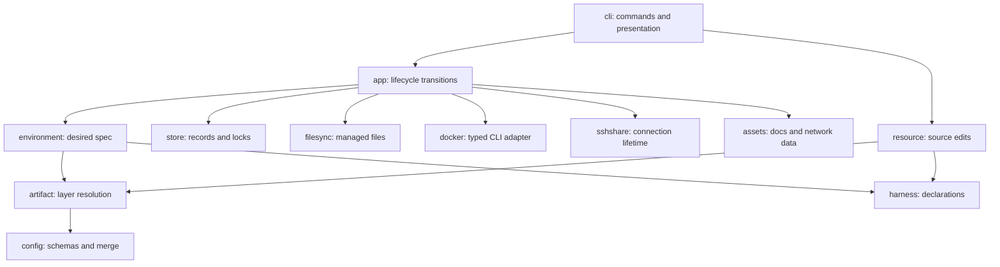

# Runtime architecture

Devbox separates desired configuration from the recorded environment it actually created. Configuration describes what the user wants now; the session record describes what can safely be started, inspected, recovered, or removed. The application engine owns transitions between those states.

The implementation targets Linux directly. File locks, process start identity, boot identity, terminal ioctls, and process exit status use Linux APIs.

## Component layout

All package paths below are under `internal/`.

| Package | Owns | Boundary |
|---|---|---|
| `cli` | Cobra commands, input, tables, menus, JSON/error rendering | Translates requests; does not implement lifecycle policy |
| `app` | Create, access, recreate, delete, inventory, transfer orchestration | Orders resolution, locks, validation, and external effects |
| `resource` | Config-directory publication, optional artifacts, setting edits | Mutates source files, not sessions or folder defaults |
| `config` | Strict schemas, host substitution, field validation and merges | Does not choose which artifacts participate |
| `artifact` | Ordered composition, provenance, artifact overlays, captured source trees | Consumes explicit absolute sources without discovery |
| `environment` | Identity, desired spec, image plan, input snapshots and comparison | Compiles resolved data before execution |
| `harness` | Definitions, registry, defaults, mount-parent derivation | Declares capabilities without owning transitions |
| `store` | Durable records, external locks, leases, transfer journals and copying | Distinguishes absent, corrupt, and reserved state |
| `filesync` | Managed file and shared-JSON ownership | Application must establish that synchronization is safe |
| `docker` | Typed Docker requests, validation, ownership checks and execution | Receives plans rather than reloading configuration |
| `sshshare` | Connection directories, supervisor and generated client config | Owns an individual SSH master's lifetime |
| `assets` | Embedded container guidance and docs bundle | Produces runtime content, not session authority |
| `commanderror` | Typed failures and actionable next steps | Carries causes separately from serialized diagnostics |

Pi, OpenCode, and custom definitions use the same engine. Installation, stores, auth overlays, merge keys, preparation commands, and continuation arguments are data in a harness definition.

## Core invariants

- **Names locate; labels authorize.** A deterministic name never makes a Docker resource safe to mutate.
- **Sessions outlive containers.** Losing a container does not erase the recorded environment.
- **Resolution is not application.** Inspecting changed configuration cannot advance the saved baseline or authorize recreation.
- **One ordinary startup boundary owns synchronization.** Access commands share stopped-to-running preparation.
- **Long commands do not hold operation locks.** They publish leases before releasing the lock; cleanup reacquires it.
- **Secret values are transient.** Recorded source references and keyed hashes support verification without storing env/auth values.
- **Transfer commitment changes authority.** A committed destination must never be overwritten by a retry from the source.

## Follow a subsystem

- [Lifecycle and applied state](lifecycle.md) — creation, startup, recovery, drift, attachment and runtime assets.
- [Configuration and images](configuration.md) — resolution, source edits, declarative harnesses, synchronization and image compilation.
- [State, locking, and transfers](state.md) — ownership, records, inventory, deletion and transactional movement.
- [SSH sharing](ssh.md) — authentication, publication, revocation and host/container masters.

## Error ownership and rendering

`commanderror.Error` carries a stable code, safe message, target, operation metadata, and optional `Step` values. Owners attach these at known failure predicates; the CLI does not infer classifications by matching prose. Causes remain available through `errors.Is` and `errors.As` but are not serialized.

File absence remains a filesystem error until the application owns enough context to turn it into a missing-environment result. Wrapped absence checks use `errors.Is`. This distinction is required for fresh creation and interrupted-transfer discovery: corrupt records must not enter an absence branch.

`cli.Execute` is the process rendering boundary. Human output uses a short error header and separate target context on stderr. JSON-capable commands emit one object on stdout. Child streams retain their normal shape, and child/Docker exit status remains authoritative when joined with cleanup errors.

`Step.Reason` supplies the label beside a shell-quoted command. Owners express sequences with `Then` and alternatives with `Or`; the renderer has no repair policy. The same renderer handles resource-success guidance. Suggested commands never run automatically and do not add force flags by default.

Guidance has two target contracts:

- Missing-session and config-owner hints retain the target spelling the user entered, such as `.` or `./devconfig`. Generic creation guidance uses normal selection rather than replaying unrelated flags.
- A recorded session or transfer retry retains its exact identity and endpoint selectors, independent of current defaults.

Project owners therefore keep the entered folder in `Name` while `Workspace` and `Root` remain canonical for filesystem operations. Explicit home selection is carried into next steps.

Command groups validate unknown commands before Cobra flattens suggestions into prose. Suggestions remain structured steps, user arguments stay quoted, and empty groups show help without opening a store.

## Presentation and completion

Menus keep canonical line input; they do not read raw keys. `cli/menu_render.go` buffers each menu frame and redraws short, safely sized frames on the terminal's temporary alternate screen. It restores the shell screen before final output and lets long or uncertain-width frames print normally. A failed creation check that emits warnings keeps its retry menu on the shell screen, so the warnings remain visible until the user responds. Redirected output keeps the existing plain format. The common formatter keeps scalars and shell argv inline, renders other lists below their field, and wraps within the terminal width. Source provenance comes from the resolver, not comparisons against displayed values. `terminalColors` centralizes TTY, `NO_COLOR`, and `TERM=dumb` handling.

Completion bypasses application/store initialization and locking record readers. Existing config/session directories provide lookup hints, including exact names whose records are corrupt. Local-name suggestions read identity metadata and are scoped to the supplied folder. Harness enumeration exposes only valid effective definitions. Live container completion uses a bounded installation-filtered inventory and quietly omits unavailable sources. Tab must not initialize a home, create locks, resolve a complete environment, or mutate Docker.

Shell generators register `devbox-neo` and an existing `dbx` shortcut against the same handlers. They do not define the shortcut. Invoking the typed shortcut preserves its own executable and flags; Zsh's autoload header advertises both command names.

## Validation strategy

Unit tests use temporary homes and a command-boundary Docker fake. This lets tests assert ordering, ownership checks, lock behavior, input redaction, missing-container recovery, and rollback at specific failure points without touching host environments.

`make test` runs unit tests. `make check` also formats, race-tests, and builds. `make test-integration` opts into the real-Docker suite, which exercises image installation, declared stores, managed auth, and harness lifecycle against a daemon. Fake-boundary tests do not establish that upstream installers or interactive provider login work; those require real runtime validation.
