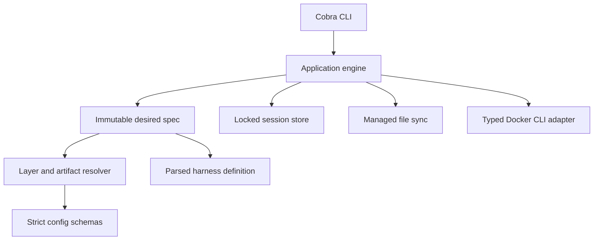

# Initial runtime architecture

The complete design remains [rewrite-plan.md](../../dev/rewrite-plan.md). This checkpoint implements its first Pi lifecycle candidate, not all delivery phases.

The implementation supports Linux only. `flock`, `/proc/<pid>/stat`, boot identity, terminal ioctls, and Linux process exit status are used directly. There is no portability layer or legacy runtime path.

## Desired versus recorded

Resolution reads participating config/artifacts once, copies the desired file tree, and returns fingerprints. Execution does not reload desired configuration. The applied container fingerprint includes the actual image ID, not the current target of a mutable shared tag.

A valid changed spec produces drift diagnostics, not permission to recreate. Existing containers launch their recorded harness. Config-independent access finds a durable record without loading desired config or the current harness registry.

Recorded recovery is a distinct transition. It verifies the stored image and bind inputs, reads the exact recorded definition source for env, checks its installation-keyed digest, and verifies the setup file before creating anything. A new override cannot replace a recorded built-in source. Literal env values are not persisted in the record.

Setup input changes are creation changes because setup is per-container. Entrypoint changes are runtime inputs. The creation record is committed only after startup, declared preparation, setup, and binary availability checks succeed.

## Locks and attached commands

The operation lock spans record loading, ownership checks, stopped-only synchronization, startup, and lease creation. The long foreground command runs without that lock. Cleanup reacquires it with an independent bounded context, removes the lease, reaps stale processes, and applies the last attached command's policy.

Linux process start ticks plus boot identity defend against PID reuse. Corrupt or unverifiable leases fail closed. A failed hook or lease setup stops a newly started container when policy requires it and no other attached command exists.

## Managed files

The synchronizer never decides whether a running container is safe to modify; the application proves stopped/absent state under the operation lock. Running opens defer writes without advancing the manifest or applied runtime fingerprint.

Ordinary files require last-applied content/mode proof before update or deletion. Structured JSON owns only declared keys, preserves all other live keys and existing permissions, and reports invalid live objects as conflicts. Writes use same-directory temporary files; the new manifest commits only after non-conflicting writes succeed.

## Validation boundary

Unit and race tests use temporary homes and a command-boundary Docker fake, including ownership, concurrency, recovery, and failure cases. The opt-in real-Docker test is a separate acceptance gate. Without a local Docker daemon, passing the fake tests is not evidence that image installation or interactive harness execution works on a host.
