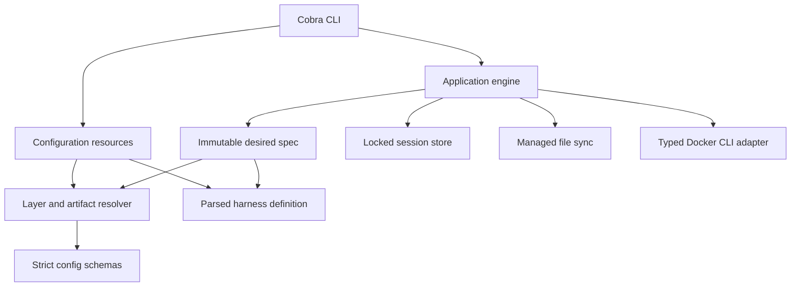
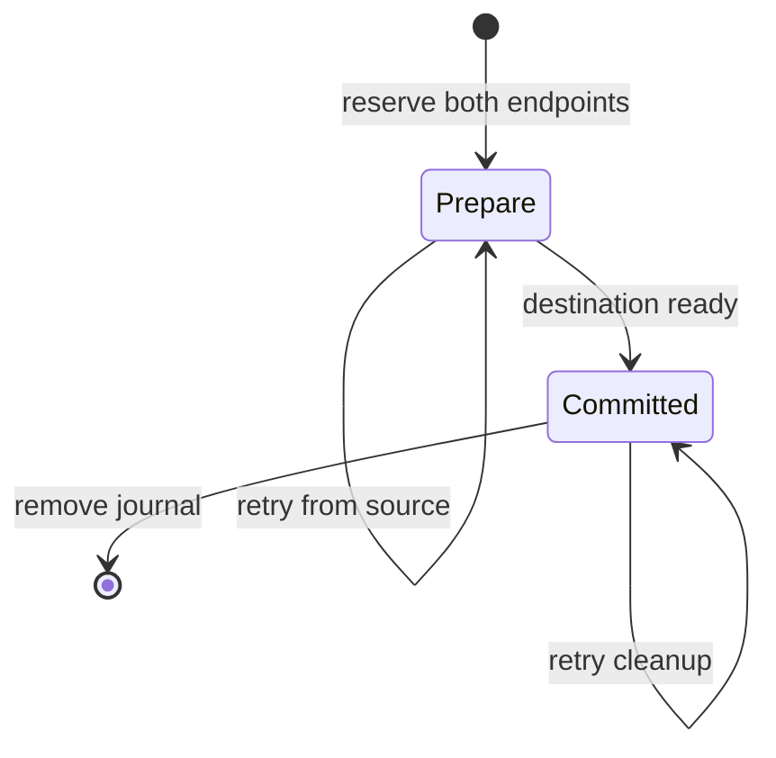

# Initial runtime architecture

The complete design remains [rewrite-plan.md](../../dev/rewrite-plan.md). This checkpoint includes the generic Pi/OpenCode/custom-harness lifecycle and configuration-owner commands, not all delivery phases.

The implementation supports Linux only. `flock`, `/proc/<pid>/stat`, boot identity, terminal ioctls, and Linux process exit status are used directly. There is no portability layer or legacy runtime path.

`environment.ContainerPrefix` defines the `devbox-` container/session lookup convention independently of `docker.Namespace`, which still defines `devbox-rewrite.*` ownership labels and image tags. Names include a sanitized, bounded canonical folder basename, followed by 12 hex characters of the hash of the full canonical workspace path plus slot, and `.profile-<name>` / `.project` suffixes. Sanitization and truncation affect only the readable folder, not the hash input; symlink aliases resolve to the same name. Session records validate against this naming rule; earlier names require a clean reset, not a runtime compatibility path. Docker ownership verification is unchanged.

## Configuration owners and registry

`resource` owns create/init/default-selection and setting-edit mutations. It uses external, per-owner configuration locks and the same Linux lock primitive as the session store. Create stages the complete source tree and publishes it with `RENAME_NOREPLACE`; even an existing empty destination is preserved. Init validates requested artifacts before writing, creates files with no-replace publication, and commits harness selection after seeding. It does not own Docker lifecycle or seed implicit defaults.

Numbered CLI menus use canonical terminal input, not a full-screen framework or raw mode. They keep raw local source values separate from the effective resolver display. Menus and human `--show` share a row formatter: scalars and shell commands inline, other lists below, and bounded wrapping with per-entry source labels. The menu adds a short title and Setting/Value/Source headings; verbose paths and layer details remain in `--show`. Shared menu presentation also serves config submenus, profile/project init, and profile selection: bold wrapped headings, aligned numbers, and dim secondary instructions. `terminalColors` owns the output-TTY, `NO_COLOR`, and `TERM=dumb` checks for both menus and lists; presentation does not change selection parsing or save behavior. Human nested fields use dotted paths matching resolver provenance; JSON output retains the original value structure. The resolver records `Trace.EntrySources` while applying each contribution, in the same order as resolved list values. Duplicate values remain distinct, excluded layers add no entries, shell replacement replaces its entry sources, and global passthrough filtering happens before sources are counted. Source labels use these entries and scalar winners rather than inferring ownership from local key presence or matching values. Human labels shorten `built-in default` to `default` and prefix lower-layer sources with `inherited - `. The JSON trace exposes `entry_sources` alongside aggregate `sources`, without changing value arrays. Display rows never feed configuration saves. Each completed scalar/list operation saves immediately without a draft or confirmation stage. List editors reload source before every operation, including after validation or conflict failures, so rejected changes are neither retained nor retried implicitly. `resource.SetConfigField` re-reads under the configuration-owner lock, compares the edited field as a JSON value, and patches only that field; unrelated concurrent edits and host expressions survive. Reset removes the source key. Source type/literal checks do not require all inherited or host-dependent settings to resolve, so the menu can repair individual settings while displaying an effective-resolution error. Runtime validation remains unchanged.

Standalone project copying uses `artifact.SourceTree`: supported profile sources only, without global values or harness defaults. It adds `inherit_profile: false` while preserving expressions. Project init previews inheritance through the normal artifact resolver rather than duplicating layer selection.

Registry enumeration sorts effective definitions and reports invalid user overrides separately. Selected loading does not inspect unrelated definitions. Built-in and user defaults use the same recursive regular-file reader. It returns files plus source-qualified warnings for skipped symlinks and other non-regular entries, without following links. Artifact resolution carries these warnings into the desired spec; the application reports them on stderr. Source-copy and seeding results expose warnings in text or JSON. Root path checks and filesystem read failures remain fatal. Pi, OpenCode, and a custom fixture use the same lifecycle engine; stores, auth, structured merges, and continuation arguments come from their definitions.

## Layered image builds

`artifact.ReadBuildContext` captures the selected Dockerfile, included regular context files and directory modes, and the effective ignore rules. `environment.ImageBuildPlan` compiles this into an optional base build plus the mandatory Devbox runtime/harness layer. Execution stages captured bytes, supplies host-ID arguments, and uses the unique temporary intermediate tag in the runtime Dockerfile's `FROM` instruction. Bare image IDs are not used as build references because BuildKit can interpret them as registry names. Temporary intermediate tags are checked against the recorded image ID and installation ownership before removal, including when the runtime build fails. Full runtime overrides are not supported.

Bundled packages and the system-wide Bash aliases are generated by `environment.ImageDockerfile` in that same mandatory layer. Their bytes participate in the image fingerprint, so ordinary recreation rebuilds when they change; `--image` additionally disables cache.

Harness mount ancestors are derived once by `Definition.MountParents`, which identifies the enclosing mount for each directory. The mandatory runtime layer creates image-owned ancestors as `devuser` after harness installation and checks that they are writable/searchable. This prevents Docker from supplying root-owned home-directory parents and applies equally to custom bases. Existing incompatible image permissions fail the build rather than triggering recursive ownership changes.

Ancestors inside another mount are created in that mount's host source before container creation/start. `app.start` uses recorded store/auth targets, so reset can remove these descendants without breaking the next start or requiring desired config. Host preparation rejects symlink paths and missing backing roots; it never replaces missing durable state with an empty root. Extra user mounts are outside this managed-harness preparation contract. Preparing directories does not add persistent stores.

## Inventory and destructive operations

Container inventory uses one label-filtered list and one batched inspection. Views combine recorded activity/action/profile/harness with Docker's live state and container creation timestamp. The CLI owns table formatting and explicit name/activity sorting; it does not reload desired config or make per-row Docker queries. It aligns plain list cells before dimming stopped/missing rows so ANSI escapes cannot shift columns. Running rows and separate error/transfer notices remain undimmed. Durable-session inventory retains parse failures as explicit entries. Status resolves desired config separately from live facts; a desired-config failure is not a container failure. `status --all` uses the same inventory join and ownership/instance checks as listing, then the same desired resolver and fingerprint comparison as single-target status. It resolves each eligible recorded slot without per-row Docker queries, keeping configuration failures on their rows. Profile selection uses live slot labels so corrupt or missing records do not hide selected containers. Pending transfers and unverifiable contracts remain unclassified rather than claiming no changes. Missing-container sessions are excluded. The table separates live state from change classification; JSON retains the existing status fields. This is local-input drift detection, not an upstream-version check.

Session listing uses its own columns: recorded name, harness, profile, activity, and folder, plus an explicitly labelled live `CONTAINER` cross-reference. It shares sorting, cell escaping, activity formatting, row styling, and diagnostics with container listing, not the container table schema. Text and JSON follow the same selected order; filtering for discovered cleanup remains under prune.

Cobra completion bypasses the application/store initializer and locking record readers to avoid writes during Tab completion. Profile/session name suggestions come from existing directories; they are lookup hints, not ownership or record-validity proof. Harness choices use registry enumeration. Live container names use the existing batched Docker inventory with the selected home's installation ID and a short deadline. Failures quietly omit suggestions. Completion never resolves a full desired environment or seeds state.

Bulk deletion, recreation, and reset acquire sorted complete operation-lock sets and preflight every target before mutations. Reset requires stopped/absent containers, preserves declared history, and leaves bind roots intact. Session deletion holds the short record lock during directory removal; external locks survive. Pruning rechecks age after acquiring locks. Dry-run preflight examines leases without reaping them.

Secondary network commands inspect the actual attachment set under the operation lock. They never alter creation fingerprints, cannot detach the primary network, and are unavailable for host networking.

## Session transfers

`app/transfer.go` owns one explicit clone/relocate state machine. Destination resolution uses the normal configuration resolver; portable store copying and external journals belong to `store`. Creation accepts the identity already allocated in the journal, so retries do not allocate another session. The engine verifies current harness portability declarations and requires the recorded active definition to remain unchanged.

Both endpoint operation locks are acquired in sorted order. A single `state/transfers/<source-container>.json` journal reserves both names. `Locked.Load` rejects pending work; read-only inventory and transfer operations can still read the records. Pending lookup scans unfinished journals, so a corrupt journal fails mutations closed rather than guessing which destination it reserves. No second creation record or permanent lineage is written.

In `prepare`, the source remains authoritative. Clone requires a stopped/absent source; relocate stops a running source before copying. Only declared environment stores and ownership manifests are copied. Auth overlays, cache stores, records and leases are excluded. Symlinks remain opaque entries, not traversed host paths. Source container-layer data and workspace files are not transferred.

Destination preparation uses normal image building, stopped config synchronization, setup, and runtime installation. Clone leaves the destination stopped; relocate preserves original running intent. A failed attempt gets bounded destination cleanup, restores the source image tag after a relocation build, and restarts a previously running source. The journal remains pending. A preparation retry requires unchanged destination fingerprints and recopies the authoritative source, since rollback may have restarted it.

Publishing `committed` switches authority to the destination before source removal. Once publication is attempted, rollback cannot delete the destination: directory sync errors can occur after rename succeeds. A committed retry does not resolve desired config or repeat copying. It verifies the recorded destination, recovers its missing container if recorded inputs permit, and finishes source cleanup. The external journal survives source-directory removal and releases both names only when cleanup completes.

## Runtime documentation and network facts

`assets` embeds the human docs, their linked development notes, and container agent guidance. The engine stages that bundle plus fresh inspected network facts in a private temporary directory. The Docker adapter copies it into the verified running container's `/devbox` directory and applies root-owned read-only permissions for `devuser`. Temporary host staging is removed on success and failure.

Preparation runs before setup/harness access and root entrypoint hooks; existing-container access remains independent of desired configuration. Managed secondary-network changes refresh the files while running. These inspected facts are not durable session authority. Pi/OpenCode supply the `devbox` skill through harness defaults, pointing to `/devbox/AGENTS.md` and the docs. Init excludes that skill from profile/project copies so it stays inherited; an explicitly supplied file still overrides it through the normal config tree resolution and synchronization.

The asset content hash participates in runtime drift, not the image build fingerprint.

## Host inputs and sensitivity

Resolution captures one host environment snapshot, expands decoded configuration strings once, and tracks variable names by source field. Literal source bytes are retained for source edits/copies; expanded env values are never serialized into session state. Sensitivity follows the destination field: env/auth are sensitive, ordinary names/paths/settings are public.

Sensitive config env uses file/field/index references. Each reference verifies the original expression and the resolved assignment with installation-keyed hashes. Recovery reads only those source entries; changing an unrelated config field does not replace the env contract. CLI-only values cannot be reconstructed and require explicit recreation after container loss. The existing-container access path never reads these sources.

Terminal display metadata is separate from desired config. The CLI captures `app.TerminalEnv`'s allowlist once into the engine. `materialize` prepends it to a temporary creation plan's env before configured values, including on recorded recovery. The saved creation contract, env-source references, and fingerprints remain unchanged. `attach` passes the same invocation's terminal values as explicit Docker exec env overrides for harness, shell, and exec commands, independent of TTY allocation. Internal hooks/preparation do not receive attachment overrides; they inherit the container's creation env. Missing host keys do not clear container values, while present empty values are forwarded. This restores terminal capabilities without sourcing host dotfiles or changing recorded shell argv.

The Docker adapter validates mount/port/raw-argument boundaries and renders a private creation env file. Config display renders the same resolver trace, redacts env, and does not serialize the host snapshot or harness definition's env values.

## Desired versus recorded

Resolution reads participating config/artifacts once, copies the desired file tree, and returns fingerprints. Execution does not reload desired configuration. The applied container fingerprint includes the actual image ID, not the current target of a mutable shared tag.

A valid changed spec produces drift diagnostics, not permission to recreate. Under the operation lock, `open` compares the loaded record before recovery, synchronization, or startup. Container/image drift is printed first, before buffered resolution warnings and entrypoint/harness output, and opening continues immediately. Diagnostics remain typed, non-fatal results and are emitted once when detected. Existing containers launch their recorded harness. Config-independent access finds a durable record without loading desired config or the current harness registry.

Recorded recovery is a distinct transition. It verifies the stored image and bind inputs, reads the exact recorded definition source for env, checks its installation-keyed digest, and verifies the setup file before creating anything. A new override cannot replace a recorded built-in source. Literal env values are not persisted in the record.

Setup input changes are creation changes because setup is per-container. Entrypoint changes are runtime inputs. The creation record is committed only after startup, declared preparation, setup, and binary availability checks succeed.

## Locks and attached commands

The operation lock spans record loading, ownership checks, stopped-only synchronization, startup, and lease creation. The long foreground command runs without that lock. Cleanup reacquires it with an independent bounded context, removes the lease, reaps stale processes, and applies the last attached command's policy.

Linux process start ticks plus boot identity defend against PID reuse. Corrupt or unverifiable leases fail closed. A failed hook or lease setup stops a newly started container when policy requires it and no other attached command exists.

## Managed files

The synchronizer never decides whether a running container is safe to modify; the application proves stopped/absent state under the operation lock. Running opens defer pending managed-file writes without advancing their manifest or claiming they were applied. Runtime-only hook/launch changes can advance the runtime fingerprint when the applied file manifest already matches desired inputs.

Ordinary files require last-applied content/mode proof before update or deletion. Structured JSON owns only declared keys, preserves all other live keys and existing permissions, and reports invalid live objects as conflicts. Pi's definition applies this to selected `settings.json` keys and the whole `providers` key in `models.json`; both use the same generic synchronizer. Writes use same-directory temporary files; the new manifest commits only after non-conflicting writes succeed.

## Validation boundary

Unit and race tests use temporary homes and a command-boundary Docker fake, including ownership, concurrency, recovery, and failure cases. The opt-in real-Docker suite is a separate acceptance gate. The user reported the original Pi lifecycle test passing on their Linux host; the expanded Pi/OpenCode/custom suite also exercises managed auth writes but has not been run here. Interactive provider login and conversation continuation remain unverified. Without a local Docker daemon, passing the fake tests is not evidence that image installation or interactive harness execution works on a host.
