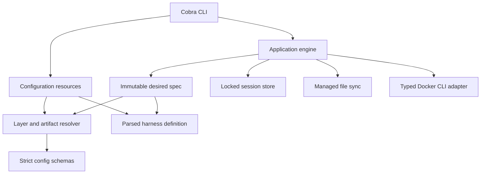
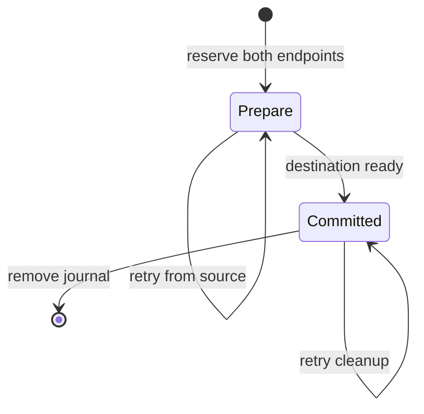

# Initial runtime architecture

The complete design remains [rewrite-plan.md](../../dev/rewrite-plan.md). This checkpoint includes the generic Pi/OpenCode/custom-harness lifecycle and configuration-owner commands, not all delivery phases.

The implementation supports Linux only. `flock`, `/proc/<pid>/stat`, boot identity, terminal ioctls, and Linux process exit status are used directly. There is no portability layer or legacy runtime path.

`environment.ContainerPrefix` defines the `devbox-` container/session lookup convention independently of `docker.Namespace`, which still defines `devbox-rewrite.*` ownership labels and image tags. Names include a sanitized, bounded canonical folder basename, followed by 12 hex characters of the hash of the full canonical workspace path plus slot, and `.profile-<name>` / `.project` suffixes. Sanitization and truncation affect only the readable folder, not the hash input; symlink aliases resolve to the same name. Session records validate against this naming rule; earlier names require a clean reset, not a runtime compatibility path. Docker ownership verification is unchanged.

## Command errors

`commanderror.Error` and `commanderror.Step` are the shared failure/guidance data model. Owners attach codes and next steps at known failure predicates; the CLI does not classify errors by matching prose. Causes unwrap for `errors.Is`/`errors.As` and exit handling but are not serialized. Store file absence remains native until application identity lookup consumes it; callers that consume wrapped lookup failures use `errors.Is`, preserving fresh creation and interrupted-transfer discovery. Corrupt state remains distinct from absence.

Command groups own their unknown-command validation before Cobra flattens suggestions into error prose. User arguments remain quoted; suggestions are ordinary `commanderror.Step` values. Empty group invocations still display help, without initializing state.

`cli.Execute` is the process rendering boundary. Existing JSON commands emit one error object on stdout with codes and operation metadata; human errors use a short `Error:` header and separate target context on stderr. Message owners describe the failure in user-facing terms and preserve actionable details such as validation reasons, conflicting paths, and recovery constraints. `stepsText` renders each existing `Step.Reason` as a label; owners mark sequential or alternative actions with `Then` or `Or`, rather than teaching the renderer command policy. The same labeling, shell quoting, and home scoping serve resource success guidance and actionable errors. Generic creation hints show only `create`, without profile selectors. Missing-environment hints use the request's entered workspace rather than its resolved identity. Project owners retain the entered folder in `Name` for command hints while `Workspace` and `Root` remain canonical for filesystem operations. Recorded-session and transfer guidance still targets its exact resources. Resource success JSON and child streams keep their existing formats. Docker/child status remains authoritative, joined cleanup failures remain visible, and no suggested mutation executes automatically. Pending-transfer retries come from exact journal endpoints, including same-folder slots, rather than current defaults or parsed error strings.

## Configuration owners and registry

`resource` owns create/init/default-selection and setting-edit mutations. It uses external, per-owner configuration locks and the same Linux lock primitive as the session store. Create stages the complete source tree and publishes it with `RENAME_NOREPLACE`; even an existing empty destination is preserved. Init validates requested artifacts before writing, creates files with no-replace publication, and commits harness selection after seeding. It does not own Docker lifecycle or seed implicit defaults.

Numbered CLI menus use canonical terminal input, not a full-screen framework or raw mode. They keep raw local source values separate from the effective resolver display. Menus and human `--show` share a row formatter: scalars and shell commands inline, other lists below, and bounded wrapping with per-entry source labels. The menu adds a short title and Setting/Value/Source headings; verbose paths and layer details remain in `--show`. Shared menu presentation also serves config submenus, profile/project init, and profile selection: bold wrapped headings, aligned numbers, and dim secondary instructions. `terminalColors` owns the output-TTY, `NO_COLOR`, and `TERM=dumb` checks for both menus and lists; presentation does not change selection parsing or save behavior. Human nested fields use dotted paths matching resolver provenance; JSON output retains the original value structure. The resolver records `Trace.EntrySources` while applying each contribution, in the same order as resolved list values. Duplicate values remain distinct, excluded layers add no entries, shell replacement replaces its entry sources, and global passthrough filtering happens before sources are counted. Source labels use these entries and scalar winners rather than inferring ownership from local key presence or matching values. Human labels shorten `built-in default` to `default` and prefix lower-layer sources with `inherited - `. The JSON trace exposes `entry_sources` alongside aggregate `sources`, without changing value arrays. Display rows never feed configuration saves. Each completed scalar/list operation saves immediately without a draft or confirmation stage. List editors reload source before every operation, including after validation or conflict failures, so rejected changes are neither retained nor retried implicitly. `resource.SetConfigField` re-reads under the configuration-owner lock, compares the edited field as a JSON value, and patches only that field; unrelated concurrent edits and host expressions survive. Reset removes the source key. Source type/literal checks do not require all inherited or host-dependent settings to resolve, so the menu can repair individual settings while displaying an effective-resolution error. Runtime validation remains unchanged.

Standalone project copying uses `artifact.SourceTree`: supported profile sources only, without global values or harness defaults. It adds `inherit_profile: false` while preserving expressions. Project init previews inheritance through the normal artifact resolver rather than duplicating layer selection.

Pi's built-in definition supplies `--tui-mode fullscreen` through ordinary launch arguments. Configured harness arguments and one-off arguments follow it, allowing an explicit regular-mode override; no Pi-specific lifecycle logic or managed preference key was added. As with any definition change, existing recorded environments require recreation to adopt it.

Registry enumeration sorts effective definitions and reports invalid user overrides separately. Selected loading does not inspect unrelated definitions. Built-in and user defaults use the same recursive regular-file reader. It returns files plus source-qualified warnings for skipped symlinks and other non-regular entries, without following links. Artifact resolution carries these warnings into the desired spec; the application reports them on stderr. Source-copy and seeding results expose warnings in text or JSON. Root path checks and filesystem read failures remain fatal. Pi, OpenCode, and a custom fixture use the same lifecycle engine; stores, auth, structured merges, and continuation arguments come from their definitions.

## Layered image builds

`artifact.ReadBuildContext` captures the selected Dockerfile, included regular context files and directory modes, and the effective ignore rules. `environment.ImageBuildPlan` compiles this into an optional base build plus the mandatory Devbox runtime/harness layer. Execution stages captured bytes, supplies host-ID arguments, and uses the unique temporary intermediate tag in the runtime Dockerfile's `FROM` instruction. Bare image IDs are not used as build references because BuildKit can interpret them as registry names. Temporary intermediate tags are checked against the recorded image ID and installation ownership before removal, including when the runtime build fails. Full runtime overrides are not supported.

Bundled packages and the system-wide Bash aliases are generated by `environment.ImageDockerfile` in that same mandatory layer. Their bytes participate in the image fingerprint, so ordinary recreation rebuilds when they change; `--image` additionally disables cache.

Harness mount ancestors are derived once by `Definition.MountParents`, which identifies the enclosing mount for each directory. The mandatory runtime layer creates image-owned ancestors as `devuser` after harness installation and checks that they are writable/searchable. This prevents Docker from supplying root-owned home-directory parents and applies equally to custom bases. Existing incompatible image permissions fail the build rather than triggering recursive ownership changes.

Ancestors inside another mount are created in that mount's host source before container creation/start. `app.start` uses recorded store/auth targets to restore missing nested parents. Ordinary startup validates these backing roots before managed sync so synchronization cannot recreate missing durable roots. Host preparation rejects symlink paths and missing backing roots; it never replaces missing durable state with an empty root. Extra user mounts are outside this managed-harness preparation contract. Preparing directories does not add persistent stores.

## Inventory and destructive operations

The durable session is the CLI's top-level environment model. `list` inventories saved environments; `status` combines recorded details and health checks. There is no separate session command group or container-only list/status. Lifecycle mutations still distinguish disposable containers from saved state.

Inventory uses one installation-filtered Docker list and one batched inspection, joined with saved records and pending transfer endpoints. `app.InventoryReport` separates `sessions` from `unmatched_containers`. A missing container does not exclude its session. A container with no record is reported separately rather than turned into a session; corrupt records remain session rows with errors. An incomplete saved directory without a container also remains visible. Profile selection uses valid recorded identity, or live slot labels for unverifiable records/unmatched containers; unknown-profile broken entries remain visible in unfiltered inventory. Listing does not resolve desired configuration.

`status --all` enriches the same saved-environment inventory with the existing resolver and `environment.CompareInputs`. It keeps runtime state independent of desired-config failures. Pending transfers and unverifiable contracts remain unclassified, never falsely clean. Missing-container sessions still receive configuration/drift checks. This detects changed local inputs, not newer upstream releases. Bulk JSON retains separate session and unmatched-container arrays. Single-target `app.Status` reads the saved record and live leases under the external operation lock, inspects the linked container, and uses the same desired-input comparison. `StatusDetails` embeds the status view and adds `record` and `active` in JSON without adding them to bulk rows. Invalid desired configuration is a diagnostic, not a reason to suppress saved details. Exact pending-transfer endpoints remain inspectable even without a record; they skip desired resolution. Inspection does not reap leases or synchronize configuration.

The CLI displays name, harness, profile, activity, container state, and folder for listing, with optional exact timestamps and last action. Bulk status displays name, container state, and changes, followed by detailed diagnostics. Single-target status also displays session ID, harness, image, and active-command count. Unmatched-container warnings appear below both tables. Formatting aligns plain cells before styling inactive rows; diagnostics remain undimmed. Text and JSON follow the same explicit name/activity ordering. Age/orphan filtering belongs to `delete`, not a separate prune command.

Cobra completion bypasses the application/store initializer and locking record readers to avoid writes during Tab completion. Profile/session name suggestions come from existing directories; they are lookup hints, not ownership or record-validity proof. Harness choices use registry enumeration. Live container names use the existing batched Docker inventory with the selected home's installation ID and a short deadline. Failures quietly omit suggestions. Completion never resolves a full desired environment or seeds state. Script generation retains Cobra's generators, help, and description flag, adding shell-specific registration of `dbx` against the same handlers as `devbox-neo`. The handlers invoke the typed shortcut, preserving its executable and flags; registration never defines the shortcut or adds a Cobra root alias. Zsh's first-line autoload header advertises both names.

Bulk deletion and recreation acquire sorted complete operation-lock sets and preflight every target before mutations. `app.Delete` retains that lock set across container deletion and the optional saved-data phase, including CLI confirmation callbacks. Mutually exclusive `--container` and `--session` flags select container-only or whole-environment deletion and suppress prompts. Without either, the CLI supplies two default-no confirmation callbacks. Non-interactive, JSON, and dry-run calls require scope. `--force` relaxes only container attached-command protection. Explicit saved-data scope is preflighted before container removal and checked again for container absence afterward. Saved-data deletion still requires idle sessions; container failures never advance to state deletion. Without explicit scope, the interactive saved-data choice occurs only after successful container removal. Cancellation after that point keeps remaining state, not a rollback of already-removed containers. State deletion holds the short record lock during directory removal; external locks survive. Deletion filters intersect. Last-activity and orphan filters are rechecked under the full lock set before mutation and again after container confirmation. This check precedes deletion's own activity update. Unknown activity is not guessed to be old. Dry-run preflight examines leases without reaping them.

Secondary network commands inspect the actual attachment set under the operation lock. They never alter creation fingerprints, cannot detach the primary network, and are unavailable for host networking.

## Session transfers

`app/transfer.go` owns one explicit clone/relocate state machine. Destination resolution uses the normal configuration resolver; portable store copying and external journals belong to `store`. Creation accepts the identity already allocated in the journal, so retries do not allocate another session. The engine verifies current harness portability declarations and requires the recorded active definition to remain unchanged.

Both endpoint operation locks are acquired in sorted order. A single `state/transfers/<source-container>.json` journal reserves both names. `Locked.Load` rejects pending work; read-only inventory and transfer operations can still read the records. Pending lookup scans unfinished journals, so a corrupt journal fails mutations closed rather than guessing which destination it reserves. No second creation record or permanent lineage is written.

In `prepare`, the source remains authoritative. Clone requires a stopped/absent source; relocate stops a running source before copying. Only declared environment stores and ownership manifests are copied. Auth overlays, cache stores, records and leases are excluded. Symlinks remain opaque entries, not traversed host paths. Source container-layer data and workspace files are not transferred.

Destination preparation uses normal image building, stopped config synchronization, setup, and runtime installation. Clone leaves the destination stopped; relocate preserves original running intent. A failed attempt gets bounded destination cleanup, restores the source image tag after a relocation build, and restarts a previously running source. The journal remains pending. A preparation retry requires unchanged destination fingerprints and recopies the authoritative source, since rollback may have restarted it.

Publishing `committed` switches authority to the destination before source removal. Once publication is attempted, rollback cannot delete the destination: directory sync errors can occur after rename succeeds. A committed retry does not resolve desired config or repeat copying. It verifies the recorded destination, recovers its missing container if recorded inputs permit, and finishes source cleanup. The external journal survives source-directory removal and releases both names only when cleanup completes.

## Foreground SSH sharing

`app.SSH` uses normal target/ownership checks and `startAccess`, then publishes an attached-command lease through `attachRun`. The same lease owner serves Docker attachments and host-side SSH controllers. Long-running work releases the operation lock; SSH revocation finishes before lease cleanup and last-command `on_exit` handling. SSH normalizes only the foreground runner's expected interrupt result, before joining cleanup failures. Container TTY Ctrl-C can return exit 130 without cancelling the host context; host cancellation can terminate the runner with 137/143 instead. Authentication failures, unrelated errors, and deadlines remain failures. The CLI snapshots/restores the host terminal around SSH and uses its current output flags when writing status lines during Docker's raw-mode attachment. Successful completion prints `Disconnected.` only after cleanup and terminal restoration. A bounded Docker inspection each second also ends host masters after forced container stop/removal or lost Docker contact.

`sshshare` owns temporary connection directories, generated client config, and an embedded Bash supervisor. Both modes run that supervisor: in the container by default, on the host only with `--host-master`. It launches `ssh -M -N`, overriding only master/persistence/backgrounding options needed for a foreground lifetime. Normal SSH configuration supplies credentials, jumps, agent forwarding, and X11 forwarding. No keys/config are copied and no personal master is adopted.

Each invocation holds a kernel flock on its own `owner.lock`. A watchdog checks that inode once per second and terminates the actual master when the controller disappears, including before authentication or when the Docker CLI disconnects without killing its exec process. A separate `master.lock` lets cleanup wait for actual teardown even during authentication, before a socket exists. The supervisor checks that the owner is still present before launching SSH. Unique invocation directories prevent an old watchdog from mistaking a new connection's lock for its controller. Authentication success is detected through the live control socket, then a per-connection Include file is atomically published. Removing that file withdraws discovery; closing the owner lock revokes the connection. Remaining inert directories are cleaned on destination retry or saved-state deletion, not adopted. This is process-lifetime management, not protection against a container deliberately altering its own runtime files.

`sessions/<name>/runtime/ssh` is a private writable mount at `/devbox/ssh`, separate from transferred harness state. Host masters use short `/proc/<controller-pid>/fd` paths backed by an open directory, preserving the caller's working directory for relative SSH configuration. `/proc/self/fd` paths also let the controller probe sockets under long home paths. Generated client settings use `BatchMode yes`, `ControlMaster no`, and a failing `ProxyCommand`: a vanished socket never triggers a new connection. These client defaults do not constrain arbitrary SSH commands or separately supplied credentials. Socket mounts are creation-time inputs; SSH refuses a recorded environment without the mount and recommends explicit recreation.

## Runtime documentation and network facts

`assets` embeds the human docs, their linked development notes, and container agent guidance. The engine stages that bundle plus fresh inspected network facts in a private temporary directory. The Docker adapter copies it into the verified running container's `/devbox` directory and applies root-owned read-only permissions for `devuser`, excluding the live `/devbox/ssh` mount from recursive ownership/permission changes. Temporary host staging is removed on success and failure.

Preparation runs before setup/harness access and root entrypoint hooks; existing-container access remains independent of desired configuration. Managed secondary-network changes refresh the files while running. These inspected facts are not durable session authority. Pi/OpenCode supply the `devbox` skill through harness defaults, pointing to `/devbox/AGENTS.md` and the docs. Init excludes that skill from profile/project copies so it stays inherited; an explicitly supplied file still overrides it through the normal config tree resolution and synchronization.

The asset content hash participates in runtime drift, not the image build fingerprint.

## Host inputs and sensitivity

Resolution captures one host environment snapshot, expands decoded configuration strings once, and tracks variable names by source field. Literal source bytes are retained for source edits/copies; expanded env values are never serialized into session state. Sensitivity follows the destination field: env/auth are sensitive, ordinary names/paths/settings are public.

Sensitive config env uses file/field/index references. Each reference verifies the original expression and the resolved assignment with installation-keyed hashes. Recovery reads only those source entries; changing an unrelated config field does not replace the env contract. CLI-only values cannot be reconstructed and require explicit recreation after container loss. The existing-container access path never reads these sources.

Terminal display metadata is separate from desired config. The CLI captures `app.TerminalEnv`'s allowlist once into the engine. `materialize` prepends it to a temporary creation plan's env before configured values, including on recorded recovery. The saved creation contract, env-source references, and fingerprints remain unchanged. `attach` passes the same invocation's terminal values as explicit Docker exec env overrides for harness, shell, and exec commands, independent of TTY allocation. Internal hooks/preparation do not receive attachment overrides; they inherit the container's creation env. Missing host keys do not clear container values, while present empty values are forwarded. This restores terminal capabilities without sourcing host dotfiles or changing recorded shell argv.

The Docker adapter validates mount/port/raw-argument boundaries and renders a private creation env file. Config display renders the same resolver trace, redacts env, and does not serialize the host snapshot or harness definition's env values.

## Desired versus recorded

Resolution reads participating config/artifacts once, copies the desired file tree, and captures `environment.Inputs`: typed image, container, and runtime snapshots. The snapshots contain public values and file/env hashes, never file contents or env values. Aggregate fingerprints and `CompareInputs` reports derive from this same model. Reports expose `PendingInputChanges` as `[]environment.InputChange` (JSON `pending_input_changes`); there is no independent diagnostic settings registry or second file scan. File source paths explain content changes but are excluded from fingerprints. Relative build-context and managed-config names remain fingerprint inputs. The comparison reports leaf changes in stable order and preserves the image > container > runtime action priority without reporting the image-to-container hash dependency as another reason. Dockerfile/ignore entries duplicated in the build context are reported once per physical change.

Session record schema version 2 requires the complete snapshot and validates that it reproduces the committed fingerprints. Creation/recreation commits all inputs; `Record.ApplyRuntime` advances only runtime inputs and their fingerprint together at existing synchronization commit points, including recorded recovery. Merely resolving desired state does not change the baseline. Clone/relocate destinations commit their own resolved inputs, not the source snapshot. Old development records require a clean reset; there are no compatibility readers, migrations, or inferred baselines. Execution does not reload desired configuration. The applied container fingerprint includes the actual image ID, not the current target of a mutable shared tag.

A valid changed spec produces drift diagnostics, not permission to recreate. Under the operation lock, `open` compares the loaded record before recovery, synchronization, or startup. Container/image drift reasons are printed first, before buffered resolution warnings and entrypoint/harness output, and opening continues immediately. Single and bulk status expose all reason scopes through the same comparison, including runtime-only changes; env reasons contain names only. Diagnostics remain typed, non-fatal results and are emitted once when detected. Existing containers launch their recorded harness. Target lookup remains config-independent. `app.startAccess` is the ordinary stopped-to-running boundary shared by open/start/shell/exec/ssh: it consumes Open's captured spec or resolves one spec for the recorded slot when startup is needed, reports creation drift, then uses `syncRecordedConfig` before starting or recorded recovery. Invalid config fails startup. Running start/shell/exec/ssh return through that boundary without desired resolution or sync.

Recorded recovery is a distinct transition. It verifies the stored image and bind inputs, reads the exact recorded definition source for env, checks its installation-keyed digest, and verifies the setup file before creating anything. A new override cannot replace a recorded built-in source. Literal env values are not persisted in the record.

New-session creation is explicit. `Engine.Create` resolves desired inputs, holds the session operation lock, rejects any existing record or uncommitted state, and uses the shared creation pipeline. It stops the prepared container after commitment without running the every-open entrypoint or attaching a harness. If stopping fails, the committed session remains available and the error points to `stop`. `Open` and `Start` require an existing record and have no new-session creation branch. The CLI exposes container-setting overrides only on `create` and `recreate`; `open` accepts launch settings (`--on-exit`, `--harness-arg`), continuation, and one-off harness arguments. `Start` resolves desired runtime inputs when starting or recovering a container; already-running access does not. Both still recover a missing container for retained session state under the same recorded recovery rules.

Setup input changes are creation changes because setup is per-container. Entrypoint changes are runtime inputs. The creation record is committed only after startup, declared preparation, setup, and binary availability checks succeed.

## Locks and attached commands

The operation lock spans record loading, ownership checks, stopped-only synchronization, startup, and lease creation. The long foreground command runs without that lock. Cleanup reacquires it with an independent bounded context, removes the lease, reaps stale processes, and applies the last attached command's policy.

Linux process start ticks plus boot identity defend against PID reuse. Corrupt or unverifiable leases fail closed. A failed hook or lease setup stops a newly started container when policy requires it and no other attached command exists.

## Managed files

The synchronizer never decides whether a running container is safe to modify; the application proves stopped/absent state under the operation lock. Creation/recreation and transfer destination creation synchronize before materialization. Access uses the shared startup boundary, validates recorded backing roots, synchronizes only compatible harness layouts, and advances runtime inputs/launch settings together. Container/image baselines remain unchanged until recreation. Transaction rollback and committed-transfer recovery still restore their recorded transaction without new desired resolution. Running opens defer pending managed-file writes without advancing their manifest or claiming they were applied. Runtime-only hook/launch changes can advance the runtime fingerprint when the applied file manifest already matches desired inputs.

Ordinary managed files are authoritative copies: synchronize desired bytes/private mode even after local edits, and remove formerly managed files no longer desired regardless of local content. Unmanaged paths remain untouched. Manifest hashes still describe applied inputs for running deferral; they no longer protect ordinary local edits from overwrite. Structured JSON owns only declared keys, preserves all other live keys and existing permissions, and reports invalid live objects as conflicts. Pi's definition applies this to selected `settings.json` keys and the whole `providers` key in `models.json`; both use the same generic synchronizer. Writes use same-directory temporary files; the new manifest commits only after non-conflicting writes succeed.

## Validation boundary

Unit and race tests use temporary homes and a command-boundary Docker fake, including ownership, concurrency, recovery, and failure cases. The opt-in real-Docker suite is a separate acceptance gate. The user reported the original Pi lifecycle test passing on their Linux host; the expanded Pi/OpenCode/custom suite also exercises managed auth writes but has not been run here. Interactive provider login and conversation continuation remain unverified. Without a local Docker daemon, passing the fake tests is not evidence that image installation or interactive harness execution works on a host.
