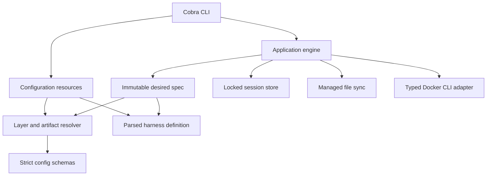

# Initial runtime architecture

The complete design remains [rewrite-plan.md](../../dev/rewrite-plan.md). This checkpoint includes the generic Pi/OpenCode/custom-harness lifecycle and configuration-owner commands, not all delivery phases.

The implementation supports Linux only. `flock`, `/proc/<pid>/stat`, boot identity, terminal ioctls, and Linux process exit status are used directly. There is no portability layer or legacy runtime path.

## Configuration owners and registry

`resource` owns create/init/default-selection mutations. It uses external, per-owner configuration locks and the same Linux lock primitive as the session store. Create stages the complete source tree and publishes it with `RENAME_NOREPLACE`; even an existing empty destination is preserved. Init validates requested artifacts before writing, creates files with no-replace publication, and commits harness selection after seeding. It does not own Docker lifecycle or seed implicit defaults.

Standalone project copying uses `artifact.SourceTree`: supported profile sources only, without global values or harness defaults. It adds `inherit_profile: false` while preserving expressions. Project init previews inheritance through the normal artifact resolver rather than duplicating layer selection.

Registry enumeration sorts effective definitions and reports invalid user overrides separately. Selected loading does not inspect unrelated definitions. Built-in and user defaults use the same recursive regular-file reader. Pi, OpenCode, and a custom fixture use the same lifecycle engine; stores, auth, structured merges, and continuation arguments come from their definitions.

## Layered image builds

`artifact.ReadBuildContext` captures the selected Dockerfile, included regular context files and directory modes, and the effective ignore rules. `environment.ImageBuildPlan` compiles this into an optional base build plus the mandatory Devbox runtime/harness layer. Execution stages captured bytes, supplies host-ID arguments, and uses the concrete intermediate image ID. Temporary intermediate tags are installation-verified before removal. Full runtime overrides are not supported.

## Inventory and destructive operations

Container inventory uses one label-filtered list and one batched inspection. Durable-session inventory retains parse failures as explicit entries. Status resolves desired config separately from live facts; a desired-config failure is not a container failure.

Bulk deletion, recreation, and reset acquire sorted complete operation-lock sets and preflight every target before mutations. Reset requires stopped/absent containers, preserves declared history, and leaves bind roots intact. Session deletion holds the short record lock during directory removal; external locks survive. Pruning rechecks age after acquiring locks. Dry-run preflight examines leases without reaping them.

Secondary network commands inspect the actual attachment set under the operation lock. They never alter creation fingerprints, cannot detach the primary network, and are unavailable for host networking.

## Desired versus recorded

Resolution reads participating config/artifacts once, copies the desired file tree, and returns fingerprints. Execution does not reload desired configuration. The applied container fingerprint includes the actual image ID, not the current target of a mutable shared tag.

A valid changed spec produces drift diagnostics, not permission to recreate. Existing containers launch their recorded harness. Config-independent access finds a durable record without loading desired config or the current harness registry.

Recorded recovery is a distinct transition. It verifies the stored image and bind inputs, reads the exact recorded definition source for env, checks its installation-keyed digest, and verifies the setup file before creating anything. A new override cannot replace a recorded built-in source. Literal env values are not persisted in the record.

Setup input changes are creation changes because setup is per-container. Entrypoint changes are runtime inputs. The creation record is committed only after startup, declared preparation, setup, and binary availability checks succeed.

## Locks and attached commands

The operation lock spans record loading, ownership checks, stopped-only synchronization, startup, and lease creation. The long foreground command runs without that lock. Cleanup reacquires it with an independent bounded context, removes the lease, reaps stale processes, and applies the last attached command's policy.

Linux process start ticks plus boot identity defend against PID reuse. Corrupt or unverifiable leases fail closed. A failed hook or lease setup stops a newly started container when policy requires it and no other attached command exists.

## Managed files

The synchronizer never decides whether a running container is safe to modify; the application proves stopped/absent state under the operation lock. Running opens defer pending managed-file writes without advancing their manifest or claiming they were applied. Runtime-only hook/launch changes can advance the runtime fingerprint when the applied file manifest already matches desired inputs.

Ordinary files require last-applied content/mode proof before update or deletion. Structured JSON owns only declared keys, preserves all other live keys and existing permissions, and reports invalid live objects as conflicts. Writes use same-directory temporary files; the new manifest commits only after non-conflicting writes succeed.

## Validation boundary

Unit and race tests use temporary homes and a command-boundary Docker fake, including ownership, concurrency, recovery, and failure cases. The opt-in real-Docker suite is a separate acceptance gate. The user reported the original Pi lifecycle test passing on their Linux host; the expanded Pi/OpenCode/custom suite also exercises managed auth writes but has not been run here. Interactive provider login and conversation continuation remain unverified. Without a local Docker daemon, passing the fake tests is not evidence that image installation or interactive harness execution works on a host.
