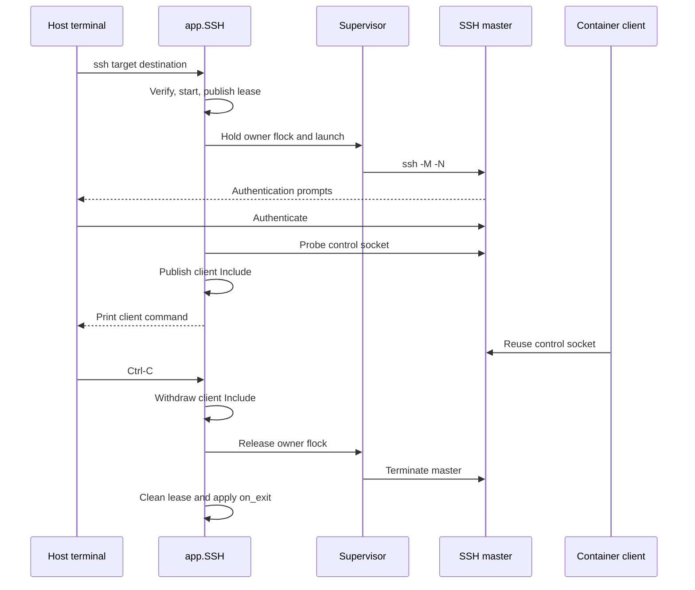

# SSH sharing

SSH sharing separates authentication from connection use. A foreground Devbox command lets the user authenticate through their terminal, then publishes an OpenSSH control socket for processes in one environment. The agent uses generated client configuration rather than handling credentials.

`app.SSH` owns environment access and the attached-command lease. `sshshare` owns each connection's processes, files, publication, and revocation.

## Execution modes and trust boundary

| Mode | SSH master runs | Configuration/network authority |
|---|---|---|
| Default | Inside the container | Container user's OpenSSH config and network namespace |
| `--host-master` | On the host | Host user's OpenSSH config, keys/agent, display, and reachable networks |

Both modes create a dedicated master. Devbox does not adopt a personal master or copy credentials/configuration. It overrides only the control-master, persistence, and backgrounding options needed for foreground ownership. Normal OpenSSH behavior supplies authentication, known-host checks, ProxyJump, agent forwarding, and X11 forwarding.

Host mode is invocation-only and warns before authentication. Sharing a host master gives the container more than remote command access: multiplexed sessions can use forwarding to reach the host and its networks. A failed container-mode login cannot silently switch into this broader authority.

Generated client forwarding requests and master capabilities are separate. A client can request `-A` or `-X`/`-Y`, but the master must permit forwarding and have the required agent/display. Generated config does not copy the master's forwarding preferences.

## Startup and publication

`app.SSH` locates and verifies the recorded environment, requires its private SSH mount, and uses `startAccess` for stopped-container preparation. `attachRun` publishes the common attached-command lease and releases the operation lock before authentication.

Authentication readiness is detected through the live control socket. Only then is the per-connection Include file atomically published under `/devbox/ssh`. This prevents clients from seeing an unauthenticated endpoint as available.

Simple destinations retain their alias; username/IPv6 destinations use a generated `ssh-<hash>` alias. Each invocation gets a unique `c/<destination-hash>-<random>/` directory, so an old supervisor cannot mistake a replacement connection's files for its own. Multiple destinations can coexist; active duplicates are refused.

## Kernel-owned lifetime

The embedded Bash supervisor runs in both modes. Each invocation holds an exclusive kernel flock on `owner.lock`; the supervisor checks that ownership still exists before launching SSH. A watchdog then checks the inode once per second and terminates the actual master when the controller disappears.

This covers failure before authentication and Docker CLI disconnection that leaves a container exec process alive. A control socket alone cannot represent lifetime because it may not exist yet while the user is answering prompts.

A separate `master.lock` lets cleanup wait for actual process teardown, including pre-authentication. Supervisors retain open lock inodes even if paths are deleted. Unique invocation directories isolate old teardown from new connections.

Revocation has two parts: remove the Include to withdraw discovery, then release the owner lock to terminate the live connection. Inert directories may remain after failure; retrying that destination or deleting saved state cleans them. They are never treated as reconnectable state.

For host masters, a bounded Docker inspection each second also terminates sharing after forced container stop/removal or lost Docker contact. SSH revocation finishes before attached-command lease cleanup and last-command `on_exit` handling.

## Socket paths and generated clients

`sessions/<name>/runtime/ssh` is a private writable mount at `/devbox/ssh`. It is separate from transferable harness stores and excluded from runtime-asset permission changes. The mount is a creation input; a recorded container without it requires recreation rather than late mount injection.

Host masters use short `/proc/<controller-pid>/fd` paths backed by an open directory. This avoids Unix socket path-length limits without changing the caller's working directory, which matters for relative SSH configuration. Controller probes can use `/proc/self/fd` for long home paths too.

Generated clients use:

- `BatchMode yes`, to avoid prompting;
- `ControlMaster no`, to prevent creating another master;
- a failing `ProxyCommand`, so a missing socket cannot fall back to a new direct connection.

These rules govern the generated client path, not arbitrary SSH commands or separately supplied credentials. Connection lifetime management is not a defense against a container deliberately modifying its writable runtime files.

## Terminal and exit handling

The CLI snapshots and restores the host terminal around SSH. Docker may have placed output in raw mode while authentication runs, so status rendering respects the active output flags rather than assuming normal newline processing.

Only expected foreground interruption is normalized to successful disconnection. Container TTY Ctrl-C can return `130` without cancelling the host context; host cancellation can produce `137` or `143`. Normalization occurs before cleanup failures are joined so an expected interruption cannot hide a real teardown error.

Authentication failures, connection loss, unrelated errors, and deadlines remain failures. `Disconnected.` prints only after successful cleanup and terminal restoration. There is no automatic reconnect: the user starts another foreground invocation to grant access again.
