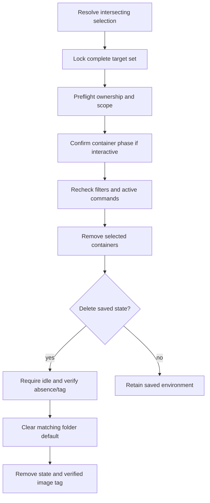
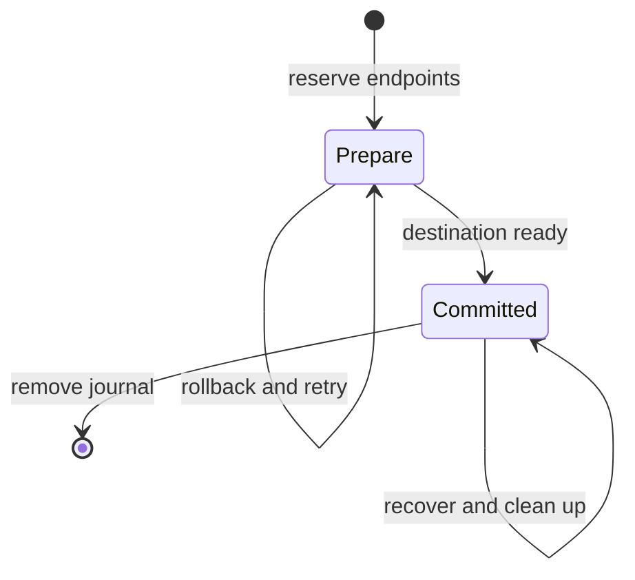

# State, locking, and transfers

The saved session is the top-level environment model. Docker inventory supplies live runtime facts, but container absence does not erase identity, history, or the recorded recovery contract. `store` owns durable state; `app` combines it with verified Docker state before transitions.

## Identity and ownership

`environment.ContainerPrefix` defines the `dbx-` lookup convention independently of `docker.Namespace`, which defines `devbox-rewrite.*` labels and image tags.

The immutable session ID identifies the saved session. `settings` contains the editable workspace, local name, config references, and keep-running intent. Storage directories and Docker names are independently allocated as `dbx-<allocation-hash>.<local-name>` hints; neither is parsed or required to match settings or the other name.

`store.Find` looks up an ID or workspace/name from saved records, without config resolution or a persistent index. Folder-only lookup reads its explicit default ID. Defaults use schema 2 under `state/workspaces/<workspace-key>.json`, keyed by the canonical workspace's SHA-256. Missing defaults are absent; malformed defaults are errors. Name reuse never inherits an old ID selection.

Docker ownership uses installation ID, ownership version, and session ID. Workspace/name labels are descriptive. Existing containers are inspected by recorded Docker ID, with image/instance checks; names alone never authorize adoption or mutation.

Images carry installation ownership and final session tags. Removing a tag requires verifying both ownership and its expected image association; a mutable name alone does not authorize deletion.

## Record structure

`sessions/<directory>/session.json` holds:

- immutable `id` and activity metadata;
- `settings`: workspace, local name, ordered config references, and `manual_start`;
- `applied`: creation/launch plans, image/container association, harness recovery contract, inputs, and fingerprints.

Schema `6` validates settings and applied state independently. Their differences are pending changes, not corruption. Applied mounts must agree with applied inputs, not desired settings. `applied.inputs.sources` retains the committed config directories for recovery. No directory name is persisted. Older development records require an explicit reset; no migration reader exists.

Records contain public settings, paths, modes, and hashes, not file contents or env/auth values. Raw env diagnostics are redacted. Records are atomically replaced with restrictive permissions; invalid records remain errors rather than being treated as missing.

Creation/recreation commits image and container baselines. `Record.ApplyRuntime` advances runtime inputs with their fingerprint at application commit points. Status and warning generation never alter either baseline.

## Locks and leases

Session operation locks are keyed by immutable ID under `state/locks/sessions/`, outside removable data directories. Attached-command leases use `state/leases/<id>/`. Changing a directory or losing a record cannot bypass the same session's lock or active commands. Record reads see an atomic snapshot or absence; mutations reload under the operation lock.

| Lock / record | Lifetime and job |
|---|---|
| Installation lock | Serialize initial home/installation identity creation |
| Configuration-owner lock | Serialize publication or mutation of one source owner |
| Name-namespace lock | Serialize creation, rename, workspace edits, and transfer name reservations |
| Session operation lock | Serialize ownership checks and lifecycle transitions |
| Workspace-default lock | Serialize a canonical folder's default selection and matching clears |
| Attached-command lease | Represent a foreground command while its operation lock is released |
| SSH owner/master flocks | Govern transient SSH process lifetime, independently of session operation locks |

Operations involving several environments acquire the complete session lock set in sorted unique session-ID order (Move shares one ID lock across its two directories). Name-changing operations acquire the namespace lock first. If workspace locks are also needed, acquire them afterward in workspace-key order; never acquire a session lock while holding a workspace lock. Bulk operations retain their complete session lock set through preflight and mutation.

Default selection prompts before locking, then reloads the chosen session under its operation lock and verifies its ID before acquiring the workspace lock. Clearing needs only the workspace lock. Resolving a default releases its workspace lock before acquiring the session lock; the chosen ID is an invocation snapshot, not a reference that can retarget midway through an operation.

Source edits use the session operation lock and compare ID, workspace, and the displayed source list. Config-directory edits use only their own owner lock and same-field conflict checks. Shared-use reporting never locks all referring sessions.

Leases use Linux process start ticks and boot identity, not PID alone. Inspection reads active state without reaping it. Mutations can reap provably stale leases; corrupt or unverifiable ones fail closed. Session deletion requires idleness even when container removal is forced.

SSH lifetime locks deliberately remain in transient connection directories: supervisors hold open inodes, so revocation still works if a path is removed. They are not substitutes for external environment-operation locks.

## Inventory and status

Inventory joins one installation-filtered Docker list and batched inspection with saved directories and pending-transfer endpoints. `app.InventoryReport` separates `sessions` from `unmatched_containers`.

| Observation | Representation |
|---|---|
| Valid session and container | Session row with live runtime facts |
| Session without container | Retained session row, marked missing |
| Managed container without record | Separate unmatched-container diagnostic |
| Corrupt/incomplete saved state | Session diagnostic, not fabricated valid state |
| Pending endpoint without record | Inspectable reserved endpoint |

Folder filtering uses saved workspace settings, or descriptive workspace labels for unmatched containers. Unassignable broken entries remain visible in global inventory. Default-state errors appear separately in `default_errors`; they do not hide sessions. Listing does not resolve desired configuration and never repairs or adopts resources.

Bulk status enriches the same inventory with the normal resolver and `environment.CompareInputs`. Runtime state remains independent of configuration health: a missing container can still have comparable inputs, while a running container can have invalid desired config.

Single-target `app.Status` reads the record and live leases under the operation lock, inspects the linked container, and uses the same comparison. `StatusDetails` adds full `record` and `active` fields without bloating bulk rows. It reads the workspace default after acquiring the session lock and matches the durable ID. Default-state read errors appear separately as `default_error`, preserving explicitly selected session details. Pending transfers skip desired resolution because their transaction, not current configuration, governs recovery.

Last activity means recorded Devbox operations, not filesystem activity or only harness launches. Container creation time in listing comes from Docker, independently of durable session creation time.

## Deletion transaction

`app.Delete` owns both runtime and saved-data phases. Explicit CLI `--container` or `--session` selects scope without a confirmation callback. The unscoped interactive command supplies a default-no callback for each phase. The frontend combines an explicit scope with that callback: container-only never asks about or removes saved data; whole-session deletion confirms each applicable phase separately. Preview and execution share the selected scope, and dry runs never call confirmations. Non-interactive and JSON calls must provide scope.

Explicit saved-data deletion is preflighted before container removal and rechecked afterward. Container failures do not advance into state deletion. `--force` only relaxes attached-command protection for the runtime phase; it cannot expand scope or bypass pending transfers and saved-state idleness.

The complete operation-lock set spans confirmations and both phases. `removeSavedSession` persists a matching-ID default clear before deleting state, while retaining the session operation lock. If deletion then fails, the surviving session may have no default; an old choice is never restored over a newer one. Container-only deletion and dry runs do not clear defaults. External lock files survive deletion. If cancellation or failure occurs after containers have been removed, remaining state is retained rather than pretending the whole operation rolled back.

Selection filters intersect. Age uses recorded activity, and unknown activity is not guessed to be old. Activity and orphan status are rechecked under lock, including after confirmation, before deletion records its own activity. Dry-run preflight examines leases without reaping them. This prevents a stale preview or prompt from selecting a newly active/recovered environment.

## Transfer state machine

`app/transfer.go` owns `copy` / `copy --move` orchestration; `store` owns journal persistence and portable store copying. A single external journal at `state/transfers/<source-directory>.json` reserves both endpoint names.

Both endpoint operation locks are acquired in sorted order. Ordinary `Locked.Load` rejects pending work, while inventory and transfer operations can inspect it. Pending lookup scans unfinished journals; corrupt journals fail mutations closed because endpoint reservations cannot be trusted.

The journal stores endpoint identities, session IDs, mode/phase, intended running state, and destination fingerprints. It contains no env/auth values. Destination creation uses the allocated ID, so retries cannot create a different session.

Journal schema 3 pins endpoint directories, bindings, IDs, the source container ID, and the separately allocated destination container name. `--as` may select another name in the same or a different folder; otherwise preserve the source name. Retry guidance uses exact source ID, destination workspace, and `--as`, without resolving a changed default.

Internal modes are `clone` for `copy` and `relocate` for `copy --move`. Harness capabilities and JSON output use these same values.

### Prepare: source is authoritative

The engine validates current portability declarations and requires the source's active definition to remain unchanged. `copy` requires a stopped or absent source; `copy --move` may stop a running source and remember its intent. Both require idle endpoints and an unused destination.

Only declared environment stores and ownership manifests are copied. Auth overlays, cache stores, records, leases, and SSH runtime data are excluded. Workspace files and container-layer tools are not part of the state tree. Symlinks are copied as opaque entries without traversal; special files are rejected.

Destination resolution preserves the source reference order and kind. Relative references expand against the destination workspace; fixed references stay absolute. Config directories are not copied. Resolution uses the normal configuration pipeline. Image building, synchronization, setup, and runtime installation follow ordinary creation. `copy` leaves the destination stopped; `copy --move` restores the source's original running intent at the destination.

If preparation fails, bounded rollback cleans the destination, restores the source image tag after a relocation build, and restarts a previously running source. The journal remains pending. A preparation retry requires matching destination fingerprints and recopies the authoritative source because rollback may have restarted it and allowed its state to change.

### Committed: destination is authoritative

Publishing `committed` changes authority before source removal. Once publication is attempted, rollback cannot delete the destination: a directory sync error can occur after rename already succeeded.

A committed retry does not resolve new desired config or copy state again. It verifies the recorded destination, recovers a missing destination container when recorded inputs permit, and finishes source cleanup. Copying again here could overwrite newer destination history with stale source data.

The journal lives outside the source directory so deleting source state cannot lose the recovery plan or reservation. Committed move cleanup uses `removeSavedSession` too, including retries after the source record is gone; the journal supplies its workspace and ID. Copy preserves source defaults. Move clears only a matching source default and never selects a destination default. Only completed cleanup removes the journal and releases both names. `copy` creates a new session ID; `copy --move` preserves it. No permanent lineage record is needed after completion.
